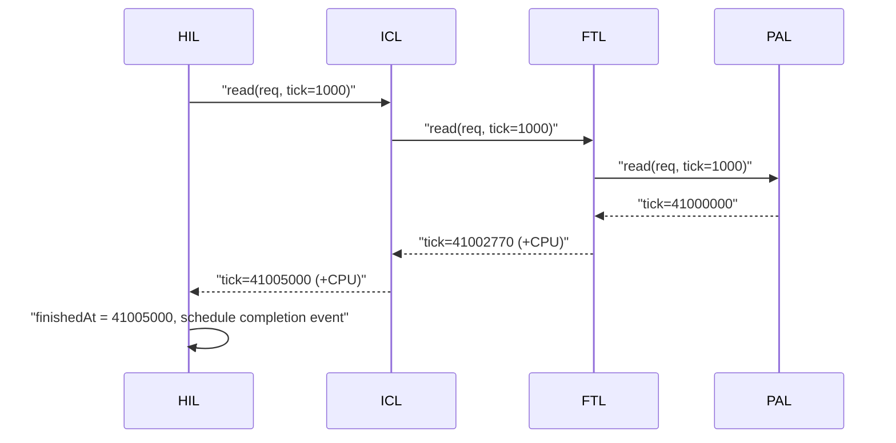
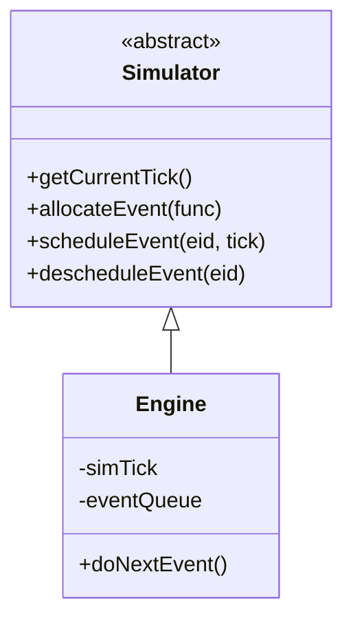

# Chapter 1 — The Simulation Model: Two Clocks

[← README](README.md) | Next: [02_boot_and_wiring.md](02_boot_and_wiring.md)

**Sources:** [`sim/engine.cc`](../../SimpleSSD-Standalone/sim/engine.cc) (253), [`simplessd/sim/simulator.{hh,cc}`](../../SimpleSSD-Standalone/simplessd/sim/simulator.cc) (59 + 73), [`simplessd/sim/cpu.cc`](../../SimpleSSD-Standalone/simplessd/sim/cpu.cc) (99), [`simplessd/util/simplessd.cc`](../../SimpleSSD-Standalone/simplessd/util/simplessd.cc) (46)

---

## The one thing to take away

SimpleSSD-Standalone has **two different notions of "now"**, and almost every confusing thing in the codebase comes from not knowing which one you are looking at.

| | Global event clock | Local request clock |
| --- | --- | --- |
| Name in code | `Engine::simTick` | the `uint64_t &tick` parameter |
| Owner | `Engine` (`sim/engine.cc:26`) | whichever function is on the stack |
| Advances when | an event is popped (`engine.cc:203`) | a layer adds latency to it |
| Can go backwards | no | no, but it is *discarded* if not written back |
| Who reads it | `getTick()` (`simulator.cc:31-37`) | the next layer down |
| Used by | IGL, BIL, SIL, HIL, NVMe, DMA | ICL, FTL, PAL, DRAM |

The boundary between them is `HIL::read` / `HIL::write`.

---

## Part 1 — Discrete-event simulation

### Wall-clock time vs simulated time

A question left unanswered in the older [`../01_Introduction_and_Architecture.md`](../01_Introduction_and_Architecture.md): *what is real wall-clock time?*

**Wall-clock time** is time on the clock on your wall — how long *you* wait for the program to finish. The `Stopwatch` in `Engine` measures exactly this (`engine.cc:30`, `engine.cc:234-236`) and reports it as "Host time duration (sec)".

**Simulated time** is the modelled time inside the pretend SSD, counted in **picoseconds** (10⁻¹² s), stored in `simTick`.

They are unrelated. A run can burn 90 seconds of wall-clock time to simulate 2 milliseconds of SSD activity, or the reverse. `Engine::printStats` prints both side by side so you can see the ratio:

```238:246:SimpleSSD-Standalone/sim/engine.cc
  out << "*** Statistics of Event Engine ***" << std::endl;
  {
    std::lock_guard<std::mutex> guard(mTick);

    out << "Simulation Tick (ps): " << simTick << std::endl;
  }
  out << "Host time duration (sec): " << std::to_string(duration) << std::endl;
  out << "Event handled: " << eventHandled << " ("
      << std::to_string(eventHandled / duration) << " ops)" << std::endl;
```

**Why picoseconds?** The fastest thing modelled (a DRAM access) is tens of nanoseconds; the slowest (a NAND block erase) is milliseconds. Picosecond integers span that range with no floating-point rounding and no unit conversions.

### The event loop

The entire simulation is these two lines at the bottom of `main`:

```255:256:SimpleSSD-Standalone/sim/main.cc
  while (engine.doNextEvent())
    ;
```

`doNextEvent` is the whole engine:

```190:227:SimpleSSD-Standalone/sim/engine.cc
bool Engine::doNextEvent() {
  uint64_t tickCopy;

  if (forceStop) {
    return false;
  }

  if (eventQueue.size() > 0) {
    auto &now = eventQueue.front();

    {
      std::lock_guard<std::mutex> guard(mTick);

      simTick = now.second;
      tickCopy = simTick;
    }

    auto iter = eventList.find(now.first);

    eventQueue.pop_front();

    if (iter != eventList.end()) {
      iter->second(tickCopy);
    }
    // ... panic if the event id is unknown ...
```

Line by line:

| Line | Code | Meaning |
| --- | --- | --- |
| 193-195 | `if (forceStop) return false` | The end-of-workload callback in `main.cc:186-194` sets this, which ends the `while` loop. |
| 197 | `if (eventQueue.size() > 0)` | No events left also ends the simulation — returning `false` is the normal exit. |
| 198 | `auto &now = eventQueue.front()` | The queue is kept **sorted by tick**, so the front is the earliest future event. |
| 203 | `simTick = now.second` | **Time travel.** The clock jumps straight to the event's timestamp. Nothing is simulated in between. |
| 209 | `eventQueue.pop_front()` | Remove before running, so the handler may reschedule itself. |
| 212 | `iter->second(tickCopy)` | Run the handler, passing the new current tick. |
| 220 | `eventHandled++` | Only used for the progress display. |

**This is why the simulator is fast.** A 40 µs NAND read costs zero CPU work: the engine simply sets `simTick` 40 000 000 ps later next time round.

### The queue is a sorted linked list

`insertEvent` (`engine.cc:35-74`) walks the list linearly to find the insertion point and to detect an existing entry for the same event id.

```42:56:SimpleSSD-Standalone/sim/engine.cc
  for (auto iter = eventQueue.begin(); iter != eventQueue.end(); iter++) {
    if (iter->first == eid) {
      found = true;
      old = iter;

      if (pOldTick) {
        *pOldTick = iter->second;
      }
    }

    if (iter->second > tick && !flag) {
      insert = iter;
      flag = true;
    }
  }
```

That is **O(n) per insertion**, not a heap. It is fine because the queue stays short — most latency is accumulated synchronously (Part 2) rather than being turned into events.

**An event id is not an event instance.** `allocateEvent` (`engine.cc:111-119`) registers a *handler* once and returns an id; scheduling the same id twice reschedules it instead of queueing two copies (`engine.cc:142-146` warns when this happens). This is why HIL keeps its own priority queue of completions and drives a single `completionEvent` (`hil.cc:195-202`).

---

## Part 2 — The `uint64_t &tick` convention

Below the HIL, latency is **not** modelled with events. It is accumulated in a reference parameter that is threaded down and back up an ordinary C++ call stack.



Each layer receives the time at which it may begin, mutates it in place, and returns. The value that comes back out is the time the operation finished.

### The three ways a layer changes `tick`

**1. Replace with a completion time.** `ICL::read` runs each logical page, keeps the maximum, and assigns:

```85:94:SimpleSSD-Standalone/simplessd/icl/icl.cc
    finishedAt = MAX(finishedAt, beginAt);
  }

  debugprint(LOG_ICL, /* ... */);

  tick = finishedAt;
```

**2. Add a modelled firmware cost.** Every layer charges CPU time for its own bookkeeping:

```95:95:SimpleSSD-Standalone/simplessd/icl/icl.cc
  tick += applyLatency(CPU::ICL, CPU::READ);
```

**3. Add a device latency.** The FTL adds the CMT miss penalty this way, and PAL adds NAND timing.

### Why a reference and not a return value

Because a layer often issues **several** sub-operations and must combine their times. The `MAX` pattern above appears in `ICL::read`, in `PageMapping::doGarbageCollection`, and in `writeInternal`. A single return value would force each caller to invent the same plumbing.

### The trap: a local copy discards time

If a function copies `tick` into a local and never writes it back, everything that local accumulates is **invisible to the caller**. This is not hypothetical — on-demand garbage collection does exactly this:

```1282:1298:SimpleSSD-Standalone/simplessd/ftl/page_mapping.cc
    std::vector<uint32_t> list;
    uint64_t beginAt = tick;

    selectVictimBlock(list, beginAt);

    debugprint(LOG_FTL_PAGE_MAPPING,
               "GC   | On-demand | %u blocks will be reclaimed", list.size());

    doGarbageCollection(list, beginAt);

    debugprint(LOG_FTL_PAGE_MAPPING,
               "GC   | Done | %" PRIu64 " - %" PRIu64 " (%" PRIu64 ")", tick,
               beginAt, beginAt - tick);

    stat.gcCount++;
    stat.reclaimedBlocks += list.size();
  }
```

`beginAt` absorbs the entire cost of victim selection, page relocation, and block erase — then `writeInternal` returns and `tick` is untouched. **The write that triggered GC is not slowed down by it.**

GC still affects results, through two indirect routes: the PAL channel and die timelines are now busy, so the *next* request queues behind that work; and `stat.gcCount` / `reclaimedBlocks` / `validPageCopies` still record what happened. But if you were expecting a GC-triggering write to show a millisecond-scale latency spike, this line is why it does not. Worth stating as a fidelity limitation in your report.

---

## Part 3 — `Simulator`, `Engine`, and the global `sim`

SimpleSSD is designed to be embedded in other simulators (gem5, for example), so it never references `Engine` directly. It talks to an abstract interface.



| Piece | File | Role |
| --- | --- | --- |
| `SimpleSSD::Simulator` | `simplessd/sim/simulator.hh` | Pure virtual interface |
| `Engine` | `sim/engine.hh:34` | The standalone implementation |
| `SimpleSSD::sim` | `simplessd/sim/simulator.cc:25` | Global pointer to the chosen implementation |
| `setSimulator` | `simplessd/sim/simulator.cc:27-29` | Installs it |
| Free functions | `simplessd/sim/simulator.cc:31-71` | `getTick`, `allocate`, `schedule`, `deschedule`, `scheduled`, `deallocate` |

The wiring happens in one line, before any SSD object exists:

```26:39:SimpleSSD-Standalone/simplessd/util/simplessd.cc
ConfigReader initSimpleSSDEngine(Simulator *sim, std::ostream *info,
                                 std::ostream *err, std::string config) {
  ConfigReader conf;

  setSimulator(sim);
  initLogSystem(info, err);

  if (!conf.init(config)) {
    panic("Failed to open configuration file %s", config.c_str());
  }

  initCPU(conf);

  return conf;
}
```

Note the **null-safety** pattern in the free functions — every one checks `if (sim)` and returns a benign default otherwise (`simulator.cc:31-37`). That is how SimpleSSD code can be unit-tested with no engine installed.

---

## Part 4 — The CPU model

`applyLatency` is how a layer says "my firmware spent some cycles here".

```91:97:SimpleSSD-Standalone/simplessd/sim/cpu.cc
uint64_t applyLatency(CPU::NAMESPACE ns, CPU::FUNCTION fct) {
  if (cpu) {
    return cpu->applyLatency(ns, fct);
  }

  return 0;
}
```

It takes a **namespace** (which subsystem) and a **function** (which operation), and returns picoseconds. It does not touch `tick` itself — the caller adds the result. There are ten such calls in `page_mapping.cc` alone, one per public and internal operation.

`execute()` (`cpu.cc:75-80`) is the other half: it runs a callback *on a modelled core*, which is how HIL enters the synchronous world. That is the seam between the two clocks:

```68:68:SimpleSSD-Standalone/simplessd/hil/hil.cc
  execute(CPU::HIL, CPU::READ, doRead, new Request(req));
```

`doRead` is a lambda. When the modelled core runs it, the lambda calls `pICL->read(reqInternal, tick)` synchronously, and on return pushes the request onto a completion priority queue ordered by `finishedAt` (`hil.cc:60-63`). One `completionEvent` drains that queue (`hil.cc:204-221`).

**So the full boundary is:** event → CPU job → synchronous descent through ICL/FTL/PAL → `finishedAt` → completion event → callbacks back to the host side.

---

## Invariants

1. **`simTick` never decreases.** `scheduleEvent` clamps a past timestamp up to the present and warns (`engine.cc:132-138`).
2. **One event id, one pending instance.** Rescheduling replaces (`engine.cc:67-71`).
3. **`tick` only moves forward** within a call chain — every layer either assigns a computed `finishedAt` or adds a non-negative latency.
4. **A local copy of `tick` is a discarded budget** unless explicitly written back.
5. **Simulated and wall-clock time are unrelated.** Never quote one for the other.

---

## Self-quiz

1. What are the two clocks, and which one does `PageMapping::readInternal` see?
2. What unit is simulated time measured in, and why not nanoseconds?
3. What does `doNextEvent` return when the workload is finished, and what are the two ways that happens?
4. Why does scheduling the same event id twice not create two events?
5. Why is the event queue a linear list rather than a heap, and why is that acceptable here?
6. In `ICL::read`, why is `finishedAt` computed with `MAX` over a loop instead of just using the last value?
7. What happens to the time consumed by on-demand garbage collection, and which line causes it?
8. What does `applyLatency` return, and who is responsible for adding it to `tick`?
9. What is the purpose of the abstract `SimpleSSD::Simulator` class if there is only one implementation here?
10. Where exactly does control cross from the event world into the synchronous world?

### Answers

1. Global `Engine::simTick` and the local `uint64_t &tick` reference. `readInternal` only ever sees the local one.
2. Picoseconds — integers span DRAM nanoseconds to NAND milliseconds with no rounding or unit conversion.
3. `false`. Either `forceStop` was set by the end-of-workload callback (`main.cc:193`), or the event queue is empty.
4. `insertEvent` finds the existing entry for that id, inserts at the new position, and erases the old one (`engine.cc:67-71`), warning about the reschedule.
5. It is a `std::list` walked linearly. Acceptable because most latency is accumulated synchronously on the call stack, so the queue holds only a handful of pending events.
6. Because the per-page calls each start from the same `tick` and may finish out of order; the request is done when the slowest sub-page is done.
7. It is discarded. `page_mapping.cc:1283` copies `tick` into a local `beginAt`, GC advances that local, and it is never written back. Only PAL busy-time and the GC stat counters retain the effect.
8. Picoseconds of modelled firmware CPU time. The caller adds it: `tick += applyLatency(...)`.
9. It decouples SimpleSSD from the host simulator, so the same code can run under gem5 or the standalone `Engine` by swapping the global `sim` pointer.
10. `execute(CPU::HIL, CPU::READ, doRead, ...)` at `hil.cc:68` (and `hil.cc:100` for writes) — the lambda body runs on a modelled core and descends synchronously from there.
