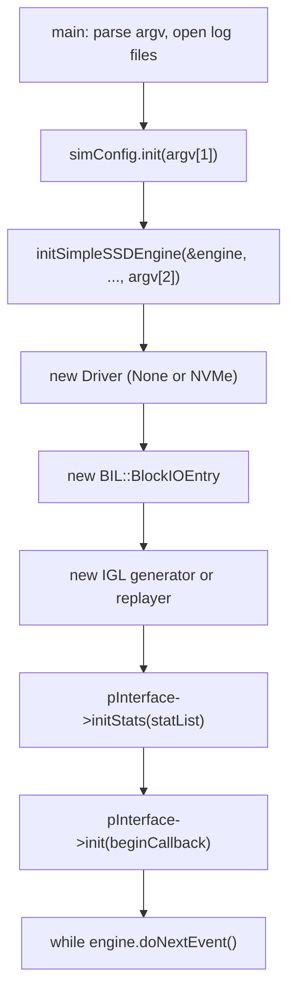
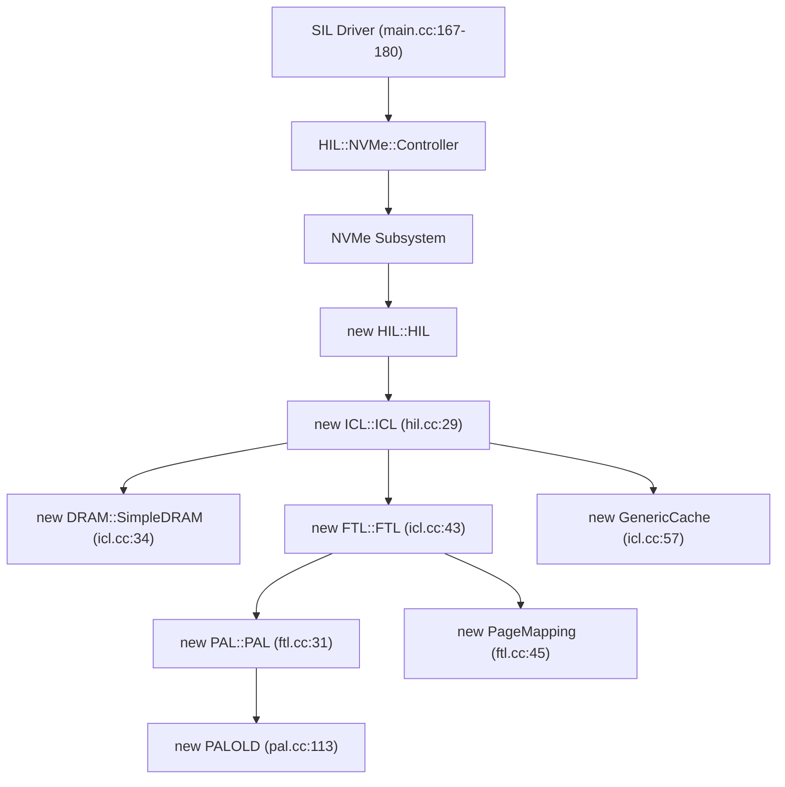
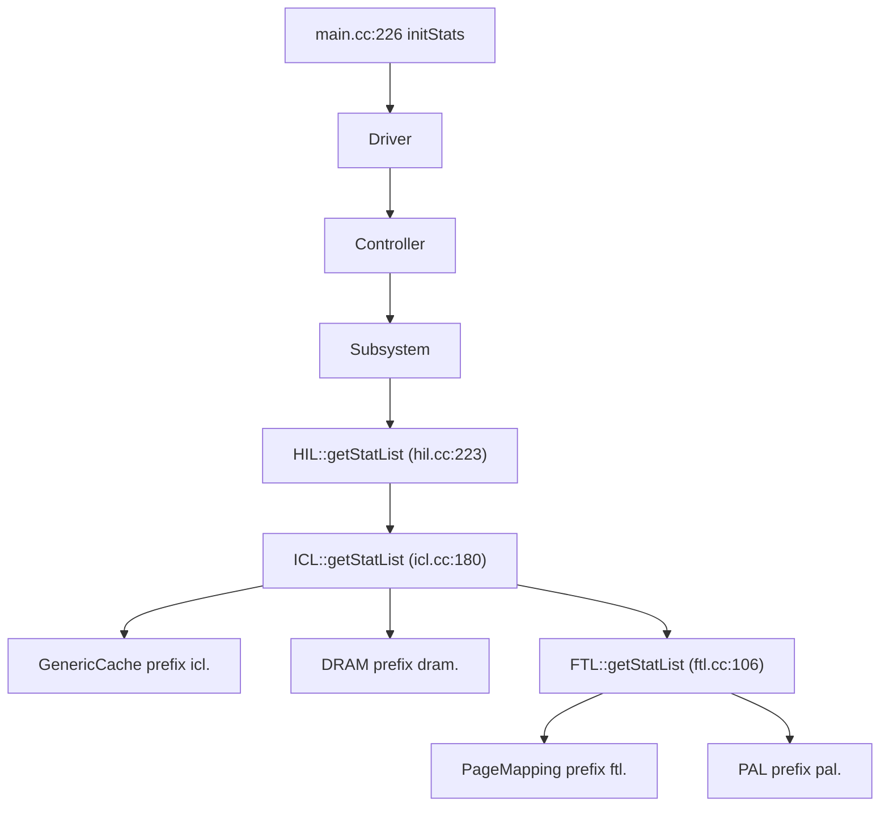

# Chapter 2 — Boot, Configuration, and Wiring

[← README](README.md) | Prev: [01_simulator_model.md](01_simulator_model.md) | Next: [03_layer_contracts.md](03_layer_contracts.md)

**Sources:** [`sim/main.cc`](../../SimpleSSD-Standalone/sim/main.cc) (371), [`simplessd/util/simplessd.cc`](../../SimpleSSD-Standalone/simplessd/util/simplessd.cc) (46), [`simplessd/sim/config_reader.cc`](../../SimpleSSD-Standalone/simplessd/sim/config_reader.cc) (250), [`simplessd/icl/icl.cc`](../../SimpleSSD-Standalone/simplessd/icl/icl.cc) (200), [`simplessd/ftl/ftl.cc`](../../SimpleSSD-Standalone/simplessd/ftl/ftl.cc) (123), [`simplessd/pal/pal.cc`](../../SimpleSSD-Standalone/simplessd/pal/pal.cc) (154)

---

## The surprise

You would expect `main()` to build the SSD. It does not. `main` builds only the **host-side harness** — driver, block I/O layer, workload generator. The SSD itself (HIL, ICL, DRAM, FTL, PAL) is constructed **inside the driver**, several constructors deep.

That is why grepping `main.cc` for `PageMapping` finds nothing.

---

## Part 1 — Two configuration files

The program takes three arguments:

```76:78:SimpleSSD-Standalone/sim/main.cc
    std::cerr << "  Usage: simplessd-standalone <Simulation configuration "
                 "file> <SimpleSSD configuration file> <Output directory>"
              << std::endl;
```

| Arg | Describes | Parsed by | Sections |
| --- | --- | --- | --- |
| `argv[1]` | The **experiment** — workload, run time, logging | `sim/cfg_reader.cc` (`ConfigReader` in the global namespace) | `[global]`, `[request_generator]`, `[trace]` |
| `argv[2]` | The **device** — geometry, cache, FTL, NAND | `simplessd/sim/config_reader.cc` (`SimpleSSD::ConfigReader`) | `[cpu]`, `[dram]`, `[ftl]`, `[nvme]`, `[icl]`, `[pal]`, … |
| `argv[3]` | Output directory for logs | — | — |

**Two classes with the same name.** `ConfigReader simConfig` at `main.cc:36` is the harness one; the SSD one is returned from `initSimpleSSDEngine` at `main.cc:164`. They are unrelated types. When a doc or a script says "the config file", check which.

### How the device config is loaded

```52:68:SimpleSSD-Standalone/simplessd/sim/config_reader.cc
bool ConfigReader::init(std::string file) {
  if (ini_parse(file.c_str(), parserHandler, this) < 0) {
    return false;
  }

  // Update all
  cpuConfig.update();
  dramConfig.update();
  ftlConfig.update();
  nvmeConfig.update();
  iclConfig.update();
  palConfig.update();
  sataConfig.update();
  ufsConfig.update();

  return true;
}
```

Two phases, and the second one matters:

1. **Parse.** `ini_parse` calls `parserHandler` for each `key = value`, which routes by section name to the right sub-config's `setConfig`.
2. **Validate.** Every section's `update()` runs *after* parsing, so cross-key checks are possible. `FTL::Config::update` (`ftl/config.cc:132-156`) is where an inconsistent config becomes a `panic` rather than a mysterious result. Chapter 07 lists every check.

### Reading a key at runtime

`ConfigReader` is a dispatcher, one method per return type, switching on the section:

```99:100:SimpleSSD-Standalone/simplessd/sim/config_reader.cc
    case CONFIG_FTL:
      return ftlConfig.readUint(idx);
```

So `conf.readUint(CONFIG_FTL, FTL_CMT_CAPACITY_BYTES)` means: FTL section, that key, as unsigned. **The type must match how the key is stored** — asking `readUint` for a key that `FTL::Config` serves from `readFloat` silently returns 0, because each `read*` is a `switch` whose default is a zero value (`ftl/config.cc:179-207`). This is a real footgun when adding a config key.

---

## Part 2 — Startup sequence



| Step | Line | What it does |
| --- | --- | --- |
| Signal handler | `main.cc:84` | So Ctrl-C still prints statistics via `cleanup` |
| Harness config | `main.cc:87` | Fails early with exit code 2 |
| Log files | `main.cc:96-161` | `STDOUT` / `STDERR` are special-cased names, not paths |
| **SimpleSSD init** | `main.cc:164` | Installs the simulator, log system, CPU model; parses the device config |
| Driver choice | `main.cc:167-180` | `GLOBAL_INTERFACE`: `INTERFACE_NONE` or `INTERFACE_NVME` |
| Block I/O layer | `main.cc:183-184` | Gets the latency log stream |
| End callback | `main.cc:186-194` | Deschedules the stat event and calls `engine.stopEngine()` |
| Workload | `main.cc:197-214` | `GLOBAL_SIM_MODE`: generator or trace replayer |
| Stat registration | `main.cc:226` | Fills `statList` with **names**, once |
| Periodic stat event | `main.cc:228-240` | Self-rescheduling event, period in seconds × 10⁹ ps |
| **Start** | `main.cc:245` | `pInterface->init(beginCallback)`; the callback starts the workload |
| **Run** | `main.cc:255-256` | The event loop from chapter 01 |
| Cleanup | `main.cc:258` | Also reachable from the signal handler |

### The device is built during `initSimpleSSDEngine`? No.

`initSimpleSSDEngine` does only four things (`simplessd.cc:26-39`): `setSimulator`, `initLogSystem`, parse the device config, `initCPU`. **No subsystem is constructed.** The SSD appears when the driver is constructed at `main.cc:167-180`, which builds the controller, which builds the subsystem, which builds `HIL`.

---

## Part 3 — Who allocates whom



Read that chain once and the ownership questions answer themselves:

- **Who owns `PageMapping`?** `FTL::FTL`, via the `pFTL` pointer (`ftl.hh:48`).
- **Who owns the DRAM model?** `ICL::ICL`. It is *shared*: passed into both `FTL::FTL` and `GenericCache`, so cache traffic and mapping-table traffic hit the same modelled DRAM (`icl.cc:43`, `icl.cc:57`).
- **Who owns PAL?** `FTL::FTL` (`ftl.cc:31`), not ICL. The FTL is the only thing that talks to NAND.

### Order matters

`ICL::ICL` must build DRAM **before** FTL, because FTL's constructor takes the DRAM pointer. It must build FTL **before** the cache, because it needs `pFTL->getInfo()` to compute the logical page geometry:

```43:57:SimpleSSD-Standalone/simplessd/icl/icl.cc
  pFTL = new FTL::FTL(conf, pDRAM);

  FTL::Parameter *param = pFTL->getInfo();

  if (conf.readBoolean(CONFIG_FTL, FTL::FTL_USE_RANDOM_IO_TWEAK)) {
    totalLogicalPages =
        param->totalLogicalBlocks * param->pagesInBlock * param->ioUnitInPage;
    logicalPageSize = param->pageSize / param->ioUnitInPage;
  }
  else {
    totalLogicalPages = param->totalLogicalBlocks * param->pagesInBlock;
    logicalPageSize = param->pageSize;
  }

  pCache = new GenericCache(conf, pFTL, pDRAM);
```

Note what this means: **`EnableRandomIOTweak` changes the size of an ICL page.** With the tweak on, one ICL page (an LCA) is one sub-page and there are `ioUnitInPage` times more of them. This is the same flag that sets `bitsetSize` in the FTL and therefore the size of a CMT entry — see [`../page_mapping/02_constructor_init.md`](../page_mapping/02_constructor_init.md).

### Destruction is the exact reverse

| Destructor | File:line | Deletes |
| --- | --- | --- |
| `ICL::~ICL` | `icl.cc:60-64` | cache, FTL, DRAM |
| `FTL::~FTL` | `ftl.cc:63-66` | PAL, then `pFTL` (`PageMapping`) |
| `PAL::~PAL` | `pal.cc:116-118` | `PALOLD` |
| `HIL::~HIL` | `hil.cc:36-38` | ICL |

`~PageMapping` calls `flushCMT()`, so dirty mapping entries reach the GMT before teardown ([`../page_mapping/02_constructor_init.md`](../page_mapping/02_constructor_init.md)). Because `FTL::~FTL` deletes PAL **first**, nothing in `flushCMT` may touch PAL — and it does not; it is a pure in-memory merge.

---

## Part 4 — Every factory decision

The simulator is configured by swapping implementations behind abstract base classes. Here is the complete list, with the line that makes the choice.

| Abstract base | Concrete class | Chosen at | Config key |
| --- | --- | --- | --- |
| `IGL::IOGenerator` | `RequestGenerator` / `TraceReplayer` | `main.cc:197-214` | `[global] Mode` (`GLOBAL_SIM_MODE`) |
| `BIL::DriverInterface` | `SIL::None::Driver` / `SIL::NVMe::Driver` | `main.cc:167-180` | `[global] Interface` |
| `BIL::Scheduler` | `NoopScheduler` | `bil/entry.cc:46-55` | `[global] Scheduler` |
| `DRAM::AbstractDRAM` | `DRAM::SimpleDRAM` | `icl/icl.cc:32-41` | `[dram] Model` |
| `ICL::AbstractCache` | `GenericCache` | `icl/icl.cc:57` | none — hardcoded |
| **`FTL::AbstractFTL`** | **`PageMapping`** | **`ftl/ftl.cc:43-47`** | **`[ftl] MappingMode`** |
| `PAL::AbstractPAL` | `PALOLD` | `pal/pal.cc:113` | none — hardcoded |
| NAND timing | `LatencySLC` / `MLC` / `TLC` | `pal/pal_old.cc` | `[pal] NANDType` |

Two observations for your own work:

1. **`FTL_MAPPING_MODE` has exactly one case.** The `switch` at `ftl.cc:43` handles `PAGE_MAPPING` and nothing else, and there is no `default`. A bad value leaves `pFTL` uninitialised and the next line dereferences it. If you add a mapping scheme, that switch and the `MAPPING` enum in `ftl/config.hh:55-57` are the two places to touch.
2. **The scheduler and cache factories exist but have one option each.** They are extension points nobody has used yet — the cheapest place to add a real I/O scheduler.

---

## Part 5 — Geometry flows upward from NAND

Nobody configures "how many logical pages the SSD has". It is **derived**, bottom-up, from the NAND geometry.


**Step 1 — PAL builds superblocks.** Depending on which dimensions the superblock spans, each dimension either multiplies the superpage size or multiplies the block count (`pal.cc:44-79`):

```81:87:SimpleSSD-Standalone/simplessd/pal/pal.cc
  // Partial I/O tweak
  param.pageInSuperPage = param.superPageSize / param.pageSize;

  // TODO: If PAL revised, this code may not needed
  if (conf.readBoolean(CONFIG_PAL, NAND_USE_MULTI_PLANE_OP)) {
    param.pageInSuperPage /= param.plane;
  }
```

**Step 2 — FTL translates PAL geometry into its own `Parameter`:**

```34:41:SimpleSSD-Standalone/simplessd/ftl/ftl.cc
  param.totalPhysicalBlocks = palparam->superBlock;
  param.totalLogicalBlocks =
      palparam->superBlock *
      (1 - conf.readFloat(CONFIG_FTL, FTL_OVERPROVISION_RATIO));
  param.pagesInBlock = palparam->page;
  param.pageSize = palparam->superPageSize;
  param.ioUnitInPage = palparam->pageInSuperPage;
  param.pageCountToMaxPerf = palparam->superBlock / palparam->block;
```

| Field | Derivation | Consumer |
| --- | --- | --- |
| `totalPhysicalBlocks` | PAL superblock count | Free block pool, sentinel PPN |
| `totalLogicalBlocks` | physical × (1 − over-provision) | Advertised capacity |
| `pagesInBlock` | pages per block | GC scan bound, block full test |
| `pageSize` | superpage size | ICL page size |
| `ioUnitInPage` | sub-pages per superpage | `bitsetSize` when the tweak is on |
| `pageCountToMaxPerf` | superblocks ÷ blocks | Number of parallel write streams |

**Step 3 — the over-provisioning sanity check:**

```49:52:SimpleSSD-Standalone/simplessd/ftl/ftl.cc
  if (param.totalPhysicalBlocks <=
      param.totalLogicalBlocks + param.pageCountToMaxPerf) {
    panic("FTL Over-Provision Ratio is too small");
  }
```

There must be enough spare blocks to hold both the GC working set and one open block per write stream. Set `OverProvisioningRatio` too low and the simulator refuses to start — which is far better than deadlocking during the run.

---

## Part 6 — Statistics plumbing

Two parallel walks over the same tree, and they must agree.



The prefix accumulates as it descends:

```106:109:SimpleSSD-Standalone/simplessd/ftl/ftl.cc
void FTL::getStatList(std::vector<Stats> &list, std::string prefix) {
  pFTL->getStatList(list, prefix + "ftl.");
  pPAL->getStatList(list, prefix);
}
```

Which is how `page_mapping.cc` registering `"page_mapping.cmt.hit_rate"` ends up printed as `ftl.page_mapping.cmt.hit_rate`.

**The contract you must not break:** `getStatList` and `getStatValues` are called separately and matched **by index**. `main.cc:324-328` compares the two lengths and calls `std::terminate()` on mismatch:

```324:328:SimpleSSD-Standalone/sim/main.cc
  if (count != stat.size()) {
    std::cerr << " Stat list length mismatch" << std::endl;

    std::terminate();
  }
```

So if you add a stat, you must push a name in `getStatList` **and** a value in `getStatValues`, in the same position. This is exactly what the CMT stats do — see [`../page_mapping/08_wear_stats.md`](../page_mapping/08_wear_stats.md).

Note also that names are collected **once** at startup (`main.cc:226`) while values are collected on every periodic print (`main.cc:320`). A stat name cannot depend on runtime state.

---

## Invariants

1. **The device config is fully parsed and validated before any subsystem exists.** A bad `[ftl]` value panics in `update()`, not mid-run.
2. **Ownership is a strict tree.** Each object deletes exactly what it allocated; no shared ownership except the DRAM pointer, which ICL owns and lends.
3. **Geometry flows one way:** PAL → FTL → ICL → host. No layer invents its own capacity.
4. **Stat names and values are positional.** Same count, same order, every time.
5. **`main` never touches SSD internals.** It only knows `BIL::DriverInterface`.

---

## Self-quiz

1. Why does grepping `main.cc` for `FTL` find nothing useful?
2. What are the two config files, and which one contains `[ftl]`?
3. What does `ConfigReader::init` do *after* parsing, and why does that ordering matter?
4. What happens if you call `readUint` for a key the section serves via `readFloat`?
5. In what order does `ICL::ICL` construct its three children, and why can the order not change?
6. Which object owns the DRAM model, and who else uses it?
7. Which line chooses `PageMapping`, and what happens if `MappingMode` is set to something else?
8. How is `totalLogicalBlocks` computed, and what check guards it?
9. How does the stat name `ftl.page_mapping.cmt.hits` get assembled?
10. What crashes the program if you add a stat name but forget the matching value?

### Answers

1. `main` builds only the host-side harness. The SSD is constructed inside the SIL driver, several constructors deep, ending at `icl.cc:43` → `ftl.cc:45`.
2. `argv[1]` is the simulation/workload config (harness `ConfigReader`); `argv[2]` is the device config (`SimpleSSD::ConfigReader`) and contains `[ftl]`.
3. It calls `update()` on every section (`config_reader.cc:57-65`). Validation must run after parsing so cross-key rules (for example `GCReclaimThreshold` versus `GCThreshold`) can be checked.
4. You silently get 0. Each `read*` is a `switch` with no matching case and a zero default (`ftl/config.cc:179-207`).
5. DRAM, then FTL, then cache. FTL needs the DRAM pointer; the cache needs geometry that only exists after `pFTL->getInfo()`.
6. `ICL::ICL` owns it (`icl.cc:34`, deleted at `icl.cc:63`). It is lent to both `FTL::FTL` and `GenericCache`, so mapping traffic and cache traffic share one modelled DRAM.
7. `ftl.cc:43-47`. The switch has only a `PAGE_MAPPING` case and no `default`, so any other value leaves `pFTL` uninitialised.
8. `superBlock × (1 − OverProvisioningRatio)` at `ftl.cc:35-37`, guarded by the panic at `ftl.cc:49-52` requiring physical blocks to exceed logical blocks plus one open block per write stream.
9. `ICL` passes an empty prefix to `FTL::getStatList`, which appends `"ftl."` (`ftl.cc:107`), and `PageMapping` appends `"page_mapping.cmt.hits"`.
10. `main.cc:324-328` compares list lengths and calls `std::terminate()`.
