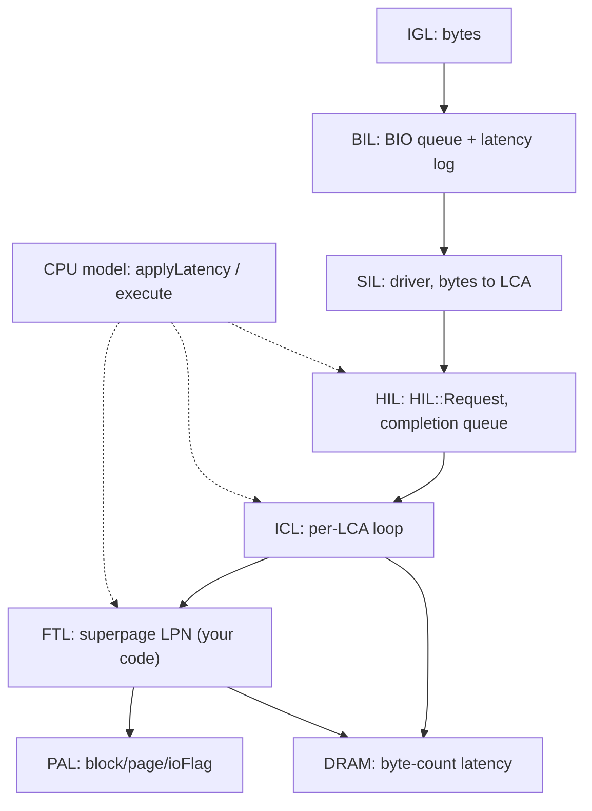
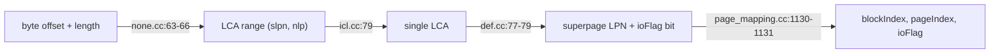

# Chapter 3 — Layer Contracts (everything that is not FTL)

[← README](README.md) | Prev: [02_boot_and_wiring.md](02_boot_and_wiring.md) | Next: [04_ftl_file_map.md](04_ftl_file_map.md)

---

## Why contracts

Your research target is the FTL. Every other subsystem in SimpleSSD-Standalone is something you must **trust, not read**. A contract is the minimum you need so that when a number moves, you can say which layer moved it — without opening that layer's algorithm.

**The rule:** if you can answer the five contract questions for a layer, you never need to open it. (1) What does it **receive**, in what addressing unit? (2) What does it **return or produce**? (3) What **state** does it mutate? (4) What does it **cost** in simulated ticks, and how is that cost delivered? (5) What **stats** does it export?

Internal algorithms are deliberately omitted: ICL replacement policy, PAL2 channel/way conflict resolution, and NVMe queue mechanics are all out of scope.

---

## All layers at a glance

| Layer | Namespace / class | Key file | Unit of work | Sync or event-driven |
| --- | --- | --- | --- | --- |
| IGL | `IGL::IOGenerator` → `RequestGenerator`, `TraceReplayer` | [`igl/io_gen.hh`](../../SimpleSSD-Standalone/igl/io_gen.hh) | byte offset + byte length | event-driven (`engine.scheduleEvent`) |
| BIL | `BIL::BlockIOEntry`, `BIL::Scheduler` | [`bil/entry.hh`](../../SimpleSSD-Standalone/bil/entry.hh) | `BIO` struct (bytes) | event-driven (completion callback) |
| SIL | `BIL::DriverInterface` → `SIL::None::Driver`, `SIL::NVMe::Driver` | [`sil/none/none.cc`](../../SimpleSSD-Standalone/sil/none/none.cc) | bytes in, **LCA range** out | event-driven |
| HIL | `SimpleSSD::HIL::HIL` | [`simplessd/hil/hil.cc`](../../SimpleSSD-Standalone/simplessd/hil/hil.cc) | `HIL::Request` (LCA range + byte offset/length) | event-driven entry, synchronous body |
| ICL | `SimpleSSD::ICL::ICL`, `AbstractCache` | [`simplessd/icl/icl.cc`](../../SimpleSSD-Standalone/simplessd/icl/icl.cc) | **one LCA** (one cache line) per loop iteration | synchronous (`uint64_t &tick`) |
| DRAM | `SimpleSSD::DRAM::AbstractDRAM` → `SimpleDRAM` | [`simplessd/dram/abstract_dram.hh`](../../SimpleSSD-Standalone/simplessd/dram/abstract_dram.hh) | bytes | synchronous (`uint64_t &tick`) |
| PAL | `SimpleSSD::PAL::PAL`, `AbstractPAL` | [`simplessd/pal/pal.cc`](../../SimpleSSD-Standalone/simplessd/pal/pal.cc) | **superpage**: `(blockIndex, pageIndex, ioFlag)` | synchronous (`uint64_t &tick`) |
| CPU model | free functions over `CPU::CPU` | [`simplessd/sim/cpu.hh`](../../SimpleSSD-Standalone/simplessd/sim/cpu.hh) | one modelled firmware function call | both (`execute` schedules, `applyLatency` returns) |



---

## IGL — I/O Generation Layer (`igl/io_gen.hh`)

**One-line job:** Produce the synthetic or replayed workload — decide *what* byte range is accessed and *when*.

**Entry points:**

| Function signature | file:line | Called by |
| --- | --- | --- |
| `virtual void init(uint64_t, uint32_t) = 0` | `igl/io_gen.hh:42` | `sim/main.cc:221` |
| `virtual void begin() = 0` | `igl/io_gen.hh:43` | `sim/main.cc:222` |
| `virtual void printStats(std::ostream &) = 0` / `getProgress(float &)` | `igl/io_gen.hh:44–45` | `sim/main.cc:283` / `:360` |
| `void RequestGenerator::_submitIO(uint64_t)`, `void TraceReplayer::submitIO()` | `igl/request/request_generator.cc:210`, `igl/trace/trace_replayer.cc:339` | their own `submitEvent` |

**Receives:** device geometry only — `init(bytesize, minBlockSize)`. Everything else comes from config (`request_generator.cc:38–50`).

**Returns / produces:** a `BIL::BIO` handed to `bioEntry.submitIO(bio)` (`request_generator.cc:235`, `trace_replayer.cc:352`). Fields set: `id`, `type`, `offset`, `length`, `callback`.

**Mutates:** its own counters `io_count`, `read_count`, `io_submitted`, `io_depth` (`request_generator.cc:216–232`); the RNG state; the pending `submitEvent`.

**Tick cost:** does **not** take `tick` by reference. It reads time with `engine.getCurrentTick()` and self-schedules the next submission at `tick + breakTime` (`request_generator.cc:287`), where `breakTime` is `submissionLatency` or `submissionLatency + completionLatency` (`request_generator.cc:238`, `:253`). No `applyLatency` call — IGL models the *host*, not the device firmware.

**Stats exported:** none in the `Stats` vector. It prints a free-text block instead (`request_generator.cc:119–135`) and reports a `float` completion fraction via `getProgress`.

**Open this file if:** your workload shape looks wrong (wrong read/write mix, wrong alignment, or the run terminates too early).

---

## BIL — Block I/O Layer (`bil/entry.hh`)

**One-line job:** The block-device queue: timestamp each request, forward it through a scheduler, and measure end-to-end latency.

**Entry points:**

| Function signature | file:line | Called by |
| --- | --- | --- |
| `void BlockIOEntry::submitIO(BIO &)` | `bil/entry.cc:64` | IGL (`request_generator.cc:235`) |
| `void BlockIOEntry::completion(uint64_t)` | `bil/entry.cc:78` | its own `callback` member, invoked by SIL |
| `void BlockIOEntry::printStats(...)` / `getProgress(Progress &)` | `bil/entry.cc:121` / `:158` | `request_generator.cc:134` / `sim/main.cc:361` |
| `virtual void Scheduler::submitIO(BIO &) = 0` → `NoopScheduler::submitIO` | `bil/scheduler.hh:39` → `bil/noop_scheduler.cc:30` | `bil/entry.cc:75` |

**Receives:** one `BIO` (`bil/entry.hh:46–61`) — `id`, `type` (`BIO_READ`/`BIO_WRITE`/`BIO_FLUSH`/`BIO_TRIM`, `bil/entry.hh:38–44`), byte `offset`, byte `length`, and the generator's `callback`.

**Returns / produces:** a **copy** of the `BIO` whose `callback` is replaced by BIL's own `completion` (`bil/entry.cc:73`), passed to the scheduler. The original is retained in `ioQueue`.

**Mutates:** `ioQueue` (push on submit `bil/entry.cc:72`, erase on completion `:104`); `bio.submittedAt` (`:68`); latency accumulators `minLatency`, `maxLatency`, `sumLatency`, `squareSumLatency` (`:110–118`); the `progress` struct under mutex (`:86–93`); the optional per-I/O latency CSV file (`:95–100`).

**Tick cost:** **zero.** BIL only reads `engine.getCurrentTick()` (`bil/entry.cc:68`, `:79`). The only scheduler built into this tree is `NoopScheduler`, which forwards straight through with no delay (`bil/noop_scheduler.cc:30–32`), selected at `bil/entry.cc:46–55`.

**Stats exported:** none in the `Stats` vector. Free-text latency min/max/avg/stdev with auto-scaled units (`bil/entry.cc:126–155`), plus live IOPS/bandwidth/latency through `Progress` (`bil/entry.hh:63–67`).

**Open this file if:** the reported average latency disagrees with `hil.busy`, or you want to change what lands in the latency CSV.

---

## SIL — Storage Interface Layer (`sil/none/none.cc`)

**One-line job:** Translate a block request into the device's own request format — and this is where **bytes become logical page addresses**.

**Entry points:**

| Function signature | file:line | Called by |
| --- | --- | --- |
| `virtual void submitIO(BIL::BIO &) = 0` | `bil/interface.hh:44` | `bil/noop_scheduler.cc:31` |
| `void None::Driver::submitIO(BIL::BIO &)` | `sil/none/none.cc:57` | via base pointer |
| `void NVMe::Driver::submitIO(BIL::BIO &)` | `sil/nvme/nvme.cc:355` | via base pointer |
| `virtual void init(std::function<void()> &)` / `getInfo(uint64_t &, uint32_t &)` | `bil/interface.hh:42–43` (impl `sil/none/none.cc:37`, `:52`) | `sim/main.cc:245` / `:220` |
| `virtual void initStats(...)` / `getStats(...)` | `bil/interface.hh:46–47` | `sim/main.cc:226` / `:320` |

**Receives:** one `BIO` with byte `offset` and `length`.

**Returns / produces:** a `SimpleSSD::HIL::Request` (`sil/none/none.cc:58–71`) then one of `pHIL->read/write/flush/trim` (`:74–89`). The conversion is the important part:

```cpp
req.range.slpn = bio.offset / logicalPageSize;          // none.cc:63
req.range.nlp  = DIVCEIL(bio.length, logicalPageSize);  // none.cc:64
req.offset     = bio.offset % logicalPageSize;          // none.cc:65
req.length     = bio.length;                            // none.cc:66
```

**Mutates:** heap-allocates a copy of the BIL callback (`none.cc:59`) and wraps it in `req.function`, which deletes it after firing (`:68–71`). `logicalPageSize` / `totalLogicalPages` are cached once from `pHIL->getLPNInfo` (`:38`). The `None` driver owns the `HIL` object (`:30`).

**Tick cost:** **zero of its own.** `None::Driver` calls into HIL directly; the only event it schedules is the one-shot `beginFunction` at tick 0 (`none.cc:43–44`). `NVMe::Driver` additionally models PCIe DMA throttling, which is out of scope here.

**Stats exported:** it is the **root of the stat tree**. `initStats` calls `pHIL->getStatList(list, "")` and `getCPUStatList(list, "cpu")` (`none.cc:93–94`). So HIL/ICL/FTL/PAL/DRAM stats arrive **unprefixed**, and CPU stats get the `cpu` prefix.

**Open this file if:** you need to know why an LCA is what it is, or you switch between the `None` and `NVMe` drivers.

---

## HIL — Host Interface Layer (`simplessd/hil/hil.cc`)

**One-line job:** Front door of the simulated device: assign request IDs, account device busy time, and re-order completions back into time order.

**Entry points:**

| Function signature | file:line | Called by |
| --- | --- | --- |
| `void HIL::read(Request &)` | `simplessd/hil/hil.cc:40` | `sil/none/none.cc:76` |
| `void HIL::write(Request &)` | `simplessd/hil/hil.cc:71` | `sil/none/none.cc:79` |
| `void HIL::flush(Request &)` | `simplessd/hil/hil.cc:103` | `sil/none/none.cc:82` |
| `void HIL::trim(Request &)` | `simplessd/hil/hil.cc:125` | `sil/none/none.cc:85` |
| `void HIL::format(Request &, bool)` | `simplessd/hil/hil.cc:147` | NVMe subsystem / warm-up paths |
| `void HIL::getLPNInfo(uint64_t &, uint32_t &)` / `getStatList(...)` | `simplessd/hil/hil.cc:172` / `:223` | `sil/none/none.cc:38` / `:93` |

**Receives:** `HIL::Request` **by reference**, but it immediately deep-copies to the heap: `execute(CPU::HIL, CPU::READ, doRead, new Request(req))` (`hil.cc:68`). The caller's object is not touched.

**Returns / produces:** `void`. Results are delivered by firing `req.function(tick, req.context)` from the completion event (`hil.cc:211`). Downstream it builds `ICL::Request reqInternal(*pReq)` and calls `pICL->read(reqInternal, tick)` (`hil.cc:52–53`).

**Mutates:** `reqCount` (monotonic request ID, `hil.cc:44`); `stat.request[]`, `stat.iosize[]`, `stat.busy[]`, `stat.lastBusyAt[]` (`:55–58`, `:180–193`); `completionQueue`, a min-heap ordered by `finishedAt` (`:61`, `:213`); `lastScheduled` (`:198`).

**Tick cost:** three stages. **Entry** goes through the CPU model — `execute(CPU::HIL, CPU::READ, ...)` (`hil.cc:68`) queues the body on a HIL core, so the body starts at `beginAt`, not now. **Body** is synchronous: `uint64_t tick = beginAt` (`:43`) goes by reference into ICL and comes back advanced; HIL adds **no** `applyLatency` of its own. **Exit** re-serialises: `pReq->finishedAt = tick` (`:60`), then `schedule(completionEvent, lastScheduled)` (`:199`) so the host callback fires at the right simulated instant.

**Stats exported:** prefix is empty by default, giving `read.request_count`, `read.bytes`, `read.busy`, `write.request_count`, `write.bytes`, `write.busy`, `request_count`, `bytes`, `busy` (`hil.cc:226–260`), then it delegates to `pICL->getStatList(list, prefix)` (`:262`).

**Open this file if:** total `busy` looks impossible, or completions appear out of order.

---

## ICL — Internal Cache Layer (`simplessd/icl/icl.cc`)

**One-line job:** Split a multi-page request into per-LCA cache accesses and hand misses/evictions to the FTL.

**Entry points:**

| Function signature | file:line | Called by |
| --- | --- | --- |
| `void ICL::read(Request &, uint64_t &)` | `simplessd/icl/icl.cc:66` | `simplessd/hil/hil.cc:53` |
| `void ICL::write(Request &, uint64_t &)` | `simplessd/icl/icl.cc:98` | `simplessd/hil/hil.cc:85` |
| `void ICL::flush(LPNRange &, uint64_t &)` | `simplessd/icl/icl.cc:130` | `simplessd/hil/hil.cc:112` |
| `void ICL::trim(LPNRange &, uint64_t &)` | `simplessd/icl/icl.cc:143` | `simplessd/hil/hil.cc:134`, `:158` |
| `void ICL::format(LPNRange &, uint64_t &)` | `simplessd/icl/icl.cc:156` | `simplessd/hil/hil.cc:155` |
| `virtual bool AbstractCache::read/write` and `void flush/trim/format` | `simplessd/icl/abstract_cache.hh:52–57` | `icl.cc:81`, `:113`, `:133`, `:146`, `:159` |

**Receives:** `ICL::Request` covering `range.nlp` consecutive LCAs plus a byte `offset`/`length`, and `tick` by reference.

**Returns / produces:** `void` at the `ICL` level; `AbstractCache::read`/`write` return `bool` (`abstract_cache.hh:52–53`) — true on hit for read (`generic_cache.cc:347`), true on cold-miss/hit for write (`:547`) — which `ICL` ignores. Downstream it produces `FTL::Request` objects — the superpage conversion point, see below.

**Mutates:** per-LCA `reqInternal` fields inside the loop (`icl.cc:78–83`); cache line array `cacheData` and its `valid`/`dirty`/`lastAccessed`/`insertedAt` metadata (`abstract_cache.hh:31–40`); the eviction staging array; hit/request counters. Note `ICL::format` **rewrites the caller's range in place** from LCA to superpage LPN (`generic_cache.cc:837–838`).

**Tick cost:** fully synchronous `uint64_t &tick`. Per call it takes `MAX` over the per-LCA finish times (`icl.cc:85`, `:94`) and then adds firmware overhead: `tick += applyLatency(CPU::ICL, CPU::READ)` (`icl.cc:95`), and the corresponding `WRITE`/`FLUSH`/`TRIM`/`FORMAT` variants at `:127`, `:140`, `:153`, `:166`. The cache implementation adds a second charge under `CPU::ICL__GENERIC_CACHE` (`generic_cache.cc:528`, `:727`, `:783`, `:814`, `:841`) and calls `pDRAM->read/write` for the data movement (`generic_cache.cc:379`, `:533`, `:597`, `:740`).

**Stats exported:** `icl.generic_cache.read.request_count`, `icl.generic_cache.read.from_cache`, `icl.generic_cache.write.request_count`, `icl.generic_cache.write.to_cache` — prefix `icl.` added at `icl.cc:181`, the rest at `generic_cache.cc:847–859`. It also owns the `dram.` prefix (`icl.cc:182`) and passes the bare prefix to FTL (`:183`).

**Open this file if:** your FTL sees a different number of writes than the host issued (cache absorption or eviction batching), or `EnableRandomIOTweak` changed and line sizing looks wrong.

---

## DRAM (`simplessd/dram/abstract_dram.hh`)

**One-line job:** Charge time and energy for moving a given number of bytes through the controller's DRAM.

**Entry points:**

| Function signature | file:line | Called by |
| --- | --- | --- |
| `virtual void read(void *, uint64_t, uint64_t &) = 0` | `simplessd/dram/abstract_dram.hh:60` | ICL (`generic_cache.cc:379`, `:740`), FTL (`page_mapping.cc:1118`, `:1207`, `:1321`) |
| `virtual void write(void *, uint64_t, uint64_t &) = 0` | `simplessd/dram/abstract_dram.hh:61` | ICL (`generic_cache.cc:489`, `:533`, `:597`), FTL (`page_mapping.cc:1208`) |
| `void SimpleDRAM::read` / `write` (the only implementation) | `simplessd/dram/simple.cc:94` / `:125` | via base pointer |
| `virtual void setScheduling(bool)` | `simplessd/dram/abstract_dram.hh:64` | `generic_cache.cc:524`, `:738`, `:742` |

**Receives:** an address pointer that is **ignored** (`simple.cc:94` names it away), a byte `size`, and `tick` by reference. Only `size` matters.

**Returns / produces:** `void`. Its whole output is the mutated `tick` plus energy accounting.

**Mutates:** `lastDRAMAccess`, the serialisation cursor (`simple.cc:61–69`); `readStat`/`writeStat` count and size (`:121–122`, `:152–153`); `totalEnergy`/`totalPower` via DRAMPower (`:76–84`).

**Tick cost:** advances `tick` **by reference**. Latency is `pageCount * (tRP + tRAS + pageSize / interfaceBandwidth)` where `pageCount = ceil(size / dramPageSize)` (`simple.cc:95–98`, constants at `:34–36`). `updateDelay` then queues the access behind `lastDRAMAccess` unless `ignoreScheduling` is set (`:53–74`) — that flag is what `setScheduling(false)` toggles. Independently, a self-rescheduling `autoRefresh` event fires every 64 ms of simulated time and can push `lastDRAMAccess` forward (`simple.cc:38–46`).

**Stats exported:** `dram.energy`, `dram.power` (`abstract_dram.cc:118`, `:122`, emitted first via `AbstractDRAM::getStatList` at `simple.cc:159`), then `dram.read.request_count`, `dram.read.bytes`, `dram.write.request_count`, `dram.write.bytes`, `dram.request_count`, `dram.bytes` (`simple.cc:161–183`).

**Open this file if:** you added mapping-table traffic in the FTL and want to know how many ticks a `pDRAM->read(..., 8 * n, tick)` actually costs.

---

## PAL — Physical Access Layer (`simplessd/pal/pal.cc`)

**One-line job:** Turn a superpage-level NAND command into a completion time, respecting channel/way/die/plane parallelism and NAND cell timings.

**Entry points:**

| Function signature | file:line | Called by |
| --- | --- | --- |
| `void PAL::read(Request &, uint64_t &)` | `simplessd/pal/pal.cc:120` | `page_mapping.cc:774`, `:1150`, `:1241` |
| `void PAL::write(Request &, uint64_t &)` | `simplessd/pal/pal.cc:124` | `page_mapping.cc:782`, `:1260` |
| `void PAL::erase(Request &, uint64_t &)` | `simplessd/pal/pal.cc:128` | `page_mapping.cc:1372` |
| `void PAL::copyback(...)` (unimplemented, `panic`s) / `Parameter *PAL::getInfo()` | `simplessd/pal/pal.cc:132` / `:136` | nothing / `simplessd/ftl/ftl.cc:32` |
| `virtual void AbstractPAL::read/write/erase = 0` | `simplessd/pal/abstract_pal.hh:40–42` | `pal.cc:121`, `:125`, `:129` |

**Receives:** `PAL::Request` — `blockIndex`, `pageIndex`, and an `ioFlag` bitset selecting which sub-pages of the superpage participate (`util/def.hh:92–101`) — plus `tick` by reference.

**Returns / produces:** `void`. The output is the advanced `tick` and the geometry it publishes through `getInfo()`: `superBlock`, `page`, `superPageSize`, `pageInSuperPage`, `block` (`pal.hh:32–43`), computed from the channel/way/die/plane config at `pal.cc:33–87`. Those values become the FTL's `param` (`ftl.cc:34–41`) — **PAL defines your device geometry**.

**Mutates:** nothing the FTL can see. Internally it advances per-channel and per-die busy timelines and the PAL statistics object.

**Tick cost:** advances `tick` **by reference**; `PAL::read/write/erase` are thin forwarders to `pPAL` (`pal.cc:120–130`). No `applyLatency` here — NAND time is hardware time, not firmware time. The FTL's own `CPU::FTL` charge is added one level up at `ftl.cc:73`, `:81`, `:89`, `:95`.

**Stats exported:** prefix `pal.` (`pal.cc:141`) over names defined in `pal_old.cc:335–455`: `pal.energy.{read,program,erase,total}`, `pal.power`, `pal.{read,program,erase}.count`, `pal.{read,program,erase}.bytes`, a per-phase timing breakdown `pal.<op>.time.{dma0.wait,dma0,mem,dma1.wait,dma1,total}`, plus `pal.channel.time.active` and `pal.die.time.active`.

**Open this file if:** you changed the NAND config and capacity or `pageCountToMaxPerf` moved unexpectedly.

---

## CPU model (`simplessd/sim/cpu.hh`)

**One-line job:** Charge simulated firmware execution time for a named function in a named subsystem, on a modelled multi-core controller.

**Entry points:**

| Function signature | file:line | Called by |
| --- | --- | --- |
| `void execute(CPU::NAMESPACE, CPU::FUNCTION, DMAFunction &, void *, uint64_t)` | `simplessd/sim/cpu.hh:52` | `hil.cc:68`, `:100`, `:122`, `:144`, `:169` |
| `uint64_t applyLatency(CPU::NAMESPACE, CPU::FUNCTION)` | `simplessd/sim/cpu.hh:54` | `icl.cc:95`, `ftl.cc:73`, `generic_cache.cc:528`, and every FTL entry point |
| `void initCPU(ConfigReader &)` / `getCPUStatList(...)` | `simplessd/sim/cpu.hh:45`, `:47` | simulator boot / `sil/none/none.cc:94` |
| `void CPU::CPU::execute(...)` / `uint64_t CPU::CPU::applyLatency(...)` | `simplessd/cpu/cpu.cc:671` / `:733` | `sim/cpu.cc:78` / `:93` |

**Receives:** a `NAMESPACE` (`FTL`, `FTL__PAGE_MAPPING`, `ICL`, `ICL__GENERIC_CACHE`, `HIL`, and the protocol namespaces — `cpu/def.hh:31–45`) and a `FUNCTION` (`READ`, `WRITE`, `FLUSH`, `TRIM`, `FORMAT`, plus FTL-internal ones like `READ_INTERNAL`, `DO_GARBAGE_COLLECTION` — `cpu/def.hh:47–112`). `execute` additionally takes the continuation and its context.

**Returns / produces:** `applyLatency` returns a picosecond delay looked up from the CPI table (`cpu/cpu.cc:789`). `execute` returns `void` and instead **calls your function later**.

**Mutates:** the chosen core's instruction counters and busy time via `addStat` (`cpu/cpu.cc:787`) or `submitJob` (`:726`); the per-core job queue.

**Tick cost:** this **is** the tick cost, in two shapes whose difference matters. `applyLatency` is a **pure lookup** — it does not touch `tick`, so the caller must write `tick += applyLatency(...)`; cores are chosen by `leastBusyCPU` (`cpu/cpu.cc:740–763`). `execute` instead **queues the continuation** on the least-busy core of the matching group (`cpu/cpu.cc:676–709`) and invokes it once that core is free. With no core configured, `execute` degrades to an immediate call at the current tick (`cpu/cpu.cc:729`) and `applyLatency` returns `0` (`sim/cpu.cc:96`).

**Stats exported:** prefix `cpu` from `sil/none/none.cc:94`, producing `cpu.hil<N>.busy`, `cpu.hil<N>.insts.{branch,load,store,arithmetic,fp,others}` and the same shape for `cpu.icl<N>.*` and `cpu.ftl<N>.*` (`cpu/cpu.cc:802–896`).

**Open this file if:** an FTL change added ticks you cannot attribute to NAND or DRAM, or you want to know whether your new FTL helper needs its own `FUNCTION` enum entry.

---

## Data structures that cross boundaries

Four request structs, all declared together in [`util/def.hh`](../../SimpleSSD-Standalone/simplessd/util/def.hh), with converting constructors in [`util/def.cc`](../../SimpleSSD-Standalone/simplessd/util/def.cc). Read those two files once and you have the whole data path.

| Struct | Declared | Key fields | Addressing unit |
| --- | --- | --- | --- |
| `LPNRange` | `util/def.hh:32–38` | `slpn`, `nlp` | start address + count, unit depends on who holds it |
| `HIL::Request` | `util/def.hh:42–57` | `reqID`, `offset`, `length`, `range`, `finishedAt`, `function`, `context` | **LCA range** + byte offset/length |
| `ICL::Request` | `util/def.hh:63–72` | `reqID`, `reqSubID`, `offset`, `length`, `range` | **one LCA** after ICL's split loop |
| `FTL::Request` | `util/def.hh:78–86` | `reqID`, `reqSubID`, `lpn`, `ioFlag` | **superpage LPN** + sub-page bitset |
| `PAL::Request` | `util/def.hh:92–101` | `reqID`, `reqSubID`, `blockIndex`, `pageIndex`, `ioFlag` | **physical** block/page + sub-page bitset |

The unit itself changes at three points; conversion 2 below splits a range without changing the unit.



**Conversion 1 — bytes to LCA (`sil/none/none.cc:63–66`).** `slpn = offset / logicalPageSize`, `nlp = DIVCEIL(length, logicalPageSize)`, intra-page remainder kept in `req.offset`. `logicalPageSize` is `pageSize / ioUnitInPage` when `EnableRandomIOTweak` is on, otherwise the full `pageSize` (`icl.cc:47–55`).

**Conversion 2 — LCA range to single LCA (`icl.cc:78–83`).** The loop sets `reqInternal.range.slpn = req.range.slpn + i` and `reqSubID = i + 1`, clamping `length` to what remains in the page. Nothing else iterates pages.

**Conversion 3 — LCA to superpage LPN (`util/def.cc:74–80`).** The single most important constructor for FTL work:

```cpp
FTL::Request::_Request(uint32_t iocount, ICL::Request &r)
    : lpn(r.range.slpn / iocount), ioFlag(iocount) {
  ioFlag.set(r.range.slpn % iocount);
}
```

`iocount` is `lineCountInSuperPage`, i.e. `ioUnitInPage` (`generic_cache.cc:36`, forced to `1` when the tweak is off at `:56`). So the LCA is split into a quotient (the LPN your GMT is keyed by) and a remainder (the bit set in `ioFlag`). The same `/` and `%` pair reappears wherever ICL rebuilds an FTL request from a cache line tag: `generic_cache.cc:321–323` (eviction), `:769–770` (flush), `:801–802` (trim), and on the whole range at `:837–838` (format).

**Conversion 4 — LPN to physical (`page_mapping.cc:1097`, `:1130–1131`).** `PAL::Request palRequest(req)` copies `reqID`, `reqSubID`, and `ioFlag` but leaves the address at zero (`util/def.cc:89–94`). Only **your FTL** fills it in, from the mapping vector: `palRequest.blockIndex = mapping.first; palRequest.pageIndex = mapping.second;`. That is the boundary you own.

---

## The five questions

Apply this to any subsystem you have not read yet; answering all five is a substitute for reading it.

| # | Question | Where to look |
| --- | --- | --- |
| 1 | What are the **pure virtual** methods of its abstract base? | the `abstract_*.hh` or `interface.hh` in that directory |
| 2 | Does it take `uint64_t &tick`? | the signature. Reference means synchronous latency; no reference means it schedules |
| 3 | Which request struct does it receive, and in what unit? | `util/def.hh` for the device side, `bil/entry.hh` for the host side |
| 4 | Does it call `applyLatency`, `execute`, or `schedule`? | grep the `.cc` for those three names |
| 5 | What prefix does its `getStatList` add? | the `getStatList` body, plus whoever calls it one level up |

If a number in your output moves and you can name the layer from its stat prefix, you have localised the change without reading that layer's algorithm.

---

## Self-quiz

1. Which layer converts a byte offset into an LCA, and what is the exact expression for `slpn`?
2. What does `logicalPageSize` equal when `EnableRandomIOTweak` is enabled?
3. Why does `HIL::read` take `Request &` but immediately heap-copy the argument?
4. Name the three tick-handling stages HIL uses in a single read.
5. In `FTL::Request(iocount, ICL::Request &)`, what is `iocount` at runtime and what are the quotient and remainder used for?
6. Which struct field does `PAL::Request` leave at zero, and which layer must fill it?
7. Does `applyLatency` modify `tick`? What must the caller write?
8. Which layer decides `param.totalPhysicalBlocks`, and where is it copied into the FTL parameter block?
9. What is the stat prefix for the DRAM model, and which layer attaches it?
10. Which layer exports **no** entries into the `Stats` vector at all — and how does it report instead?

## Self-quiz — answers

1. SIL. `req.range.slpn = bio.offset / logicalPageSize` (`sil/none/none.cc:63`).
2. `param.pageSize / param.ioUnitInPage` (`icl.cc:50`); otherwise the full `pageSize` (`:54`).
3. Because the body runs later, on a CPU core, via `execute(CPU::HIL, CPU::READ, doRead, new Request(req))` (`hil.cc:68`) — the caller's stack object would be gone by then. The lambda deletes the copy (`:65`).
4. Entry through the CPU model (`execute`, `hil.cc:68`); body synchronous by reference into ICL (`:53`); exit re-serialised with `schedule(completionEvent, ...)` (`:199`).
5. `iocount` is `lineCountInSuperPage` = `ioUnitInPage` (`generic_cache.cc:36`). Quotient becomes `lpn`, remainder becomes the set bit in `ioFlag` (`util/def.cc:77–79`).
6. `blockIndex` and `pageIndex` are zero after construction (`util/def.cc:89–94`); the FTL fills them (`page_mapping.cc:1130–1131`).
7. No — it only returns a delay (`cpu/cpu.cc:789`). The caller must write `tick += applyLatency(...)`, e.g. `icl.cc:95`.
8. PAL, as `Parameter::superBlock` (`pal.hh:39`; seeded at `pal.cc:41` then multiplied at `:50`, `:59`, `:68`, `:78`), copied at `ftl.cc:34`.
9. `dram.`, attached by ICL at `icl.cc:182`.
10. IGL and BIL. Both print free-text blocks instead — `request_generator.cc:119–135` and `bil/entry.cc:121–156` — and expose live progress through `getProgress`.
