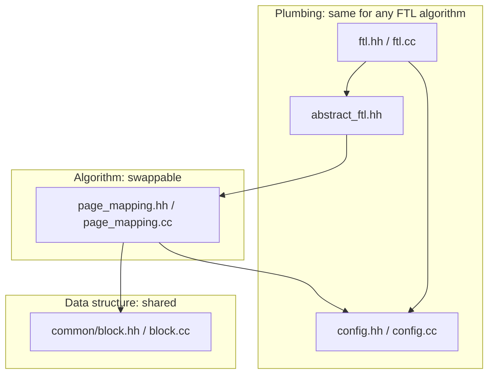
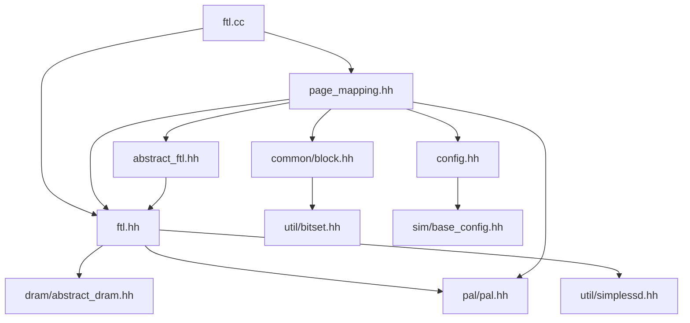
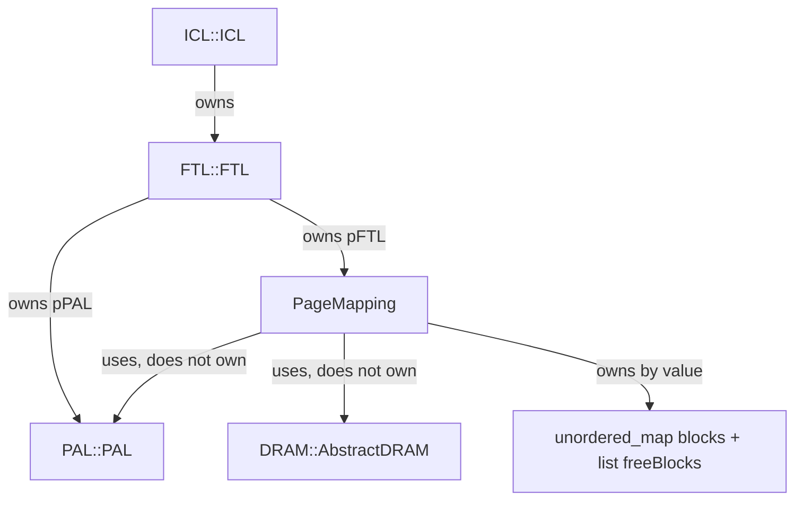
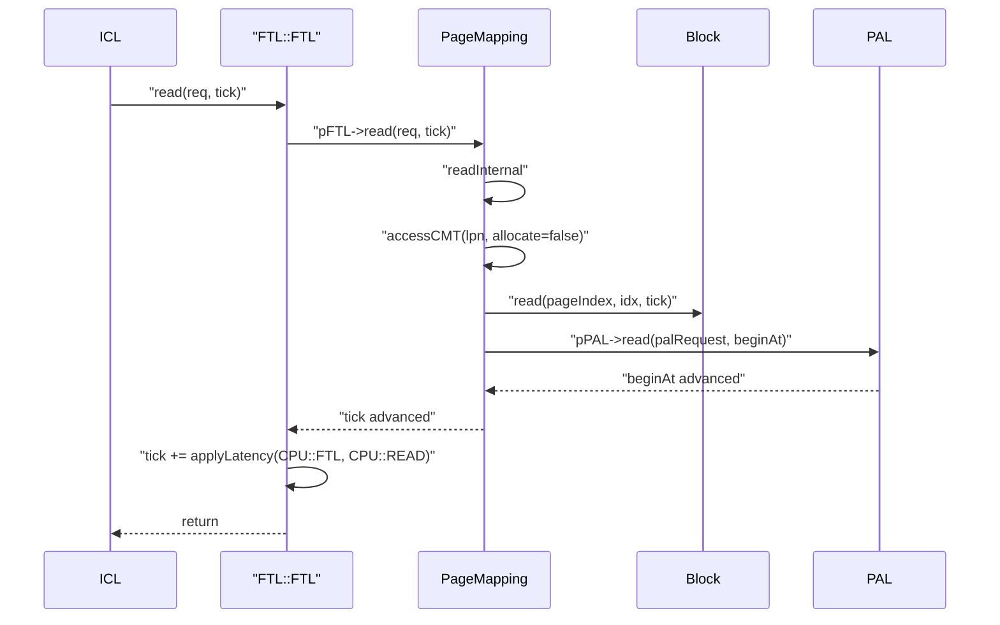

# Chapter 4 — The FTL Directory as a Whole

[← README](README.md) | Prev: [03_layer_contracts.md](03_layer_contracts.md) | Next: [05_ftl_facade.md](05_ftl_facade.md)

**Source directory:** [`simplessd/ftl/`](../../SimpleSSD-Standalone/simplessd/ftl) — 9 files, 2854 lines

This is where the abstraction stops. Everything from here down is read in full.

---

## The nine files

| File | Lines | Kind | One-line role |
| --- | --- | --- | --- |
| `ftl.hh` | 73 | facade | Declares `FTL::FTL` and the `Parameter` geometry struct |
| `ftl.cc` | 123 | facade | Builds PAL + the mapping algorithm, delegates I/O, adds CPU latency, merges stats |
| `abstract_ftl.hh` | 64 | interface | The contract every mapping algorithm implements; holds `param`, `pPAL`, `pDRAM`, `status` |
| `page_mapping.hh` | 214 | algorithm | Page-mapping declarations: GMT, block pool, CMT (LRU + LFU), GC helpers, stats |
| `page_mapping.cc` | 1564 | algorithm | The entire FTL algorithm |
| `common/block.hh` | 80 | data | `Block` class declaration |
| `common/block.cc` | 367 | data | Per-block valid/erased bitmaps, write pointers, erase count |
| `config.hh` | 119 | config | `[ftl]` key enum, policy enums, member defaults in comments |
| `config.cc` | 250 | config | Parse, validate, and serve `[ftl]` keys |

Three layers of responsibility, which is the mental model worth keeping:



If you write a second FTL scheme, you replace only the middle box.

---

## Include graph

Who includes whom, and therefore who can see whom:



Two things fall out of this graph:

**1. `ftl.hh` forward-declares the algorithm, it does not include it.**

```31:31:SimpleSSD-Standalone/simplessd/ftl/ftl.hh
class AbstractFTL;
```

Only `ftl.cc` includes `page_mapping.hh`. So adding a mapping scheme never forces a rebuild of ICL or HIL — they only ever see `ftl.hh`.

**2. `page_mapping.hh` includes `ftl.hh`, and `abstract_ftl.hh` includes `ftl.hh` too.** The `Parameter`, `Request`, and `LPNRange` types all live in `ftl.hh`, so it is the shared vocabulary header for the whole directory.

---

## Ownership and call direction



| Relationship | Where established | Note |
| --- | --- | --- |
| `FTL::FTL` owns `PAL::PAL` | `ftl.cc:31`, deleted `ftl.cc:64` | The FTL is the only route to NAND |
| `FTL::FTL` owns `PageMapping` | `ftl.cc:45`, deleted `ftl.cc:65` | Held as `AbstractFTL *pFTL` |
| `PageMapping` borrows PAL | passed at `ftl.cc:45`, stored `page_mapping.hh:40` | Also stored in the base as `AbstractFTL::pPAL` — **two pointers to the same object** |
| `PageMapping` borrows DRAM | `AbstractFTL::pDRAM` | Owned by ICL, shared with `GenericCache` |
| `PageMapping` owns all `Block` objects | `blocks` and `freeBlocks` | By value, not pointer; a block is in exactly one of the two containers |

**The duplicated PAL pointer** is worth noticing when reading code: `AbstractFTL` already declares `pPAL` (`abstract_ftl.hh:40`) and `PageMapping` declares its own (`page_mapping.hh:40`), initialised from the same constructor argument. They are always equal. Nothing breaks, but it explains why you see both spellings.

---

## The geometry contract

`ftl.cc` converts PAL's physical geometry into the FTL's own `Parameter` struct. Every other file in the directory reads from that struct rather than from PAL.

```34:41:SimpleSSD-Standalone/simplessd/ftl/ftl.cc
  param.totalPhysicalBlocks = palparam->superBlock;
  param.totalLogicalBlocks =
      palparam->superBlock *
      (1 - conf.readFloat(CONFIG_FTL, FTL_OVERPROVISION_RATIO));
  param.pagesInBlock = palparam->page;
  param.pageSize = palparam->superPageSize;
  param.ioUnitInPage = palparam->pageInSuperPage;
  param.pageCountToMaxPerf = palparam->superBlock / palparam->block;
```

| `Parameter` field | Source | Used in the directory by |
| --- | --- | --- |
| `totalPhysicalBlocks` | `superBlock` | Free-block pool size, `freeBlockRatio`, the **sentinel PPN**, GMT reserve |
| `totalLogicalBlocks` | superblocks minus over-provision | `status.totalLogicalPages`, warm-up sizing |
| `pagesInBlock` | `page` | `Block` constructor, "is this block full" test, GC page scan |
| `pageSize` | `superPageSize` | Reported up to ICL as the logical page size |
| `ioUnitInPage` | `pageInSuperPage` | `Block` sub-page arrays; `bitsetSize` when the random-I/O tweak is on |
| `pageCountToMaxPerf` | superblocks ÷ blocks | Number of parallel write streams (`lastFreeBlock` length) |

Full derivation from `[pal]` keys is in [chapter 2, part 5](02_boot_and_wiring.md#part-5--geometry-flows-upward-from-nand).

---

## The one flag that touches everything: `EnableRandomIOTweak`

`FTL_USE_RANDOM_IO_TWEAK` is read in three different files and changes the meaning of an address in all of them.

| Where | Effect | Line |
| --- | --- | --- |
| `icl.cc` | An ICL page becomes one **sub-page**, so there are `ioUnitInPage`× more logical pages | `icl.cc:47-55` |
| `page_mapping.cc` | `bitsetSize = ioUnitInPage` (else 1), so one GMT/CMT entry holds that many PPNs | ctor, see [`../page_mapping/02_constructor_init.md`](../page_mapping/02_constructor_init.md) |
| `common/block.cc` | `Block` switches from single `Bitset` to a `std::vector<Bitset>` per page | `block.cc:39-59` |

**Consequence for your CMT work:** with the tweak on and `ioUnitInPage == 8`, one CMT entry costs 8 × 8 = 64 bytes, not 8. That is the capacity bug documented in [`../08_CMT_Mentor_Census.md`](../08_CMT_Mentor_Census.md).

---

## Where each concept lives

A lookup table for "which file do I open".

| I want to change… | File | Chapter |
| --- | --- | --- |
| The LPN → PPN mapping algorithm | `page_mapping.cc` | [`page_mapping/07`](../page_mapping/07_internal_io.md) |
| The mapping cache (CMT) policy | `page_mapping.cc` + `config.{hh,cc}` | [`page_mapping/06`](../page_mapping/06_cmt_access.md), [07](07_ftl_config.md) |
| GC victim selection | `page_mapping.cc` | [`page_mapping/05`](../page_mapping/05_gc.md) |
| What a physical block remembers | `common/block.{hh,cc}` | [06](06_block_metadata.md) |
| A new `[ftl]` config key | `config.hh` + `config.cc` | [07](07_ftl_config.md) |
| Per-operation FTL CPU cost | `ftl.cc` | [05](05_ftl_facade.md) |
| Adding a whole new mapping scheme | `ftl.cc:43-47` + new files + `config.hh:55-57` | [05](05_ftl_facade.md) |
| A new exported statistic | `page_mapping.cc` (both stat functions) | [`page_mapping/08`](../page_mapping/08_wear_stats.md) |

---

## Call flow inside the directory

One host read, restricted to the FTL directory:



Notice that `FTL::FTL` contributes **nothing but a debug line and a latency charge**. All behaviour is in `PageMapping`. That is the point of the facade — chapter 05.

---

## Reading order for the FTL itself

1. [05_ftl_facade.md](05_ftl_facade.md) — the thin outer shell (260 lines of source total)
2. [06_block_metadata.md](06_block_metadata.md) — the data structure everything mutates
3. [07_ftl_config.md](07_ftl_config.md) — the knobs
4. [`../page_mapping/README.md`](../page_mapping/README.md) — the 1778-line algorithm itself

Doing it in this order means that by the time you open `page_mapping.cc`, every type it uses is already familiar.

---

## Self-quiz

1. How many files are in `simplessd/ftl/`, and which one is the largest?
2. Why does `ftl.hh` forward-declare `AbstractFTL` instead of including `page_mapping.hh`?
3. Which file is the shared vocabulary header for the directory, and what types does it provide?
4. Who owns `PAL::PAL`, and who is allowed to call it?
5. Why do both `AbstractFTL` and `PageMapping` have a `pPAL` member?
6. Which container holds a `Block` that is currently receiving writes, and which holds an erased one?
7. Name the three files whose behaviour changes when `EnableRandomIOTweak` is toggled.
8. Where does `totalLogicalBlocks` come from, and which config key shrinks it?
9. What does `FTL::FTL::read` actually do beyond calling `pFTL->read`?
10. If you added an N+K mapping scheme, which three places would you have to edit?

### Answers

1. Nine files, 2854 lines. `page_mapping.cc` at 1564 lines is by far the largest.
2. So that ICL and HIL, which include `ftl.hh`, never depend on a specific mapping algorithm — adding one does not trigger their recompilation.
3. `ftl.hh`. It defines the `Parameter` geometry struct and pulls in `Request` and `LPNRange` used across the directory.
4. `FTL::FTL` owns it (`ftl.cc:31`). Only the FTL talks to NAND; `PageMapping` borrows the pointer.
5. `AbstractFTL` stores it for all subclasses, and `PageMapping` keeps its own copy initialised from the same constructor argument (`page_mapping.hh:40`). They always point at the same object.
6. `blocks` (an `unordered_map<uint32_t, Block>`) holds in-use blocks; `freeBlocks` (a `list<Block>`) holds erased ones. A block is in exactly one of them.
7. `icl.cc` (logical page size and count), `page_mapping.cc` (`bitsetSize`, and therefore CMT entry size), `common/block.cc` (single bitset versus per-page vector of bitsets).
8. `superBlock × (1 − OverProvisioningRatio)` at `ftl.cc:35-37`. `OverProvisioningRatio` shrinks it.
9. It prints a `LOG_FTL` debug line and adds `applyLatency(CPU::FTL, CPU::READ)` to the tick. Nothing else.
10. The `MAPPING` enum in `config.hh:55-57`, the factory switch at `ftl.cc:43-47`, and the new algorithm files implementing `AbstractFTL`.
