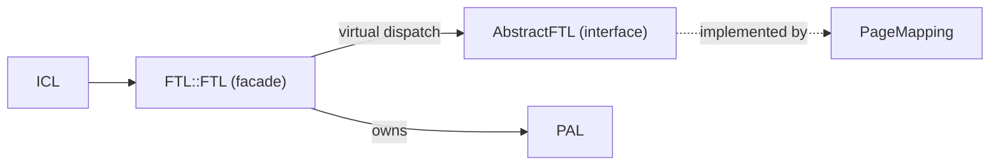

# Chapter 5 — The FTL Facade: `ftl.hh`, `ftl.cc`, `abstract_ftl.hh`

[← README](README.md) | Prev: [04_ftl_file_map.md](04_ftl_file_map.md) | Next: [06_block_metadata.md](06_block_metadata.md)

**Sources:** [`ftl.hh`](../../SimpleSSD-Standalone/simplessd/ftl/ftl.hh) (73), [`ftl.cc`](../../SimpleSSD-Standalone/simplessd/ftl/ftl.cc) (123), [`abstract_ftl.hh`](../../SimpleSSD-Standalone/simplessd/ftl/abstract_ftl.hh) (64)

260 lines total — small enough to cover every statement.

---

## Why a facade at all

`FTL::FTL` implements **no** translation logic. It exists to do four jobs that any mapping algorithm would otherwise have to duplicate:

1. Own and construct PAL, and derive FTL geometry from it.
2. Pick the mapping algorithm from config.
3. Charge a per-operation firmware CPU cost.
4. Merge its own and PAL's statistics into one list.

`ICL::ICL` only ever sees this class. Swapping the algorithm changes nothing above it.



---

## Part 1 — `ftl.hh`

### Lines 20-25: guard and includes

| Line(s) | Code | Meaning |
| --- | --- | --- |
| 20-21 | `#ifndef __FTL_FTL__` | Include guard. |
| 23 | `#include "dram/abstract_dram.hh"` | For the `DRAM::AbstractDRAM *` constructor parameter. |
| 24 | `#include "pal/pal.hh"` | `FTL::FTL` owns a `PAL::PAL` by pointer, and PAL's header supplies `Request` / `LPNRange` via its own includes. |
| 25 | `#include "util/simplessd.hh"` | Pulls in `ConfigReader`, `StatObject`, `panic`, `debugprint`. |

### Line 31: the forward declaration

```31:31:SimpleSSD-Standalone/simplessd/ftl/ftl.hh
class AbstractFTL;
```

**The single most important line in the header.** Because the algorithm class is only forward-declared, `ftl.hh` can be included by ICL without dragging in `page_mapping.hh`. A pointer to an incomplete type is legal; that is all `FTL::FTL` needs.

### Lines 33-40: the `Parameter` struct

```33:40:SimpleSSD-Standalone/simplessd/ftl/ftl.hh
typedef struct {
  uint64_t totalPhysicalBlocks;  //!< (PAL::Parameter::superBlock)
  uint64_t totalLogicalBlocks;
  uint64_t pagesInBlock;  //!< (PAL::Parameter::page)
  uint32_t pageSize;      //!< Mapping unit (PAL::Parameter::superPageSize)
  uint32_t ioUnitInPage;  //!< # smallest I/O unit in one page
  uint32_t pageCountToMaxPerf;  //!< # pages to fully utilize internal parallism
} Parameter;
```

| Field | Type | Meaning | Note |
| --- | --- | --- | --- |
| `totalPhysicalBlocks` | `uint64_t` | Superblocks on the device | The **sentinel** block index is exactly this value |
| `totalLogicalBlocks` | `uint64_t` | Blocks visible to the host | Physical minus over-provisioning |
| `pagesInBlock` | `uint64_t` | Pages per block | Sentinel page index is exactly this value |
| `pageSize` | `uint32_t` | Superpage size in bytes | Becomes the ICL page size |
| `ioUnitInPage` | `uint32_t` | Sub-pages per superpage | Drives `bitsetSize` |
| `pageCountToMaxPerf` | `uint32_t` | Parallel write streams | Length of `lastFreeBlock` |

The comments in the source name the PAL field each one comes from — a rare piece of upstream documentation worth trusting.

### Lines 42-67: the class

| Line(s) | Member | Meaning |
| --- | --- | --- |
| 42 | `class FTL : public StatObject` | `StatObject` is the base that requires the three stat methods. |
| 44 | `Parameter param` | Owned **by value**; handed out by pointer via `getInfo()`. |
| 45 | `PAL::PAL *pPAL` | Owned. Constructed first, deleted first. |
| 47 | `ConfigReader &conf` | Reference — the caller must outlive the FTL. |
| 48 | `AbstractFTL *pFTL` | The algorithm. Owned, deleted second. |
| 49 | `DRAM::AbstractDRAM *pDRAM` | **Borrowed** from ICL; never deleted here. |
| 52-53 | ctor / dtor | See part 2. |
| 55-57 | `read` / `write` / `trim` | Take `Request &` and `uint64_t &tick`. |
| 59 | `format` | Takes `LPNRange &` — a range operation, not a single request. |
| 61 | `getInfo()` | Returns `&param`; how ICL learns the geometry. |
| 62 | `getUsedPageCount` | Capacity query for the host. |
| 64-66 | stat trio | `override` on all three. |

**Notice what is missing:** no `initialize()`. The facade calls it once inside its own constructor (`ftl.cc:60`) and never exposes it.

---

## Part 2 — `ftl.cc`

### Lines 28-61: the constructor

```28:32:SimpleSSD-Standalone/simplessd/ftl/ftl.cc
FTL::FTL(ConfigReader &c, DRAM::AbstractDRAM *d) : conf(c), pDRAM(d) {
  PAL::Parameter *palparam;

  pPAL = new PAL::PAL(conf);
  palparam = pPAL->getInfo();
```

| Line | Code | Meaning |
| --- | --- | --- |
| 28 | ctor signature | Only two arguments: config and the DRAM model. Geometry is *not* passed in — it is discovered. |
| 29 | `PAL::Parameter *palparam;` | Scratch pointer. |
| 31 | `pPAL = new PAL::PAL(conf)` | **PAL is built first.** It parses `[pal]` and computes the superblock geometry. |
| 32 | `palparam = pPAL->getInfo()` | Borrow PAL's geometry to derive our own. |

Then the six-field translation (lines 34-41) covered in [chapter 04](04_ftl_file_map.md#the-geometry-contract). Two lines deserve a second look:

```35:37:SimpleSSD-Standalone/simplessd/ftl/ftl.cc
  param.totalLogicalBlocks =
      palparam->superBlock *
      (1 - conf.readFloat(CONFIG_FTL, FTL_OVERPROVISION_RATIO));
```

Float arithmetic truncated into a `uint64_t`. With the default 0.25, a 512-block device advertises 384 logical blocks and keeps 128 spare.

```41:41:SimpleSSD-Standalone/simplessd/ftl/ftl.cc
  param.pageCountToMaxPerf = palparam->superBlock / palparam->block;
```

Superblocks divided by per-plane blocks — that is the number of independent parallel units, so the FTL keeps that many open write blocks.

#### The factory

```43:47:SimpleSSD-Standalone/simplessd/ftl/ftl.cc
  switch (conf.readInt(CONFIG_FTL, FTL_MAPPING_MODE)) {
    case PAGE_MAPPING:
      pFTL = new PageMapping(conf, param, pPAL, pDRAM);
      break;
  }
```

| Line | Meaning |
| --- | --- |
| 43 | Read `MappingMode` from `[ftl]`. |
| 44-46 | The only implemented case. `PageMapping` gets config, geometry, PAL, DRAM. |
| 47 | **No `default`.** Any other value leaves `pFTL` uninitialised and the program dereferences garbage at line 60. |

If you add a scheme, add the enum value in `config.hh:55-57` and a case here — and while you are there, add a `default: panic(...)`.

#### The over-provisioning guard

```49:52:SimpleSSD-Standalone/simplessd/ftl/ftl.cc
  if (param.totalPhysicalBlocks <=
      param.totalLogicalBlocks + param.pageCountToMaxPerf) {
    panic("FTL Over-Provision Ratio is too small");
  }
```

Spare blocks must exceed the number of open write streams, otherwise `getFreeBlock` could exhaust the pool with no victim available and GC would have nowhere to relocate to. Failing at construction is the right call.

**Note the ordering quirk:** this check runs *after* `new PageMapping`, so the algorithm object is already built when the panic fires. Harmless, since `panic` terminates.

#### Debug print and warm-up

| Line(s) | Code | Meaning |
| --- | --- | --- |
| 55-57 | three `debugprint(LOG_FTL, ...)` | Physical blocks, logical blocks, logical page size — the quickest way to sanity-check geometry in a run log. |
| 60 | `pFTL->initialize();` | **Warm-up runs inside the constructor.** By the time `ICL::ICL` gets its `FTL *`, the drive is already filled per `FillRatio` and the CMT counters have been reset. |

That last line explains something confusing: the fill happens before the first host request exists, so warm-up cost never appears in any request's latency. See [`../page_mapping/02_constructor_init.md`](../page_mapping/02_constructor_init.md).

### Lines 63-66: destructor

```63:66:SimpleSSD-Standalone/simplessd/ftl/ftl.cc
FTL::~FTL() {
  delete pPAL;
  delete pFTL;
}
```

**PAL is deleted before the algorithm.** So `~PageMapping` — which runs second and calls `flushCMT()` — must not touch PAL. It does not: `flushCMT` is a pure in-memory copy of dirty CMT entries into the GMT with no tick charge. If you ever add write-back I/O to `flushCMT`, swap these two lines first.

`pDRAM` is not deleted; ICL owns it.

### Lines 68-96: the four I/O methods

All four are the same three-line shape:

```68:74:SimpleSSD-Standalone/simplessd/ftl/ftl.cc
void FTL::read(Request &req, uint64_t &tick) {
  debugprint(LOG_FTL, "READ  | LPN %" PRIu64, req.lpn);

  pFTL->read(req, tick);

  tick += applyLatency(CPU::FTL, CPU::READ);
}
```

| Method | Lines | Debug tag | Latency charged |
| --- | --- | --- | --- |
| `read` | 68-74 | `READ  \| LPN n` | `CPU::FTL, CPU::READ` |
| `write` | 76-82 | `WRITE \| LPN n` | `CPU::FTL, CPU::WRITE` |
| `trim` | 84-90 | `TRIM  \| LPN n` | `CPU::FTL, CPU::TRIM` |
| `format` | 92-96 | none | `CPU::FTL, CPU::FORMAT` |

Three observations:

1. **The latency is added *after* the call**, so it stacks on top of whatever `PageMapping` already accumulated (which includes its own `CPU::FTL__PAGE_MAPPING` charges). A single read is therefore charged at two levels: the facade and the algorithm. That is intentional — they model different firmware stages.
2. **`format` has no debug print.** The other three do. Minor inconsistency, worth knowing when a format seems to vanish from the log.
3. **`tick` is passed straight through by reference.** The facade never copies it, so unlike the GC path in [chapter 01](01_simulator_model.md#the-trap-a-local-copy-discards-time), nothing is lost here.

### Lines 98-104: information queries

```98:104:SimpleSSD-Standalone/simplessd/ftl/ftl.cc
Parameter *FTL::getInfo() {
  return &param;
}

uint64_t FTL::getUsedPageCount(uint64_t lpnBegin, uint64_t lpnEnd) {
  return pFTL->getStatus(lpnBegin, lpnEnd)->mappedLogicalPages;
}
```

| Line(s) | Meaning |
| --- | --- |
| 98-100 | Returns a pointer to the **live** member. Callers must not modify it; `ICL::ICL` only reads (`icl.cc:45`). |
| 102-104 | Delegates to `getStatus`, which returns a pointer to the algorithm's own `status` struct, and picks one field. |

`getUsedPageCount` is how the NVMe layer answers "how full is this namespace". It walks the GMT when the range is partial — see [`../page_mapping/03_public_io.md`](../page_mapping/03_public_io.md).

### Lines 106-119: statistics

```106:114:SimpleSSD-Standalone/simplessd/ftl/ftl.cc
void FTL::getStatList(std::vector<Stats> &list, std::string prefix) {
  pFTL->getStatList(list, prefix + "ftl.");
  pPAL->getStatList(list, prefix);
}

void FTL::getStatValues(std::vector<double> &values) {
  pFTL->getStatValues(values);
  pPAL->getStatValues(values);
}
```

| Line | Meaning |
| --- | --- |
| 107 | Appends `"ftl."` to the incoming prefix before handing it to the algorithm. This is where `page_mapping.cmt.hits` becomes `ftl.page_mapping.cmt.hits`. |
| 108 | PAL gets the **unmodified** prefix; PAL adds its own `"pal."` internally (`pal.cc:141`). |
| 111-114 | Values pushed in the **same order**: algorithm first, PAL second. |
| 116-119 | `resetStatValues` forwards to both. |

**The invariant:** the order of the two calls in `getStatList` must match the order in `getStatValues`. Swap one and every stat in the output is mislabelled while the length check at `main.cc:324` still passes — a silent, nasty failure.

---

## Part 3 — `abstract_ftl.hh`

### Lines 31-35: the `Status` struct

```31:35:SimpleSSD-Standalone/simplessd/ftl/abstract_ftl.hh
typedef struct _Status {
  uint64_t totalLogicalPages;
  uint64_t mappedLogicalPages;
  uint64_t freePhysicalBlocks;
} Status;
```

Three numbers the host may ask for: capacity, how much is written, and how much erased space remains. Populated by `PageMapping::getStatus`.

### Lines 37-42: protected state every algorithm inherits

```37:42:SimpleSSD-Standalone/simplessd/ftl/abstract_ftl.hh
class AbstractFTL : public StatObject {
 protected:
  Parameter &param;
  PAL::PAL *pPAL;
  DRAM::AbstractDRAM *pDRAM;
  Status status;
```

| Line | Member | Note |
| --- | --- | --- |
| 39 | `Parameter &param` | A **reference** to the facade's `param`. Not a copy — if the facade's geometry changed, the algorithm would see it. |
| 40 | `PAL::PAL *pPAL` | Borrowed. `PageMapping` also keeps its own copy of this pointer. |
| 41 | `DRAM::AbstractDRAM *pDRAM` | Borrowed. Used for translation-table traffic. |
| 42 | `Status status` | Owned by value; `getStatus` returns `&status`. |

These four are why `page_mapping.cc` can write `param.pagesInBlock` and `pDRAM->read(...)` with no declaration in its own header.

### Lines 44-58: the interface

```44:57:SimpleSSD-Standalone/simplessd/ftl/abstract_ftl.hh
 public:
  AbstractFTL(Parameter &p, PAL::PAL *l, DRAM::AbstractDRAM *d)
      : param(p), pPAL(l), pDRAM(d) {}
  virtual ~AbstractFTL() {}

  virtual bool initialize() = 0;

  virtual void read(Request &, uint64_t &) = 0;
  virtual void write(Request &, uint64_t &) = 0;
  virtual void trim(Request &, uint64_t &) = 0;

  virtual void format(LPNRange &, uint64_t &) = 0;

  virtual Status *getStatus(uint64_t, uint64_t) = 0;
};
```

| Line(s) | Element | Meaning |
| --- | --- | --- |
| 45-46 | ctor | Initialises the three borrowed members. |
| 47 | `virtual ~AbstractFTL() {}` | **Virtual destructor** — required, because `FTL::~FTL` deletes through an `AbstractFTL *`. Without it, `~PageMapping` (and therefore `flushCMT`) would never run. |
| 49 | `initialize()` | Warm-up. Returns `bool`, though `ftl.cc:60` ignores it. |
| 51-53 | `read` / `write` / `trim` | Per-request operations. |
| 55 | `format` | Range operation. |
| 57 | `getStatus` | Range-scoped status query. |

Six pure virtuals plus the three inherited from `StatObject` — that is the complete contract for a new FTL scheme.

**What is *not* in the interface:** garbage collection, free-block management, wear leveling, caching. Those are implementation choices, deliberately invisible to the facade.

---

## Invariants

1. **The facade holds no algorithm state.** Delete `PageMapping` and `FTL::FTL` still compiles and links.
2. **Construction order is PAL → geometry → algorithm → warm-up**, all inside one constructor.
3. **Destruction order is PAL → algorithm.** Nothing in an algorithm destructor may use PAL.
4. **`param` is shared by reference**, so the facade and the algorithm can never disagree about geometry.
5. **Stat order is fixed:** algorithm before PAL, in both list and value functions.
6. **Every I/O method charges CPU latency after delegating**, never before.

---

## Self-quiz

1. What four jobs does `FTL::FTL` do, given that it implements no mapping logic?
2. Why is `AbstractFTL` forward-declared in `ftl.hh` rather than included?
3. In what order does the constructor build things, and why must PAL come first?
4. What does the panic at `ftl.cc:49-52` protect against?
5. Why is it significant that `pFTL->initialize()` is called inside the constructor?
6. `~FTL` deletes PAL before the algorithm. What constraint does that place on `~PageMapping`?
7. A single host read is charged CPU latency at two different levels. Which two?
8. How does the stat name `ftl.page_mapping.cmt.hits` get its `ftl.` prefix?
9. What would break if you swapped the two lines inside `FTL::getStatList` but not `getStatValues`?
10. Why must `~AbstractFTL` be virtual, and what specifically would be lost otherwise?

### Answers

1. Owns and constructs PAL plus derives geometry; selects the algorithm from config; charges per-operation CPU latency; merges its own and PAL's statistics.
2. So that ICL and HIL, which include `ftl.hh`, do not depend on any specific algorithm header. A pointer to an incomplete type is sufficient.
3. PAL, then `param` from PAL's geometry, then the algorithm, then warm-up. PAL must come first because the FTL's entire geometry is derived from `pPAL->getInfo()`.
4. A configuration with too little over-provisioning, where spare blocks would not cover the open write streams plus GC working set.
5. Warm-up completes before any host request exists, so fill cost never appears in a request's measured latency, and CMT counters are already reset when the workload starts.
6. `~PageMapping` must not call PAL. Currently true: `flushCMT` is a pure in-memory GMT merge with no I/O and no tick charge.
7. `CPU::FTL, CPU::READ` in the facade (`ftl.cc:73`) and `CPU::FTL__PAGE_MAPPING, CPU::READ` plus `READ_INTERNAL` inside the algorithm.
8. `FTL::getStatList` appends `"ftl."` to the incoming prefix at `ftl.cc:107` before passing it down.
9. Every statistic would be printed under the wrong name. The length check at `main.cc:324-328` compares only counts, so nothing would crash.
10. Because `FTL::~FTL` deletes through an `AbstractFTL *`. Without a virtual destructor the derived destructor never runs, so `flushCMT()` would be skipped and dirty CMT entries would be lost.
