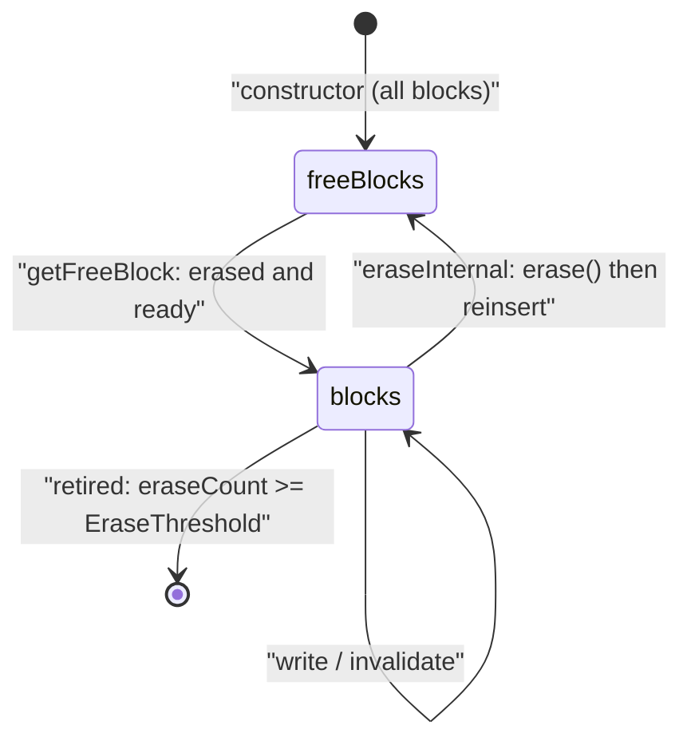

# Chapter 6 — Block Metadata: `common/block.{hh,cc}`

[← README](README.md) | Prev: [05_ftl_facade.md](05_ftl_facade.md) | Next: [07_ftl_config.md](07_ftl_config.md)

**Sources:** [`common/block.hh`](../../SimpleSSD-Standalone/simplessd/ftl/common/block.hh) (80), [`common/block.cc`](../../SimpleSSD-Standalone/simplessd/ftl/common/block.cc) (367)

---

## What a `Block` is

`Block` is the simulator's model of **one physical NAND superblock**. It stores no data — only the metadata a real FTL would keep in its own tables:

- which pages are still **valid**,
- which pages are still **erased** (writable),
- which LPN each page holds (for GC reverse lookup),
- how far the **write pointer** has advanced,
- how many times the block has been **erased**,
- when it was **last accessed** (for the cost-benefit GC policy).

Every `Block` lives inside `PageMapping`, in exactly one of two containers:



`blocks` is an `unordered_map<uint32_t, Block>` of in-use blocks; `freeBlocks` is a `list<Block>` of erased ones. A block is never in both, and a retired block is in neither.

---

## The three-state page model

Each page (or sub-page) is described by **two** bits, not one:

| `valid` | `erased` | State | Meaning |
| --- | --- | --- | --- |
| 0 | 1 | **Free** | Never written since erase; writable |
| 1 | 0 | **Valid** | Holds live data |
| 0 | 0 | **Dirty** | Held data that was superseded or trimmed; **not** writable until the block is erased |
| 1 | 1 | — | Impossible; never produced |

This is the whole reason garbage collection exists. A dirty page is wasted space that only a block erase can recover.

The `getDirtyPageCount` implementation makes the encoding explicit:

```222:238:SimpleSSD-Standalone/simplessd/ftl/common/block.cc
uint32_t Block::getDirtyPageCount() {
  uint32_t ret = 0;

  if (ioUnitInPage == 1) {
    ret = (~(*pValidBits | *pErasedBits)).count();
  }
  else {
    for (uint32_t i = 0; i < pageCount; i++) {
      // Dirty: Valid(false), Erased(false)
      if ((~(validBits.at(i) | erasedBits.at(i))).any()) {
        ret++;
      }
    }
  }

  return ret;
}
```

`~(valid | erased)` is exactly "neither valid nor erased".

---

## Part 1 — `block.hh` annotated

### Lines 32-50: private state

| Line | Member | Meaning |
| --- | --- | --- |
| 34 | `uint32_t idx` | This block's physical index. |
| 35 | `uint32_t pageCount` | Pages per block, from `param.pagesInBlock`. |
| 36 | `uint32_t ioUnitInPage` | Sub-pages per page. **Selects the storage layout below.** |
| 37 | `uint32_t *pNextWritePageIndex` | Write pointer, **one per sub-page**, always allocated. |
| 40-42 | `pValidBits`, `pErasedBits`, `pLPNs` | Used only when `ioUnitInPage == 1`. |
| 45-47 | `validBits`, `erasedBits`, `ppLPNs` | Used only when `ioUnitInPage > 1`. |
| 49 | `uint64_t lastAccessed` | Tick of the last successful read or write. Cost-benefit GC input. |
| 50 | `uint32_t eraseCount` | Lifetime erase count. Wear-leveling input. |

**Two layouts in one class.** With one I/O unit per page, a page is a single bit in one `Bitset` covering the whole block. With several, each page needs its own `Bitset` of sub-page bits, so the class switches to a `vector<Bitset>` and a 2-D LPN array. Every method branches on `ioUnitInPage` because of this. It is the same `EnableRandomIOTweak` decision that sets `bitsetSize` in `page_mapping.cc`.

### Lines 52-73: public interface

| Line | Method | Category |
| --- | --- | --- |
| 53 | `Block(uint32_t, uint32_t, uint32_t)` | construct: index, pages, I/O units |
| 54-59 | copy/move ctor and assignment, destructor | Rule-of-five; needed because of the raw `calloc` members |
| 61-63 | `getBlockIndex`, `getLastAccessedTime`, `getEraseCount` | cheap accessors |
| 64-66 | `getValidPageCount`, `getValidPageCountRaw`, `getDirtyPageCount` | counting |
| 67-68 | `getNextWritePageIndex()` / `(uint32_t)` | write pointer |
| 69 | `getPageInfo` | GC reverse lookup |
| 70-73 | `read`, `write`, `erase`, `invalidate` | state transitions |

---

## Part 2 — `block.cc` annotated

### Lines 29-66: constructor

```39:59:SimpleSSD-Standalone/simplessd/ftl/common/block.cc
  if (ioUnitInPage == 1) {
    pValidBits = new Bitset(pageCount);
    pErasedBits = new Bitset(pageCount);

    pLPNs = (uint64_t *)calloc(pageCount, sizeof(uint64_t));
  }
  else if (ioUnitInPage > 1) {
    Bitset copy(ioUnitInPage);

    validBits = std::vector<Bitset>(pageCount, copy);
    erasedBits = std::vector<Bitset>(pageCount, copy);

    ppLPNs = (uint64_t **)calloc(pageCount, sizeof(uint64_t *));

    for (uint32_t i = 0; i < pageCount; i++) {
      ppLPNs[i] = (uint64_t *)calloc(ioUnitInPage, sizeof(uint64_t));
    }
  }
  else {
    panic("Invalid I/O unit in page");
  }
```

| Line(s) | Meaning |
| --- | --- |
| 30-38 | Member init list; all pointers start null, counters at zero. |
| 39-44 | Simple layout: two block-wide bitsets and a flat LPN array. |
| 45-56 | Superpage layout: a `Bitset` per page, and a jagged LPN array. |
| 57-59 | `ioUnitInPage == 0` is fatal. |
| 62 | Write pointers always sized `ioUnitInPage`, in both layouts. |
| 64-65 | **`erase()` is called to initialise**, then `eraseCount` is reset to 0. |

Line 64-65 is a neat trick: `erase()` already sets every page free and zeroes the write pointers, so the constructor reuses it and then undoes the erase-count side effect. A fresh block therefore reports `eraseCount == 0`, not 1.

### Lines 68-175: copy, move, destroy

| Line(s) | What | Why it exists |
| --- | --- | --- |
| 68-89 | Copy constructor | Delegates to the main ctor, then deep-copies bitsets and LPN arrays. Without this, two blocks would share `calloc`ed memory and double-free. |
| 91-115 | Move constructor | Steals the pointers and **nulls the source** so its destructor is harmless. |
| 117-137 | Destructor | `free`s the C allocations, `delete`s the bitsets, and nulls everything. |
| 139-146 | Copy assignment | Calls `this->~Block()` then move-assigns from a temporary copy. |
| 148-175 | Move assignment | Explicit destroy then member-by-member steal. |

**Why so much ceremony?** Because `Block` mixes `new`/`delete` with `calloc`/`free` and is stored **by value** in `std::unordered_map` and `std::list`. Those containers copy and move elements freely, so the rule of five is mandatory.

**A caveat worth knowing:** `operator=` calling `this->~Block()` and then assigning into the destroyed object (lines 141-142, 150) is undefined behaviour in the strict sense. It works here because the destructor nulls every pointer, so the subsequent assignment writes into a valid-but-empty object. Do not copy the pattern into your own code.

### Lines 177-254: accessors

| Line(s) | Method | Returns |
| --- | --- | --- |
| 177-179 | `getBlockIndex` | `idx`. |
| 181-183 | `getLastAccessedTime` | `lastAccessed`. |
| 185-187 | `getEraseCount` | `eraseCount`. |
| 189-204 | `getValidPageCount` | Number of **pages** with at least one valid sub-page. |
| 206-220 | `getValidPageCountRaw` | Number of valid **sub-pages** (sums the bits). |
| 222-238 | `getDirtyPageCount` | Pages with at least one dirty sub-page. |
| 240-250 | `getNextWritePageIndex()` | **Maximum** write pointer across sub-pages. |
| 252-254 | `getNextWritePageIndex(idx)` | The write pointer of one sub-page. |

**`getValidPageCount` vs `getValidPageCountRaw` is a real distinction.** With `ioUnitInPage == 8`, a page holding one valid sub-page counts as **1** in the former and **1** in the latter; a fully valid page counts as 1 and 8. GC victim weighting uses the *raw* count (`page_mapping.cc:582`, `592`) so that a page with a single surviving sub-page is correctly treated as cheap to relocate. Wear/utilisation accounting uses the page-granular count (`page_mapping.cc:1445`). When `ioUnitInPage == 1` they are identical, which is why the bug is easy to miss in single-unit configs.

**Why `getNextWritePageIndex()` takes a maximum:** sub-pages can advance unevenly under partial writes. The block is "full" only when the furthest sub-page has reached the end, which is exactly the test used at `page_mapping.cc:556`, `578`, and `588`.

### Lines 256-272: `getPageInfo` — the GC reverse lookup

```256:272:SimpleSSD-Standalone/simplessd/ftl/common/block.cc
bool Block::getPageInfo(uint32_t pageIndex, std::vector<uint64_t> &lpn,
                        Bitset &map) {
  if (ioUnitInPage == 1 && map.size() == 1) {
    map.set();
    lpn = std::vector<uint64_t>(1, pLPNs[pageIndex]);
  }
  else if (map.size() == ioUnitInPage) {
    map = validBits.at(pageIndex);
    lpn = std::vector<uint64_t>(ppLPNs[pageIndex],
                                ppLPNs[pageIndex] + ioUnitInPage);
  }
  else {
    panic("I/O map size mismatch");
  }

  return map.any();
}
```

| Line(s) | Meaning |
| --- | --- |
| 258-261 | Single-unit case: mark the whole page valid in the map, return one LPN. |
| 262-266 | Superpage case: **copy the valid bitmap out**, return all sub-page LPNs. |
| 267-269 | A caller-supplied `Bitset` of the wrong size is a programming error. |
| 271 | Return true if **any** sub-page is valid. |

This answers GC's central question — "physical page *p* of this victim block: is anything still live, and if so which LPNs?" — in one call. It is used at `page_mapping.cc:705`.

**Note the asymmetry at line 259:** in the single-unit path the map is set unconditionally, *without* consulting `pValidBits`. The returned `map.any()` is therefore always true in that configuration, and the LPN may be stale. The superpage path (line 263) does consult the valid bits. With `EnableRandomIOTweak = 1` you are always on the correct path; be careful if you ever run single-unit configs.

### Lines 274-292: `read`

| Line(s) | Meaning |
| --- | --- |
| 277-279 | Single-unit: is this page valid? |
| 280-282 | Superpage: is this sub-page valid? |
| 283-285 | Out-of-range sub-page index is fatal. |
| 287-289 | **Only a successful read updates `lastAccessed`.** |
| 291 | Return whether the page was valid. |

`lastAccessed` feeding only on success is what makes the cost-benefit GC "age" meaningful — an invalid probe does not make a block look recently used. Called at `page_mapping.cc:1149`.

### Lines 294-335: `write` — where the rules are enforced

```298:311:SimpleSSD-Standalone/simplessd/ftl/common/block.cc
  if (ioUnitInPage == 1 && idx == 0) {
    write = pErasedBits->test(pageIndex);
  }
  else if (idx < ioUnitInPage) {
    write = erasedBits.at(pageIndex).test(idx);
  }
  else {
    panic("I/O map size mismatch");
  }

  if (write) {
    if (pageIndex < pNextWritePageIndex[idx]) {
      panic("Write to block should sequential");
    }
```

| Line(s) | Meaning |
| --- | --- |
| 298-306 | The target must be **erased**. |
| 309-311 | **Sequential-write rule.** NAND cannot be programmed out of order within a block; going backwards is fatal. |
| 313 | Update `lastAccessed`. |
| 315-320 | Single-unit: clear erased, set valid, record the LPN. |
| 321-326 | Superpage: same three updates, per sub-page. |
| 328 | **Advance the write pointer** past this page. |
| 330-332 | Writing a non-erased page is fatal. |

Two hard NAND constraints are encoded here as panics rather than as return codes: no overwrite, and no out-of-order programming. If your FTL change trips `"Write to non erased page"`, you allocated a page that was already used — usually a mapping or free-list bug. Called from the host path at `page_mapping.cc:1228` and from GC relocation at `page_mapping.cc:737`.

### Lines 337-354: `erase`

| Line(s) | Meaning |
| --- | --- |
| 338-341 | Single-unit: all pages invalid, all erased. |
| 342-349 | Superpage: same, per page. |
| 351 | **Reset every write pointer to zero** — the block is writable from the start again. |
| 353 | `eraseCount++`. |

Note that `erase()` **does not** touch the LPN arrays. Stale LPNs remain until overwritten, which is harmless because `erasedBits` gates every read and `getPageInfo`'s superpage path gates on `validBits`. Called at `page_mapping.cc:1370`.

### Lines 356-363: `invalidate`

```356:363:SimpleSSD-Standalone/simplessd/ftl/common/block.cc
void Block::invalidate(uint32_t pageIndex, uint32_t idx) {
  if (ioUnitInPage == 1) {
    pValidBits->reset(pageIndex);
  }
  else {
    validBits.at(pageIndex).reset(idx);
  }
}
```

Four lines, and the most consequential method in the file. It clears **only** the valid bit, leaving erased clear — producing the **dirty** state. That is what creates GC work.

It is also the only mutator with **no bounds check and no panic**: `pValidBits->reset()` on a bad index and `validBits.at()` on a bad page both fail elsewhere (or throw), so callers must have validated the PPN first. This is exactly why `page_mapping.cc` guards every call with the sentinel test `mapping.first < param.totalPhysicalBlocks`.

Called from three places: host overwrite (`page_mapping.cc:1192`), trim (`1343`), format (`434`), and GC relocation (`726`).

---

## Part 3 — Who calls what

Complete map of `Block` usage inside `page_mapping.cc`.

| `Block` method | Called at | Purpose |
| --- | --- | --- |
| `getNextWritePageIndex()` | `556` | Is the current write block full? Roll over if so |
| | `578`, `588` | GC candidate filter: only **sealed** blocks |
| `getNextWritePageIndex(idx)` | `732` | GC: next free page in the destination block |
| | `1223` | Host write: next free page |
| `getValidPageCountRaw()` | `582` | GC greedy weight |
| | `592` | GC cost-benefit valid ratio |
| `getLastAccessedTime()` | `596` | GC cost-benefit age term |
| `getPageInfo()` | `705` | GC: which LPNs live in this physical page |
| `write()` | `737` | GC relocation |
| | `1228` | Host write |
| `read()` | `1149` | Host read: confirm the page is valid |
| `invalidate()` | `434` | Format |
| | `726` | GC: kill the old copy |
| | `1192` | Host overwrite: kill the old copy |
| | `1343` | Trim |
| `getValidPageCount()` | `1365` | Erase safety check: refuse to erase a block with live pages |
| | `1445` | `calculateTotalPages` |
| `getDirtyPageCount()` | `1446` | `calculateTotalPages` |
| `getEraseCount()` | `1375` | Wear ordering on free-list reinsertion |
| | `1414` | `calculateWearLeveling` |

Chapters for those call sites: GC in [`../page_mapping/05_gc.md`](../page_mapping/05_gc.md), host I/O in [`../page_mapping/07_internal_io.md`](../page_mapping/07_internal_io.md), free blocks in [`../page_mapping/04_free_blocks.md`](../page_mapping/04_free_blocks.md), stats in [`../page_mapping/08_wear_stats.md`](../page_mapping/08_wear_stats.md).

---

## Worked example

`ioUnitInPage = 4`, `pageCount = 3`. Notation `V` valid, `E` erased, `D` dirty.

| Step | Operation | Page 0 | Page 1 | Write ptr (per sub-page) |
| --- | --- | --- | --- | --- |
| 0 | after `erase()` | `EEEE` | `EEEE` | `[0,0,0,0]` |
| 1 | `write(0, lpn=5, idx=0)` | `VEEE` | `EEEE` | `[1,0,0,0]` |
| 2 | `write(0, lpn=6, idx=1)` | `VVEE` | `EEEE` | `[1,1,0,0]` |
| 3 | `invalidate(0, 0)` | `DVEE` | `EEEE` | `[1,1,0,0]` |
| 4 | `write(1, lpn=7, idx=0)` | `DVEE` | `VEEE` | `[2,1,0,0]` |
| 5 | `write(0, lpn=8, idx=0)` | — | — | **panic**: page 0 is not erased |

At step 4: `getValidPageCount()` = 2 (pages 0 and 1 each have a live sub-page), `getValidPageCountRaw()` = 2 (sub-pages), `getDirtyPageCount()` = 1 (page 0), `getNextWritePageIndex()` = 2.

Step 5 shows the sequential rule biting: sub-page 0's pointer is already at 2, so page 0 is closed forever until the block is erased.

---

## Invariants

1. **A page is Free, Valid, or Dirty.** `valid && erased` never occurs.
2. **Writes are sequential per sub-page.** `pageIndex >= pNextWritePageIndex[idx]`, enforced by panic.
3. **A page can be written once per erase cycle.** Enforced by the erased-bit test.
4. **Only `erase()` clears dirty pages**, and it resets all write pointers.
5. **`lastAccessed` advances only on successful read or write.**
6. **`eraseCount` is monotonically increasing**, except the constructor's deliberate reset to 0.
7. **`invalidate` validates nothing** — the caller must have checked the PPN.
8. **A block is in `blocks` or `freeBlocks`, never both** — or in neither, once it retires. `eraseInternal` drops a block whose erase count has reached `EraseThreshold` instead of returning it to the free list (`page_mapping.cc:1377-1402`), so the two containers do not always partition the device.

---

## Self-quiz

1. Why does a page need two bits rather than one?
2. What does `~(valid | erased)` compute, and which method uses it?
3. What does `ioUnitInPage` change about the internal storage layout?
4. Why does `Block` need a full rule-of-five implementation?
5. Why does the constructor call `erase()` and then set `eraseCount = 0`?
6. What is the difference between `getValidPageCount` and `getValidPageCountRaw`, and which does GC weighting use?
7. Why does `getNextWritePageIndex()` return a maximum over sub-pages?
8. Which two NAND constraints does `Block::write` enforce with a panic?
9. Does `erase()` clear the stored LPNs? Why is the answer safe?
10. Why does `invalidate` perform no bounds checking, and what protects it?

### Answers

1. To distinguish three states: Free (erased, not valid), Valid, and Dirty (neither). One bit could not express Dirty, which is the state GC exists to reclaim.
2. Pages that are neither valid nor erased, that is dirty pages. `getDirtyPageCount` (`block.cc:222-238`).
3. With one unit per page, the block uses two block-wide `Bitset`s and a flat LPN array. With more, it uses a `Bitset` per page (`vector<Bitset>`) and a 2-D LPN array. Every method branches on it.
4. Because it mixes `new`/`delete` with `calloc`/`free` and is stored **by value** in `unordered_map` and `list`, which copy and move elements. Without deep copies the containers would double-free.
5. `erase()` already performs exactly the initialisation needed (all pages free, pointers zeroed), but it also increments `eraseCount`. Resetting it keeps a fresh block at zero erases.
6. `getValidPageCount` counts pages with at least one valid sub-page; `getValidPageCountRaw` counts valid sub-pages. GC weighting uses the raw count (`page_mapping.cc:582`, `592`).
7. Sub-pages advance unevenly under partial writes; the block is full only when the furthest one is done.
8. No overwrite without erase ("Write to non erased page") and sequential programming order ("Write to block should sequential").
9. No, it leaves them stale. Safe because `erasedBits` gates writes, and reads and `getPageInfo`'s superpage path gate on `validBits`, so a stale LPN is never returned as live.
10. It is a hot path called from four sites that have all already validated the PPN against the sentinel `param.totalPhysicalBlocks`. The safety lives in the callers.
