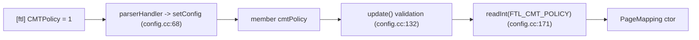

# Chapter 7 — FTL Configuration: `config.{hh,cc}`

[← README](README.md) | Prev: [06_block_metadata.md](06_block_metadata.md) | Next: [08_traces.md](08_traces.md)

**Sources:** [`ftl/config.hh`](../../SimpleSSD-Standalone/simplessd/ftl/config.hh) (119), [`ftl/config.cc`](../../SimpleSSD-Standalone/simplessd/ftl/config.cc) (250)

Every knob in the `[ftl]` section: its name in the file, its default, what validates it, and who reads it.

---

## How a key travels



Four places must agree for one key to work:

| Step | File:line | What you add |
| --- | --- | --- |
| 1. Enum | `config.hh:29-53` | `FTL_YOUR_KEY` |
| 2. Member | `config.hh:83-101` | `type yourKey;` with a `//!< Default:` comment |
| 3. Name + default | `config.cc:28-45`, `47-66` | `NAME_YOUR_KEY` string and the ctor default |
| 4. Parse + serve | `config.cc:68-130`, and the matching `read*` | `MATCH_NAME` branch and a `case` in the right reader |

Miss step 4's reader and the key parses fine but always reads as zero.

---

## Complete key reference

Defaults are from the constructor (`config.cc:47-66`); the "Read as" column tells you which `conf.read*` call retrieves it.

### Mapping and capacity

| Config name | Enum | Default | Read as | Consumer |
| --- | --- | --- | --- | --- |
| `MappingMode` | `FTL_MAPPING_MODE` | `PAGE_MAPPING` (0) | `readInt` | `ftl.cc:43` factory |
| `OverProvisioningRatio` | `FTL_OVERPROVISION_RATIO` | `0.25` | `readFloat` | `ftl.cc:35-37` logical capacity |
| `EraseThreshold` | `FTL_BAD_BLOCK_THRESHOLD` | `100000` | `readUint` | `page_mapping.cc:1356` — bad-block retirement |
| `EnableRandomIOTweak` | `FTL_USE_RANDOM_IO_TWEAK` | `true` | `readBoolean` | `icl.cc:47`, `PageMapping` ctor (`bitsetSize`) |

### Warm-up (`initialize`)

| Config name | Enum | Default | Read as | Consumer |
| --- | --- | --- | --- | --- |
| `FillingMode` | `FTL_FILLING_MODE` | `FILLING_MODE_0` | `readUint` | `page_mapping.cc:242` |
| `FillRatio` | `FTL_FILL_RATIO` | `0.0` | `readFloat` | `page_mapping.cc:239` |
| `InvalidPageRatio` | `FTL_INVALID_PAGE_RATIO` | `0.0` | `readFloat` | `page_mapping.cc:241` |

`FILLING_MODE` values (`config.hh:64-68`):

| Value | Step 1: fill | Step 2: invalidate |
| --- | --- | --- |
| 0 | sequential | sequential over the filled range |
| 1 | sequential | random within the filled range |
| 2 | random | random over the whole LPN space |

Detail in [`../page_mapping/02_constructor_init.md`](../page_mapping/02_constructor_init.md).

### Garbage collection

| Config name | Enum | Default | Read as | Consumer |
| --- | --- | --- | --- | --- |
| `GCThreshold` | `FTL_GC_THRESHOLD_RATIO` | `0.05` | `readFloat` | `page_mapping.cc:1275` trigger; `246` warm-up headroom |
| `GCMode` | `FTL_GC_MODE` | `GC_MODE_0` | `readInt` | `page_mapping.cc:607` |
| `GCReclaimBlocks` | `FTL_GC_RECLAIM_BLOCK` | `1` | `readUint` | `page_mapping.cc:612` (mode 0) |
| `GCReclaimThreshold` | `FTL_GC_RECLAIM_THRESHOLD` | `0.1` | `readFloat` | `page_mapping.cc:622` (mode 1) |
| `EvictPolicy` | `FTL_GC_EVICT_POLICY` | `POLICY_GREEDY` | `readInt` | `page_mapping.cc:608` |
| `DChoiceParam` | `FTL_GC_D_CHOICE_PARAM` | `3` | `readUint` | `page_mapping.cc:610` |

`EVICT_POLICY` values (`config.hh:70-75`): 0 greedy, 1 cost-benefit, 2 random, 3 d-choice. See [`../page_mapping/05_gc.md`](../page_mapping/05_gc.md).

### CMT — the keys you added

| Config name | Enum | Default | Read as | Consumer |
| --- | --- | --- | --- | --- |
| `CMTPolicy` | `FTL_CMT_POLICY` | `CMT_POLICY_LRU` (0) | `readInt` | `PageMapping` ctor; `accessCMT` dispatcher |
| `CMTCapacityRatio` | `FTL_CMT_CAPACITY_RATIO` | `0.01` | `readFloat` | `PageMapping` ctor — **overrides bytes when > 0** |
| `CMTCapacityBytes` | `FTL_CMT_CAPACITY_BYTES` | `2097152` (2 MiB) | `readUint` | `PageMapping` ctor |
| `CMTMissLatency` | `FTL_CMT_MISS_LATENCY` | `40000000` (40 µs) | `readUint` | `accessCMT` miss path |
| `CMTWriteBackLatency` | `FTL_CMT_WRITEBACK_LATENCY` | `500000000` (500 µs) | `readUint` | `accessCMT` dirty eviction |

The latency defaults are not arbitrary — the source comments tie them to MLC NAND:

```63:65:SimpleSSD-Standalone/simplessd/ftl/config.cc
  cmtCapacityBytes = 2097152;   // 2MB → matches sample.cfg
  cmtMissLatency = 40000000;      // 40us — matches LSBRead for MLC NAND
  cmtWriteBackLatency = 500000000; // 500us — matches LSBWrite for MLC NAND
```

A CMT miss costs a translation-page read; a dirty eviction costs a translation-page program. The write-back is 12.5× the miss, which is why LFU's reduction in dirty evictions matters more than its hit rate — see [`../08_CMT_Mentor_Census.md`](../08_CMT_Mentor_Census.md).

**Capacity precedence.** `CMTCapacityRatio` wins if it is greater than zero, in which case `CMTCapacityBytes` is ignored entirely. Since the default ratio is `0.01`, a config that sets only `CMTCapacityBytes` and never zeroes the ratio gets a size it did not ask for. `sample.cfg` sets `CMTCapacityRatio = 0.0` explicitly for exactly this reason.

### Declared but unused

| Config name | Enum | Status |
| --- | --- | --- |
| — | `FTL_NKMAP_N` | Enum value exists (`config.hh:51`); no name string, no member, no parser branch |
| — | `FTL_NKMAP_K` | Same |

Both are placeholders for an N+K mapping scheme that was never implemented. They cannot be set from a config file at all.

### What `EraseThreshold` actually does

It is easy to assume this key is dead, because nothing named "bad block" appears anywhere. It is not dead — it is the **block retirement** rule, and it lives in one `if` at the end of `eraseInternal`:

```1377:1399:SimpleSSD-Standalone/simplessd/ftl/page_mapping.cc
  if (erasedCount < threshold) {
    // Reverse search
    auto iter = freeBlocks.end();

    while (true) {
      iter--;

      if (iter->getEraseCount() <= erasedCount) {
        // emplace: insert before pos
        iter++;

        break;
      }

      if (iter == freeBlocks.begin()) {
        break;
      }
    }

    // Insert block to free block list
    freeBlocks.emplace(iter, std::move(block->second));
    nFreeBlocks++;
  }
```

A freshly erased block is returned to `freeBlocks` **only** if its erase count is still below `EraseThreshold`. At or above it, the `if` is skipped, `blocks.erase(block)` on line 1402 runs regardless, and the block disappears from both containers permanently — retired.

Three consequences worth knowing:

- **`nFreeBlocks` shrinks for good** each time a block retires, so the free-block ratio drifts down and GC fires more often as the device ages.
- **No statistic records retirement.** There is no counter for retired blocks; you would infer it from `nFreeBlocks` falling below its initial value.
- **The default of 100 000 erases is far beyond any normal run.** With MLC endurance around 3 000 cycles, the default effectively disables retirement. Lower it deliberately if you want to study end-of-life behaviour.

The free-list insertion above it is also the **wear-leveling** mechanism: the reverse search inserts the block in erase-count order, so `getFreeBlock` naturally hands out the least-worn block first. See [`../page_mapping/04_free_blocks.md`](../page_mapping/04_free_blocks.md).

---

## `config.cc` annotated

### Lines 28-45: key name strings

One `const char[]` per key. `MATCH_NAME` (from `sim/base_config.hh`) compares the incoming key against these. Names are **case-sensitive** and must match the ini file exactly.

Note two spellings that differ from their enum: `EraseThreshold` for `FTL_BAD_BLOCK_THRESHOLD`, and `GCReclaimBlocks` (plural) for `FTL_GC_RECLAIM_BLOCK` (singular).

### Lines 47-66: constructor defaults

Every member gets a default, so an empty `[ftl]` section still yields a runnable device. Compare against the `//!<` comments in `config.hh:84-101` — they are currently consistent, but they are hand-maintained, so treat `config.cc` as the truth.

### Lines 68-130: `setConfig`

```68:73:SimpleSSD-Standalone/simplessd/ftl/config.cc
bool Config::setConfig(const char *name, const char *value) {
  bool ret = true;

  if (MATCH_NAME(NAME_MAPPING_MODE)) {
    mapping = (MAPPING)strtoul(value, nullptr, 10);
  }
```

A single `if`/`else if` chain, one branch per key, ending in `ret = false` for anything unrecognised (`config.cc:125-127`).

| Conversion | Used for |
| --- | --- |
| `strtoul` | enums and small integers |
| `strtoull` | byte counts and latencies |
| `strtof` | ratios |
| `convertBool` | `EnableRandomIOTweak` (accepts `true`/`false` or a number, `config_reader.cc:42-50`) |

**Unknown keys are silently tolerated.** `setConfig` returning `false` does not abort the run — a typo like `CMTPolicyy = 1` leaves the default in place with no warning. When a config change appears to do nothing, check the spelling first.

**No range checking here.** `(CMT_POLICY)strtoul(...)` will happily produce 7. Catching that is `update()`'s job.

### Lines 132-156: `update` — the validation gate

```132:156:SimpleSSD-Standalone/simplessd/ftl/config.cc
void Config::update() {
  if (gcMode == GC_MODE_0 && reclaimBlock == 0) {
    panic("Invalid GCReclaimBlocks");
  }

  if (gcMode == GC_MODE_1 && reclaimThreshold < gcThreshold) {
    panic("Invalid GCReclaimThreshold");
  }

  if (fillingRatio < 0.f || fillingRatio > 1.f) {
    panic("Invalid FillingRatio");
  }

  if (invalidRatio < 0.f || invalidRatio > 1.f) {
    panic("Invalid InvalidPageRatio");
  }

  if (cmtPolicy != CMT_POLICY_LRU && cmtPolicy != CMT_POLICY_LFU) {
    panic("Invalid CMTPolicy");
  }

  if (cmtCapacityRatio < 0.f || cmtCapacityRatio > 1.f) {
    panic("Invalid CMTCapacityRatio");
  }
}
```

| Line(s) | Check | Why |
| --- | --- | --- |
| 133-135 | Mode 0 must reclaim ≥ 1 block | Otherwise GC runs, frees nothing, and the free-block ratio never recovers |
| 137-139 | Mode 1's target must exceed the trigger | Otherwise GC would fire without ever reaching its own goal |
| 141-143 | Fill ratio in [0, 1] | It is a fraction of the LPN space |
| 145-147 | Invalid ratio in [0, 1] | Same |
| 149-151 | CMT policy must be a defined enum value | Catches the unchecked cast in `setConfig` |
| 153-155 | CMT ratio in [0, 1] | Same as the other ratios |

Runs once, after parsing, from `ConfigReader::init` (`config_reader.cc:60`) — so **before any subsystem exists**. A bad config fails at startup, never mid-run.

**Checks that are absent** and would be reasonable to add:

- `overProvision` is never range-checked here. A value ≥ 1 makes `totalLogicalBlocks` zero or negative-then-wrapped; the panic at `ftl.cc:49-52` catches it, but with a confusing message.
- `evictPolicy` is not validated. An out-of-range value reaches the `switch` in `calculateVictimWeight` and hits its `default: panic("Invalid evict policy")` at run time instead of at startup.
- `mapping` is not validated, which is the `ftl.cc:43` missing-`default` problem from [chapter 05](05_ftl_facade.md#the-factory).

### Lines 158-246: the four readers

```158:177:SimpleSSD-Standalone/simplessd/ftl/config.cc
int64_t Config::readInt(uint32_t idx) {
  int64_t ret = 0;

  switch (idx) {
    case FTL_MAPPING_MODE:
      ret = mapping;
      break;
    case FTL_GC_MODE:
      ret = gcMode;
      break;
    case FTL_GC_EVICT_POLICY:
      ret = evictPolicy;
      break;
    case FTL_CMT_POLICY:
      ret = cmtPolicy;
      break;
  }

  return ret;
}
```

Four `switch` functions, split by return type:

| Reader | Lines | Serves |
| --- | --- | --- |
| `readInt` | 158-177 | The four **enum** keys |
| `readUint` | 179-207 | `FillingMode`, `EraseThreshold`, `GCReclaimBlocks`, `DChoiceParam`, and the three CMT byte/latency keys |
| `readFloat` | 209-234 | The six **ratio** keys |
| `readBoolean` | 236-246 | `EnableRandomIOTweak` only |

**The zero-default trap.** Every switch initialises `ret` to zero and has **no `default` case**. Asking the wrong reader for a key returns 0 silently:

```cpp
// Wrong: cmtCapacityRatio is served by readFloat
conf.readUint(CONFIG_FTL, FTL_CMT_CAPACITY_RATIO);   // always 0

// Right
conf.readFloat(CONFIG_FTL, FTL_CMT_CAPACITY_RATIO);
```

This is the single most likely bug when adding a key. If a new knob "has no effect", check that you added a `case` to the reader whose type you are calling.

Note also that `readString` is **not** overridden by `FTL::Config`. The base `BaseConfig::readString` returns an empty string, which is why `ConfigReader::readString(CONFIG_FTL, ...)` (`config_reader.cc:145-146`) always yields nothing.

---

## Adding a key: worked checklist

Suppose you want `CMTPrefetchDepth`, an unsigned integer defaulting to 0.

| # | File | Edit |
| --- | --- | --- |
| 1 | `config.hh:48` | Add `FTL_CMT_PREFETCH_DEPTH,` to the enum, **after** the existing CMT keys |
| 2 | `config.hh:101` | Add `uint64_t cmtPrefetchDepth;  //!< Default: 0` |
| 3 | `config.cc:45` | Add `const char NAME_CMT_PREFETCH_DEPTH[] = "CMTPrefetchDepth";` |
| 4 | `config.cc:65` | Add `cmtPrefetchDepth = 0;` in the constructor |
| 5 | `config.cc:124` | Add an `else if (MATCH_NAME(NAME_CMT_PREFETCH_DEPTH))` branch |
| 6 | `config.cc:203` | Add `case FTL_CMT_PREFETCH_DEPTH:` to **`readUint`** |
| 7 | `config.cc:155` | Add a range check in `update()` if one applies |
| 8 | `simplessd/config/sample.cfg` | Add the key with a comment, so runs are self-documenting |
| 9 | `page_mapping.cc` | Read it, usually once in the constructor |
| 10 | `page_mapping.cc` stats | Export it if it changes results, so output files record it |

Steps 8 and 10 are the ones people skip, and they are what make a sweep reproducible six months later. Your existing `cmt.policy`, `cmt.entry_bytes`, and `cmt.capacity_bytes` stats exist for exactly this reason.

**Enum ordering caution:** insert new values at the **end** of a group, never in the middle. The enum is used as a plain integer index, and while nothing serialises it today, reordering silently changes the meaning of every `case` label you did not update.

---

## Invariants

1. **Parse, then validate, then run.** `update()` executes before any subsystem is constructed.
2. **A key is served by exactly one reader**, matching its C++ type.
3. **Unknown keys are ignored silently**; misspelling is not an error.
4. **Out-of-range values are only caught if `update()` checks them** — several are not.
5. **`CMTCapacityRatio > 0` overrides `CMTCapacityBytes`.**
6. **Static reads happen once.** Several call sites use `static const` locals (for example `page_mapping.cc:607-611`), so the value is read once per process, not per call.

---

## Self-quiz

1. What four places must agree for a new `[ftl]` key to work?
2. What happens if you misspell a key in the config file?
3. What happens if you call `readUint` for a key served by `readFloat`?
4. When does `update()` run, and why is that timing important?
5. Which two GC checks does `update()` perform, and what would break without them?
6. Which CMT capacity key wins when both are set, and what is the trap?
7. Why are `CMTMissLatency` and `CMTWriteBackLatency` set to 40 µs and 500 µs?
8. What does `EraseThreshold` control, and why does its default effectively disable it?
9. Which config errors are *not* caught at startup, and where do they surface instead?
10. Why should a new config key also be exported as a statistic?

### Answers

1. The enum in `config.hh`, the member in `config.hh`, the name string plus constructor default in `config.cc`, and the `setConfig` branch plus a `case` in the correct `read*` function.
2. Nothing visible. `setConfig` returns `false`, which is not treated as an error, and the default silently stands.
3. You get 0. Each reader is a `switch` with no matching case and a zero-initialised return.
4. Once, from `ConfigReader::init` (`config_reader.cc:60`), after parsing and before any subsystem is constructed. Bad configs therefore fail at startup rather than mid-run.
5. Mode 0 must reclaim at least one block; mode 1's reclaim threshold must exceed the GC trigger threshold. Without them GC could run forever while freeing nothing, or fire without being able to reach its target.
6. `CMTCapacityRatio` wins when greater than zero. The trap is its non-zero default of `0.01`, so setting only `CMTCapacityBytes` has no effect unless you also set the ratio to `0.0`.
7. They model the NAND cost of reading and programming one translation page: LSB read and LSB program times for MLC (`config.cc:64-65`).
8. Block retirement. In `eraseInternal` (`page_mapping.cc:1377`), a block is returned to `freeBlocks` only if its erase count is below the threshold; otherwise it is dropped permanently. The default of 100 000 is far above realistic NAND endurance, so no block ever retires in a normal run.
9. `OverProvisioningRatio` out of range surfaces as the over-provisioning panic in `ftl.cc:49-52`; a bad `EvictPolicy` surfaces at the first GC as `"Invalid evict policy"`; a bad `MappingMode` surfaces as an uninitialised `pFTL` dereference.
10. So that every output file records the parameter it was produced with. Without it, a sweep's results cannot be attributed to a configuration after the fact.
