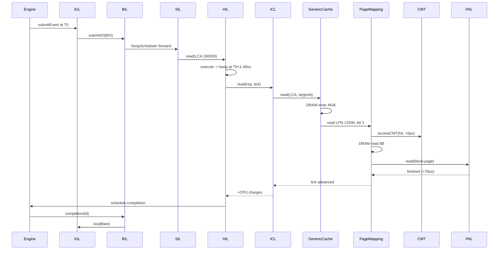
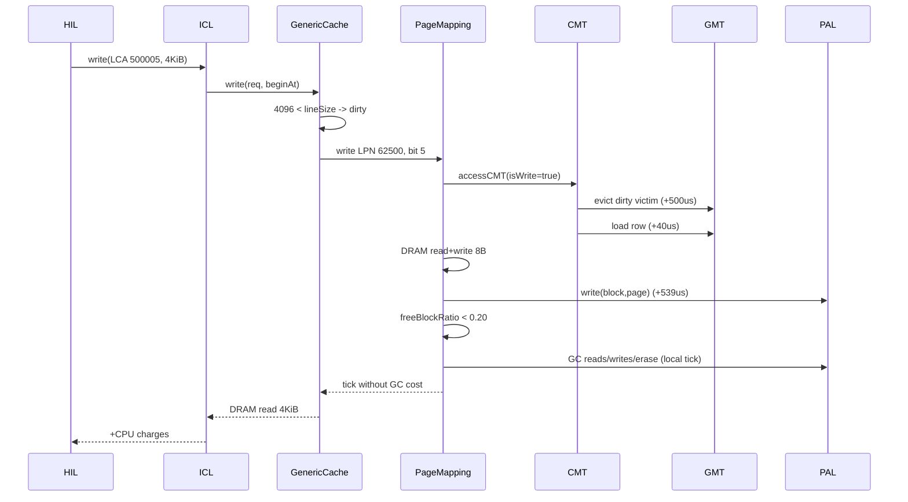

# Chapter 8 — Two End-to-End Traces

[← README](README.md) | Prev: [07_ftl_config.md](07_ftl_config.md)

---

## What this chapter is

Chapters 1–7 explained each layer on its own. This one follows **one request at a time** from the event queue in `main` down to a NAND command and back to the host callback, and accounts for **every picosecond added on the way**. Nothing here re-explains a layer; when depth is needed the text points at the layer's own chapter or at the sibling FTL series ([`../page_mapping/`](../page_mapping/README.md)) — specifically [`07_internal_io.md`](../page_mapping/07_internal_io.md) for `readInternal`/`writeInternal`, [`06_cmt_access.md`](../page_mapping/06_cmt_access.md) for `accessCMT`, and [`05_gc.md`](../page_mapping/05_gc.md) for garbage collection.

Two traces:

| | Workload | FTL story |
| --- | --- | --- |
| **A** | 4 KiB random read | misses the ICL cache, **hits** the CMT |
| **B** | 4 KiB random write | **misses** the CMT, dirty write-back, then trips GC |

---

## Setup

### Values actually read from config

From [`simplessd/config/sample.cfg`](../../SimpleSSD-Standalone/simplessd/config/sample.cfg) and [`config/sample.cfg`](../../SimpleSSD-Standalone/config/sample.cfg):

| Key | Value | Line |
| --- | --- | --- |
| `[pal] Channel / Package / Die / Plane` | 8 / 4 / 2 / 2 | `simplessd/config/sample.cfg:234–244` |
| `[pal] Block / Page / PageSize` | **512** / 512 / 16384 | `simplessd/config/sample.cfg:245–247` |
| `[pal] EnableMultiPlaneOperation`, `SuperblockSize` | 1, `C` | `:251`, `:300` |
| `[pal] NANDType`, `LSBRead`/`MSBRead`, `LSBWrite`/`MSBWrite`, `Erase` | MLC, 40 µs / 65 µs, 500 µs / 1300 µs, 3.5 ms | `:262`, `:265–271` |
| `[pal] DMASpeed / DMAWidth` | 400 MT/s, 8 bit | `:289–290` |
| `[ftl] OverProvisioningRatio`, `EnableRandomIOTweak` | 0.25, **1** | `:320`, `:404` |
| `[ftl] CMTPolicy`, `CMTCapacityRatio` / `CMTCapacityBytes` | 0 (LRU), 0.0 / **2097152** | `:356`, `:361`, `:368` |
| `[ftl] CMTMissLatency` / `CMTWriteBackLatency` | **40 000 000** / **500 000 000 ps** | `:374`, `:379` |
| `[ftl] GCThreshold`, `GCMode`, `GCReclaimBlocks`, `EvictPolicy` | **0.20**, 0, 1, **0 (greedy)** | `:386–396`, `:349` |
| `[ftl] FillingMode / FillRatio / InvalidPageRatio` | 0 / 1.0 / 0.0 | `:331–341` |
| `[icl] EnableReadCache / EnableWriteCache` | **0 / 0** | `:417`, `:439` |
| `[cpu] ClockSpeed`, core counts | 400 MHz, 1 HIL + 1 ICL + 1 FTL | `:37–42` |
| `[global] SubmissionLatency / CompletionLatency` | 5 µs / 5 µs | `config/sample.cfg:83–84` |
| `[generator] blocksize`, `readwrite`, `iodepth` | 4K, `randrw`, 64 | `config/sample.cfg:119–141` |

The traces assume `[global] Interface = 0` (the `None` driver) even though the shipped file says `1` — the `None` path is the one worth reading first.

### Geometry that follows

PAL derives the superpage from those keys at [`pal/pal.cc:41–87`](../../SimpleSSD-Standalone/simplessd/pal/pal.cc); the FTL copies it at [`ftl/ftl.cc:34–41`](../../SimpleSSD-Standalone/simplessd/ftl/ftl.cc).

| Derived value | Formula | Result |
| --- | --- | --- |
| `superPageSize` | 16384 × channel 8 × plane 2 (`pal.cc:46`, `:74`) | 262 144 B |
| `pageInSuperPage` → `param.ioUnitInPage` | 262144/16384 then ÷ plane (`pal.cc:82–87`) | **8** |
| `superBlock` → `totalPhysicalBlocks` | 512 × package 4 × die 2 (`pal.cc:59`, `:68`) | **4096** |
| `totalLogicalBlocks` | 4096 × (1 − 0.25) (`ftl.cc:35–37`) | 3072 |
| `pageCountToMaxPerf` | 4096 / 512 (`ftl.cc:41`) | 8 |
| `bitsetSize` | `ioUnitInPage` because the tweak is on (`page_mapping.cc:63`) | 8 |
| `logicalPageSize` (one LCA) | 262144 / 8 (`icl.cc:50`) | **32 768 B** |
| `totalLogicalPages` (LCAs) | 3072 × 512 × 8 (`icl.cc:48–49`) | 12 582 912 → 384 GiB |
| GMT rows (LPNs) | 3072 × 512 (`page_mapping.cc:51`) | 1 572 864 |
| `cmtEntryBytes`, `cmtCapacity` | 8 × 8 = 64 B; 2097152/64 (`page_mapping.cc:72–81`) | 64 B, **32 768 entries** (2.1 % of the GMT) |
| GC trigger | `nFreeBlocks / 4096 < 0.20` (`page_mapping.cc:1277`) | below 819 free blocks |

Two consequences to keep in mind: a 4 KiB host request is **smaller than one cache line** (4096 < 32768), and the CMT covers only 2 % of the mapping table — so trace B's miss is the *normal* case and trace A's hit is the lucky one.

### Numbers that are illustrative

Everything below labelled *illustrative* is computed from the config but assumes **no contention** (idle channel, idle die, idle DRAM, idle CPU core, empty completion queue). A real run is larger because PAL2 queues per channel/die and `SimpleDRAM::updateDelay` serialises DRAM accesses ([`dram/simple.cc:53–74`](../../SimpleSSD-Standalone/simplessd/dram/simple.cc)).

| Cost | Derivation | Illustrative value |
| --- | --- | --- |
| One DRAM access ≤ 4096 B | `tRP+tRAS` = 18000+42000 (defaults, `dram/config.cc:102–103`) + `pageSize/interfaceBandwidth` = 4096/0.0064 (`simple.cc:34–36`, `:95–98`) | **700 000 ps** |
| NAND DMA cycle; `dma0.read`/`dma1.read`; `dma0.write`/`dma1.write` | 1e12/(400 × 1048576); 7 / 16384 cycles; (7+16384) / 1 cycles (`pal/config.cc:198–204`, `:65`) | 2384 ps; 16 689 / 39 058 500; 39 075 200 / 2384 |
| MLC page type | `pageIndex % 2`: even = LSB, odd = MSB (`pal/old/LatencyMLC.cc:26–28`, `:63–75`) | read 40/65 µs, program 500/1300 µs |
| **One sub-page read** | `dma0.read + tR(LSB) + dma1.read` | **≈ 79 075 000 ps** |
| **One sub-page program** | `dma0.write + tPROG(LSB) + dma1.write` | **≈ 539 078 000 ps** |

CPU charges used later. Each is `instruction count × clockPeriod`, where `clockPeriod = 1e12/400e6 = 2500 ps` and the instruction counts come from the generated CPI table (`cpu/cpu.cc:47–48`, `:140`, [`:162–199`](../../SimpleSSD-Standalone/simplessd/cpu/cpu.cc)):

| Charge | Insts | ps |
| --- | --- | --- |
| `HIL/READ`, `HIL/WRITE` (via `execute`) | 597 | 1 492 500 |
| `ICL/READ`, `ICL/WRITE` | 141 | 352 500 |
| `FTL/READ`, `FTL/WRITE` | 57 | 142 500 |
| `FTL__PAGE_MAPPING/READ`, `/WRITE` | 62 | 155 000 |
| `FTL__PAGE_MAPPING/READ_INTERNAL` / `WRITE_INTERNAL` | 395 / 1108 | 987 500 / 2 770 000 |
| `FTL__PAGE_MAPPING/SELECT_VICTIM_BLOCK` / `DO_GARBAGE_COLLECTION` | 1346 / 1215 | 3 365 000 / 3 037 500 |
| `FTL__PAGE_MAPPING/ERASE_INTERNAL` | 703 | 1 757 500 |

---

## The two clocks — read this before the traces

Everything in this chapter depends on telling these apart.

**`Engine::simTick`** is the global event clock. Exactly one line advances it after construction — `simTick = now.second` inside [`sim/engine.cc:203`](../../SimpleSSD-Standalone/sim/engine.cc) — so it moves only when an event is dequeued by `doNextEvent`. `getCurrentTick()` / `getTick()` read it (`engine.cc:105`). While a callback runs, `simTick` is **frozen**.

**`uint64_t &tick`** is a *projected* timestamp passed by reference down HIL → ICL → FTL → PAL/DRAM. Each layer adds its own latency to it. It is an ordinary local variable that starts at the body's begin time (`hil.cc:43`) and ends up as `pReq->finishedAt` (`hil.cc:60`). Nothing about it is visible to the engine until HIL turns it back into a real event with `schedule(completionEvent, lastScheduled)` (`hil.cc:199`).

Three practical consequences:

1. A whole descent — HIL, ICL, cache, FTL, CMT, PAL, DRAM, back up — happens **inside one event callback, at one `simTick`**.
2. `debugprint` stamps lines with `getTick()` ([`sim/log.cc:124`](../../SimpleSSD-Standalone/simplessd/sim/log.cc)), so every line of one descent carries the *same* leading tick. The interesting times are inside the message text, printed as `begin - end (delta)`.
3. Advancing `tick` is not the only way to spend time. PAL2 also marks channels and dies busy on its own timelines, so work whose ticks are never charged to *this* request still delays the *next* one. Trace B's garbage collection is exactly that case.

---

## Trace A — 4 KiB random read, ICL miss, CMT hit

Concrete request: `bio.offset = 3 276 902 400`, `bio.length = 4096`, `type = BIO_READ`. Derived: LCA 100 003, intra-page offset 4096, **LPN 12 500**, `ioFlag` bit **3** (100003 = 8 × 12500 + 3). Call the tick at which the submission event fires **T0**.

### Step 1 — Engine: `Engine::doNextEvent` (`sim/engine.cc:190`)

The loop at [`sim/main.cc:255`](../../SimpleSSD-Standalone/sim/main.cc) pops the earliest event, sets `simTick = T0` (`engine.cc:203`), and invokes the generator's `submitEvent` (allocated at `request_generator.cc:70`).

**Tick:** `simTick` jumps to T0; no latency added.

### Steps 2–3 — IGL and BIL (`request_generator.cc:210`, `bil/entry.cc:64`)

`generateAddress` draws a uniform random offset and rounds it down to `blockalign` (`:170–174`); `nextIOIsRead` returns true because `rwmixread = 0.5` is above the running read fraction (`:194–208`). The `BIO` gets `id`, `type`, `offset`, `length` and the generator's `iocallback` (`:216–229`), goes to `bioEntry.submitIO(bio)` (`:235`), and `rescheduleSubmit(submissionLatency)` books the *next* submission at `T0 + 5 000 000` (`:238`, `:287`) — host-side pipelining, not part of this request. BIL stamps `bio.submittedAt = engine.getCurrentTick()` = T0 (`entry.cc:68`) — **the only timestamp host-visible latency is measured against** — keeps the original in `ioQueue`, and forwards a copy whose callback is replaced by BIL's own `completion` (`:72–75`); `NoopScheduler::submitIO` passes it straight to the driver (`bil/noop_scheduler.cc:30–32`).

**Tick:** `+0`. Both layers are instrumentation, not delay.

### Step 4 — SIL: `None::Driver::submitIO` (`sil/none/none.cc:57`)

Bytes become logical page addresses here: `slpn = 3276902400 / 32768 = 100003`, `nlp = DIVCEIL(4096, 32768) = 1`, `offset = 4096`, `length = 4096` (`:63–66`). The BIL callback is heap-copied into `req.function` so it survives the descent (`:59`, `:68–71`), then `pHIL->read(req)` (`:76`).

**Tick:** `+0`.

### Step 5 — HIL: `HIL::read` (`simplessd/hil/hil.cc:40`)

`HIL::read` does not run the read; it hands the body to the CPU model: `execute(CPU::HIL, CPU::READ, doRead, new Request(req))` (`:68`). With `HILCoreCount = 1` and the core idle, `Core::submitJob` → `handleJob` schedules the continuation at `now + inst->latency` ([`cpu/cpu.cc:90–116`](../../SimpleSSD-Standalone/simplessd/cpu/cpu.cc)). So the body begins at `T0 + 1 492 500`, and `uint64_t tick = beginAt` (`hil.cc:43`) — this is where the pass-by-reference chain is born.

**Tick:** `+1 492 500 ps` (firmware entry; a real event, so `simTick` really does move).

### Step 6 — ICL: `ICL::read` (`simplessd/icl/icl.cc:66`)

The per-LCA loop runs once (`nlp = 1`). It copies `tick` into `beginAt`, sets `reqInternal.range.slpn = 100003`, clamps `length` to `MIN(4096, 32768 − 4096) = 4096`, and calls `pCache->read(reqInternal, beginAt)` (`:75–81`). After the loop `tick = finishedAt` then `tick += applyLatency(CPU::ICL, CPU::READ)` (`:94–95`).

**Tick:** `+352 500 ps`, charged *after* the cache returns.

### Step 7 — ICL cache boundary: `GenericCache::read` (`simplessd/icl/generic_cache.cc:348`)

`EnableReadCache = 0`, so `useReadCaching` is false and the whole set/way machinery is skipped: control goes to the bypass branch at `:530–536`. It builds `FTL::Request reqInternal(lineCountInSuperPage, req)` — the LCA→superpage split, `lpn = 100003/8 = 12500`, `ioFlag.set(100003 % 8) = bit 3` ([`util/def.cc:74–80`](../../SimpleSSD-Standalone/simplessd/util/def.cc)) — charges the data buffer to DRAM with `pDRAM->write(nullptr, req.length, tick)` (`:533`), and calls `pFTL->read(reqInternal, tick)` (`:535`). Note that the *read* path calls DRAM **write** (data lands in the buffer), and that the bypass branch pays **no** `ICL__GENERIC_CACHE` CPU charge — that charge lives at `:528`, inside the caching branch. With `EnableReadCache = 1` a miss instead lands at `:403–509` and reaches the FTL at `:485`; cache internals belong to [Chapter 3](03_layer_contracts.md).

**Tick:** `+700 000 ps` (one DRAM page).

### Step 8 — FTL wrapper: `FTL::FTL::read` (`simplessd/ftl/ftl.cc:68`)

Logs `LOG_FTL`, delegates to the mapping implementation, then adds its own firmware charge (`:69–73`). `PageMapping::read` (`page_mapping.cc:353`) checks `ioFlag.count() > 0`, calls `readInternal`, prints the `LOG_FTL_PAGE_MAPPING` line with `begin - tick (delta)`, and adds a second charge (`:356–368`).

**Tick:** `+142 500` (`FTL/READ`) `+155 000` (`FTL__PAGE_MAPPING/READ`), both **after** the internal work.

### Step 9 — FTL: `PageMapping::readInternal` — CMT lookup (`page_mapping.cc:1096`)

The first statement that matters is `accessCMT(req.lpn, false, tick, false, false)` (`:1103`). `allocate = false` is deliberate: a read of a never-written LPN must not manufacture a mapping. Trace A assumes a **hit**, so `accessCMT_LRU` finds the entry, bumps `stat.cmtHits`, splices it to the front of `cmtOrder`, and returns the mapping vector without touching `tick` (`:824–841`). Depth: [`../page_mapping/06_cmt_access.md`](../page_mapping/06_cmt_access.md).

**Tick:** `+0 ps` — **a CMT hit is free**. That is the entire point of the cache.

### Step 10 — FTL: mapping fetch charged to DRAM (`page_mapping.cc:1116–1122`)

After confirming at least one sub-page is mapped (`:1106–1114`), the mapping bytes are charged to controller DRAM: `pDRAM->read(mappingData, 8 * req.ioFlag.count(), tick)` — 8 bytes, because exactly one `ioFlag` bit is set (`:1118`). Eight bytes still costs a whole DRAM page in this model.

**Tick:** `+700 000 ps`.

### Step 11 — FTL → PAL: the NAND read (`page_mapping.cc:1124–1157`)

Only `idx = 3` passes `req.ioFlag.test(idx)`. `palRequest.blockIndex/pageIndex` are filled from the mapping pair (`:1130–1131`) and `ioFlag` is narrowed to that one bit (`:1134–1135`). `block->second.read(...)` only records `lastAccessed` — it takes `tick` **by value** ([`ftl/common/block.cc:274`](../../SimpleSSD-Standalone/simplessd/ftl/common/block.cc)) and costs nothing. `pPAL->read(palRequest, beginAt)` (`:1150`) forwards through `pal.cc:120` to `PALOLD::read` (`pal_old.cc:96–115`), which submits one `CPDPBP` command into PAL2 and returns `cmd.finished`. Then `tick = finishedAt` and `applyLatency(READ_INTERNAL)` (`:1157–1158`).

**Tick:** `+79 075 000 ps` (illustrative NAND read) `+987 500 ps` (`READ_INTERNAL`). Statement-by-statement walk-through: [`../page_mapping/07_internal_io.md`](../page_mapping/07_internal_io.md).

### Step 12 — Return trip and HIL bookkeeping (`hil.cc:55–64`)

The stack unwinds without further work — `readInternal` → `PageMapping::read` (+155 000) → `FTL::read` (+142 500) → `GenericCache::read` (bypass adds nothing, bumps `stat.request[0]` at `:538`) → `ICL::read` (+352 500) — and then HIL records `stat.request[0]++`, `stat.iosize[0] += 4096`, and `updateBusyTime(0/2, beginAt, tick)` (`:55–58`, `:180–193`). `pReq->finishedAt = tick` goes into the min-heap `completionQueue` (`:60–61`) and `updateCompletion` schedules the real `completionEvent` at the heap top (`:195–201`). This is where a projected `tick` becomes a scheduled event again.

**Tick:** no new charges; the projected total is frozen as `finishedAt`.

### Step 13 — Completion: back to the host

The engine advances `simTick` to `finishedAt` and calls `HIL::completion` (`:204`), which fires `req.function(tick, req.context)` for every request whose `finishedAt <= tick` (`:210–213`). That lambda is SIL's (`none.cc:68–71`), which invokes BIL's `completion` (`bil/entry.cc:78`): latency is computed as `now − submittedAt` (`:83`), logged to the latency CSV (`:95–100`), and the generator's `_iocallback` runs (`:102` → `request_generator.cc:241`), decrementing `io_depth` and rescheduling submission with `submissionLatency + completionLatency` (`:253`).

**Tick:** `+0` to this request; host-visible latency is `finishedAt − T0`.

### Trace A tick accounting

| Hop | Function | file:line | Tick delta source | Cumulative (ps from T0) |
| --- | --- | --- | --- | --- |
| 1–4 | `doNextEvent` → `_submitIO` → `submitIO` → `None::Driver::submitIO` | `engine.cc:203`, `request_generator.cc:210`, `bil/entry.cc:64`, `none.cc:57` | none; `submittedAt` stamped at `entry.cc:68` | 0 |
| 5 | `HIL::read` → `execute` | `hil.cc:68`, `cpu/cpu.cc:107` | `HIL/READ` job on hil0 | 1 492 500 |
| 6 | `ICL::read` per-LCA loop | `icl.cc:75–81` | none (its charge lands in row 14) | 1 492 500 |
| 7 | `GenericCache::read` bypass | `generic_cache.cc:533` | `pDRAM->write(4096 B)` | 2 192 500 |
| 8 | `PageMapping::readInternal` → `accessCMT` **hit** | `page_mapping.cc:1103` | none | 2 192 500 |
| 9 | mapping fetch | `page_mapping.cc:1118` | `pDRAM->read(8 B)` | 2 892 500 |
| 10 | `pPAL->read` | `page_mapping.cc:1150` → `pal_old.cc:96` | `dma0 + tR(LSB) + dma1` | 81 967 500 |
| 11 | `READ_INTERNAL` charge | `page_mapping.cc:1158` | `applyLatency` | 82 955 000 |
| 12 | `PageMapping::read` charge | `page_mapping.cc:368` | `applyLatency` | 83 110 000 |
| 13 | `FTL::read` charge | `ftl.cc:73` | `applyLatency` | 83 252 500 |
| 14 | `ICL::read` charge | `icl.cc:95` | `applyLatency` | 83 605 000 |
| 15 | `finishedAt`, completion scheduled | `hil.cc:60`, `:199` | none | 83 605 000 |
| 16 | `BlockIOEntry::completion` | `bil/entry.cc:83` | reports `now − submittedAt` | ≈ 83.6 µs latency |

`read.busy` gets `83 605 000 − 1 492 500 ≈ 82.11 µs` (`hil.cc:57`), because busy time starts at the body, not at submission.

---

## Trace B — 4 KiB random write, CMT miss, dirty eviction, GC

Concrete request: `bio.offset = 16 384 163 840`, `bio.length = 4096`, `type = BIO_WRITE`. Derived: LCA 500 005, intra-page offset 0, **LPN 62 500**, `ioFlag` bit **5**. Steps 1–5 are identical to trace A with `BIO_WRITE`, `pHIL->write` (`none.cc:79`) and `HIL::write` (`hil.cc:71`, `execute(CPU::HIL, CPU::WRITE, ...)` at `:100`). Pick up at the cache.

### Step 6 — ICL: `ICL::write` and the sub-line rule (`icl.cc:98`, `generic_cache.cc:548`)

`GenericCache::write` builds the `FTL::Request` first (`:557`), then asks whether the write covers a whole line: `req.length (4096) < lineSize (32768)` is true, so `dirty = true` and the eager full-line write at `:563` is **skipped** (`:559–564`). `EnableWriteCache = 0`, so control falls to the bypass branch: because `dirty` is set, `pFTL->write(reqInternal, tick)` runs at `:731`, then DRAM is charged with scheduling temporarily disabled (`:738–742`).

**Tick:** `+700 000 ps` (`pDRAM->read(4096 B)` at `:740`) and `+352 500 ps` (`applyLatency(CPU::ICL, CPU::WRITE)` at `icl.cc:127`).

### Step 7 — FTL wrapper (`ftl.cc:76`, `page_mapping.cc:371`)

Same shape as trace A: `writeInternal`, then `applyLatency(FTL__PAGE_MAPPING, WRITE)` (`page_mapping.cc:386`) and `applyLatency(FTL, WRITE)` (`ftl.cc:81`).

**Tick:** `+155 000` and `+142 500`.

### Step 8 — FTL: `PageMapping::writeInternal` — CMT miss (`page_mapping.cc:1162`)

`accessCMT(req.lpn, true, tick)` uses the header defaults `isGC = false, allocate = true` (`page_mapping.hh:116–120`), and `isWrite = true` marks the entry dirty on the spot. LPN 62 500 is not resident — expected, since the CMT holds 32 768 of 1 572 864 rows — so `stat.cmtMisses++` and the code walks the miss path at `:843–921`.

**Tick:** `+0` so far; the charges arrive in the next two steps.

### Steps 9–10 — FTL: dirty eviction, then the row load (`page_mapping.cc:862–921`)

`cmt.size() >= cmtCapacity` is true in steady state, so the LRU victim is `cmtOrder.back()` (`:864`). Because nearly every resident entry got there through a write, the victim is almost always dirty: its mapping is copied back into the GMT, `cmtDirtyEvictions`/`cmtWritebacks` increment, and `tick += cmtWriteBackLatency` (`:876–884`); the comment at `:888–890` explains why `gmtIt` must be re-found afterwards. Then the wanted row is loaded: `gmtIt` exists (the drive was fully filled by `initialize`, `FillRatio = 1.0`), so this is the DFTL "double read", `tick += cmtMissLatency` (`:909–913`). A brand-new LPN would instead get a sentinel-filled row from `table.emplace` with **no** latency (`:896–908`).

**Tick:** `+500 000 000 ps` (write-back) `+40 000 000 ps` (miss load) = **540 000 000 ps**, more than the NAND program that follows.

### Step 11 — FTL: invalidate, allocate, charge DRAM (`page_mapping.cc:1174–1214`)

The old sub-page is invalidated in its block (`:1182–1196`) — no tick. `getLastFreeBlock(req.ioFlag)` picks the write-pointer block and, if it just filled up, sets `bReclaimMore = true` (`:1199`, `:533–563`), which will make the next GC reclaim `pageCountToMaxPerf = 8` extra blocks. Then the mapping row is charged to DRAM twice, read-modify-write, 8 bytes each because one `ioFlag` bit is set (`:1206–1209`).

**Tick:** `+700 000` `+700 000`.

### Step 12 — FTL → PAL: the NAND program (`page_mapping.cc:1221–1271`)

For `idx = 5`: `getNextWritePageIndex(idx)` returns the next sequential page, `block->second.write(...)` records it (again `tick` by value, `block.cc:294`), the mapping pair is updated **in the CMT entry** (`:1245–1246` — the GMT stays stale until write-back), and `pPAL->write(palRequest, beginAt)` issues the program (`:1260`). `readBeforeWrite` stays false because `bRandomTweak` is on (`:1216–1219`). Then `tick = finishedAt` and `applyLatency(WRITE_INTERNAL)` (`:1268–1271`).

**Tick:** `+539 078 000 ps` (illustrative LSB program) `+2 770 000 ps`. Statement-by-statement walk-through: [`../page_mapping/07_internal_io.md`](../page_mapping/07_internal_io.md).

### Step 13 — FTL: the GC trigger check (`page_mapping.cc:1273–1298`)

`gcThreshold` is read once into a `static` (`:1275`), then `freeBlockRatio() < 0.20` decides (`:1277`). Note what the block does with time: it copies the request's clock into a **local** — `uint64_t beginAt = tick` (`:1283`) — passes that local to `selectVictimBlock` (`:1285`) and `doGarbageCollection` (`:1290`), prints `tick - beginAt` as the GC duration (`:1292–1294`), and then **never assigns `beginAt` back to `tick`**.

**Tick:** `+0`. On-demand GC does not extend the latency of the write that triggered it. Its cost surfaces in three other places: `stat.gcCount`/`reclaimedBlocks` (`:1296–1297`), the debug line, and PAL2's channel/die timelines — which is what makes *subsequent* requests slow.

### Step 14 — GC: victim selection (`page_mapping.cc:605`)

`GCMode = 0` keeps `nBlocks = GCReclaimBlocks = 1`, plus 8 more if `bReclaimMore` was set (`:612–635`). `EvictPolicy = 0` is greedy, so `calculateVictimWeight` scores every **fully written** block by raw valid-page count (`:574–583`) and the lowest wins after the sort (`:661–672`). Depth: [`../page_mapping/05_gc.md`](../page_mapping/05_gc.md). **Tick (on `beginAt`):** `+3 365 000 ps` (`SELECT_VICTIM_BLOCK`, `:674`).

### Steps 15–16 — GC: relocate, erase, close out (`page_mapping.cc:677`, `:1355`)

For every valid superpage of the victim, `getPageInfo` yields its LPNs and sub-page bitset (`:705`), and **each set bit goes through the CMT again**: `accessCMT(lpns.at(idx), true, tick, true)` with `isGC = true` (`:729`), counted under `cmt.gc_*` — so each relocation can itself miss (+40 µs) and dirty-evict (+500 µs). PAL work is then batched deliberately to avoid PAL2 pathologies: all reads from the current tick (`:771–777`), all writes from `readFinishedAt` (`:779–785`), erases last (`:787–793`). `eraseInternal` panics if any valid page remains, issues `pPAL->erase`, and returns the block to `freeBlocks` with `nFreeBlocks++`, wear-sorted by erase count (`:1365–1399`). Finally `tick = MAX(writeFinishedAt, eraseFinishedAt)` plus the closing CPU charge (`:795–796`).

**Tick (on `beginAt`):** `V × (0 … 540 000 000)` for CMT accesses — worst case here a victim with all 512 × 8 sub-pages valid means 4096 relocations — plus one batched read/program wave, `+3 500 000 000` (erase), `+1 757 500` (`ERASE_INTERNAL`), `+3 037 500` (`DO_GARBAGE_COLLECTION`).

> Quirk worth knowing: `beginAt` is declared uninitialised at `page_mapping.cc:685` and first *used* at `:737` (`freeBlock->second.write(..., beginAt)`). Because `Block::write` takes the tick by value and only stores `lastAccessed`, this cannot corrupt the simulated clock — but it does mean relocated blocks get a garbage `lastAccessed`, which matters if you switch `EvictPolicy` to cost-benefit.

### Step 17 — Return trip and completion

Identical to trace A steps 12–13, via `HIL::write`'s `stat.request[1]` / `updateBusyTime(1, ...)` (`hil.cc:87–90`).

### Trace B tick accounting

| Hop | Function | file:line | Tick delta source | Cumulative (ps from T0) |
| --- | --- | --- | --- | --- |
| 1–4 | IGL → BIL → SIL | `request_generator.cc:210`, `bil/entry.cc:64`, `none.cc:79` | none | 0 |
| 5 | `HIL::write` → `execute` | `hil.cc:100` | `HIL/WRITE` job | 1 492 500 |
| 6 | `GenericCache::write` sub-line | `generic_cache.cc:559`, `:731` | none (routing decision) | 1 492 500 |
| 7 | `accessCMT` **miss** | `page_mapping.cc:1171` | miss recorded | 1 492 500 |
| 8 | dirty eviction write-back | `page_mapping.cc:883` | `cmtWriteBackLatency` | 501 492 500 |
| 9 | GMT row load | `page_mapping.cc:912` | `cmtMissLatency` | 541 492 500 |
| 10 | mapping read + write | `page_mapping.cc:1207–1208` | 2 × `pDRAM` | 542 892 500 |
| 11 | `pPAL->write` | `page_mapping.cc:1260` | `dma0 + tPROG(LSB) + dma1` | 1 081 970 500 |
| 12 | `WRITE_INTERNAL` charge | `page_mapping.cc:1270` | `applyLatency` | 1 084 740 500 |
| 13 | **GC block** | `page_mapping.cc:1283–1290` | charged to local `beginAt` | **+0** |
| 14 | `PageMapping::write` charge | `page_mapping.cc:386` | `applyLatency` | 1 084 895 500 |
| 15 | `FTL::write` charge | `ftl.cc:81` | `applyLatency` | 1 085 038 000 |
| 16 | DRAM buffer read | `generic_cache.cc:740` | `pDRAM->read(4096 B)` | 1 085 738 000 |
| 17 | `ICL::write` charge | `icl.cc:127` | `applyLatency` | 1 086 090 500 |
| — | GC, *not* charged here | `page_mapping.cc:674`, `:729`, `:1372`, `:796` | select + V × CMT + PAL + erase | ≥ 3.51 ms on channel/die timelines |

So the host sees ≈ **1.09 ms** for this write, of which **540 µs (50 %) is CMT maintenance** and 539 µs is the NAND program. The ≥ 3.5 ms of GC is paid by whoever comes next.

---

## The NVMe path in one page

With `[global] Interface = 1` (the shipped default), steps 3–4 change and everything from `HIL::read` down is identical.

| Aspect | `None` | `NVMe` |
| --- | --- | --- |
| Entry | `Driver::submitIO` converts bytes → LCA directly (`sil/none/none.cc:63–66`) | `Driver::submitIO` builds a 64-byte NVMe command with `slba = offset / LBAsize`, `nlb = DIVCEIL(length, LBAsize) − 1` (`sil/nvme/nvme.cc:365–387`) |
| LBA unit | `logicalPageSize` = 32 768 B | `LBASize` = 512 B (`simplessd/config/sample.cfg:98`) |
| Handoff | direct C++ call into HIL | `submitCommand` pushes to the SQ, allocates a PRP data buffer, and rings the tail doorbell (`nvme.cc:305–337`) |
| Added latency | none of its own (`none.cc` schedules only the boot event at `:43–44`) | PCIe/AXI DMA, controller `WorkInterval` polling, queue arbitration, CQ + interrupt |
| Completion; stat root | `req.function` → BIL callback (`none.cc:68–71`); `pHIL->getStatList(list, "")` (`:93`) | `Driver::_io` unwraps the PRP then calls back (`nvme.cc:413–425`); `pController->getStatList(list, "")` (`:428`) |

For FTL work prefer `Interface = 0`: it removes several hundred microseconds of protocol noise from every latency number without changing a single FTL code path.

---

## Where the two traces differ

| Dimension | Trace A (read, CMT hit) | Trace B (write, CMT miss + GC) |
| --- | --- | --- |
| ICL branch | read bypass, `generic_cache.cc:530–536` | write bypass with `dirty = true`, `:559`, `:729–743` |
| DRAM calls | `write(4096)` + `read(8)` | `read(8)` + `write(8)` + `read(4096)` |
| `accessCMT` args | `isWrite=false, allocate=false` (`:1103`) | `isWrite=true, allocate=true` (`:1171`) |
| CMT tick cost | **0** | `cmtWriteBackLatency + cmtMissLatency` = 540 000 000 ps (`:883`, `:912`) |
| GMT mutation | none | victim row rewritten (`:877`); new row may be created (`:897`) |
| Block metadata | `Block::read` sets `lastAccessed` only | `invalidate` + `write` + write-pointer advance, possibly `bReclaimMore` (`:1199`) |
| NAND op | 1 sub-page read, ≈ 79 µs | 1 sub-page program, ≈ 539 µs, plus GC's reads/programs/erase |
| CPU charges | `HIL/READ`, `ICL/READ`, `FTL/READ`, `PM/READ`, `READ_INTERNAL` | the WRITE equivalents plus `WRITE_INTERNAL`, and on the GC local `SELECT_VICTIM_BLOCK`, `ERASE_INTERNAL`, `DO_GARBAGE_COLLECTION` |
| Host-visible latency | ≈ 83.6 µs | ≈ 1.09 ms |
| Deferred cost | none | ≥ 3.5 ms of GC on PAL timelines, invisible to this request (`:1283`) |
| Stats moved | `read.*`, `icl.generic_cache.read.request_count`, `ftl.page_mapping.cmt.hits` | `write.*`, `cmt.misses`, `cmt.dirty_evictions`, `cmt.writebacks`, `ftl.page_mapping.gc_count`, `pal.erase.count` |

---

## How to watch this yourself

**1. Turn the debug log on.** The key is `DebugLogFile` in the `[global]` section of the *simulator* config ([`config/sample.cfg:51`](../../SimpleSSD-Standalone/config/sample.cfg), name defined at [`sim/global_config.cc:28`](../../SimpleSSD-Standalone/sim/global_config.cc)). It is empty by default, so nothing prints. Set it to a filename (resolved against the output directory, `sim/main.cc:133–146`) or to `STDOUT`/`STDERR` (`:125–132`). The stream is handed to SimpleSSD at `sim/main.cc:164`.

**2. Know that there is no per-tag filter.** `debugprint` prints whenever the log stream exists and the id is valid ([`sim/log.cc:112–127`](../../SimpleSSD-Standalone/simplessd/sim/log.cc)); the `LOG_ID` enum in [`sim/trace.hh:29–43`](../../SimpleSSD-Standalone/simplessd/sim/trace.hh) is a *label*, not a switch. Filtering is your job, using the names table at `sim/log.cc:97–110`:

| Tag | Log prefix | Emitted at |
| --- | --- | --- |
| `LOG_HIL` | `HIL:` | `hil.cc:46`, `:78` — one line per host request with LCA + byte range |
| `LOG_ICL` | `ICL:` | `icl.cc:88`, `:120` — per-request begin/end/delta |
| `LOG_ICL_GENERIC_CACHE` | `ICL::GenericCache:` | `generic_cache.cc:351`, `:381`, `:502`, `:553`, `:599` — hit/miss and set/way |
| `LOG_FTL` | `FTL:` | `ftl.cc:69`, `:77` — the LPN after the superpage split |
| `LOG_FTL_PAGE_MAPPING` | `FTL::PageMapping:` | `page_mapping.cc:359`, `:377`, plus CMT sizing at `:90` and GC at `:1287`, `:1292` |
| `LOG_PAL` / `LOG_PAL_OLD` | `PAL:` / `PAL::PALOLD:` | geometry at `pal.cc:90–111`; per-command PPN/CPDPBP at `pal_old.cc:101`, `:106` |

**3. Reproduce the two traces.** For trace A's CMT hit: with `CMTCapacityBytes = 2097152` a uniformly random read over 384 GiB almost always *misses*, so either raise capacity (`CMTCapacityRatio = 1.0` covers every LPN) or shrink the footprint with `[generator] size` until the working set fits 32 768 LPNs; check `ftl.page_mapping.cmt.hits` against `cmt.misses`. For trace B's GC: `nFreeBlocks` must fall under 819, and after `FillRatio = 1.0` the drive starts near 1016, so run enough random writes to consume ~200 more blocks or lower `GCThreshold`, and watch for `GC   | On-demand | N blocks will be reclaimed` (`page_mapping.cc:1287`).

**4. Read the log correctly, then cross-check.** Every line of one descent shares the same leading tick because `simTick` is frozen (`log.cc:124`, `engine.cc:203`) — reconstruct the timeline from the `begin - end (delta)` values inside the messages. `LogFile` (`config/sample.cfg:50`) plus `LogPeriod` dumps the whole `Stats` vector (`sim/main.cc:311–340`); useful identities are `cmt.misses × CMTMissLatency` plus `cmt.writebacks × CMTWriteBackLatency` against the CMT share of `write.busy`, and `pal.erase.count` against `ftl.page_mapping.gc_count`.

---

## Self-quiz

1. In this config, how many bytes is one LCA, and why is a 4 KiB host write therefore never a full-line write?
2. Exactly one line advances `Engine::simTick`. Which is it, and what follows for `debugprint` timestamps?
3. At what tick does the body of `HIL::read` begin relative to the submission tick, and which mechanism puts it there?
4. Why does `readInternal` pass `allocate = false` to `accessCMT`, and what does the function return for a never-written LPN?
5. A CMT hit costs how many picoseconds, and where would the charge be if there were one?
6. Which two config keys produce trace B's 540 µs of CMT cost, and at which two source lines are they added to `tick`?
7. In `GenericCache::write`, which comparison decides whether the FTL write is issued eagerly at `:563` or through the bypass at `:731`?
8. Does the GC triggered at the end of `writeInternal` lengthen the latency of the write that triggered it? Justify from the code.
9. `doGarbageCollection` calls `accessCMT` with `isGC = true`. What are the two possible tick penalties per relocated sub-page?
10. Which layer measures host-visible latency, against which timestamp, and why does it differ from `hil.read.busy`?

## Self-quiz — answers

1. `logicalPageSize = param.pageSize / param.ioUnitInPage = 262144 / 8 = 32768` B (`icl.cc:50`). Since 4096 < 32768, `req.length < lineSize` is always true, so `GenericCache::write` sets `dirty = true` (`generic_cache.cc:559–561`).
2. `simTick = now.second` in `Engine::doNextEvent` (`sim/engine.cc:203`). Because it only moves when an event is dequeued, every `debugprint` line emitted during one descent carries the same leading tick (`sim/log.cc:124`).
3. At `submission + 1 492 500 ps`: `execute(CPU::HIL, CPU::READ, ...)` (`hil.cc:68`) queues the body on the HIL core, and `Core::handleJob` schedules it at `now + inst->latency` (`cpu/cpu.cc:107`), where the latency is 597 instructions × 2500 ps (`cpu.cc:47–48`, `:140`, `:195–196`).
4. Because a read must not manufacture a mapping — that would grow the GMT without bound and fill the CMT with entries that can never hit (`page_mapping.cc:855–860`). It returns `nullptr`, after incrementing the miss counter, with no latency (`:1103`, `:858–859`).
5. Zero. The hit path only bumps a counter, splices `cmtOrder`, and optionally sets `dirty` (`page_mapping.cc:824–841`). The tick charges exist only on the miss path, at `:883` and `:912`.
6. `CMTWriteBackLatency = 500000000` added at `page_mapping.cc:883`, and `CMTMissLatency = 40000000` added at `:912`; both are read in the constructor at `:85–87`.
7. `req.length < lineSize` (`generic_cache.cc:559`). Full-line writes go straight to `pFTL->write(reqInternal, flash)` at `:563`; sub-line writes set `dirty` and, with write caching off, reach the FTL at `:731`.
8. No. The block copies the clock into a local (`uint64_t beginAt = tick`, `:1283`), passes that local to `selectVictimBlock` and `doGarbageCollection`, and never assigns it back to `tick`. The cost appears in `stat.gcCount`, in the debug line's `beginAt - tick`, and in PAL2's channel/die busy timelines, which delay later requests.
9. `cmtMissLatency` (40 µs) if the relocated LPN is not resident, and `cmtWriteBackLatency` (500 µs) if inserting it evicts a dirty entry — the same two charges as a user write (`page_mapping.cc:729` → `:883`, `:912`), counted under `cmt.gc_*`.
10. BIL, against `bio.submittedAt` stamped at `bil/entry.cc:68`; latency is `now − submittedAt` (`:83`). `hil.read.busy` instead starts at the body's `beginAt` (`hil.cc:57`, `:180–193`), so it excludes the CPU-model entry delay and any queueing before the body ran.
