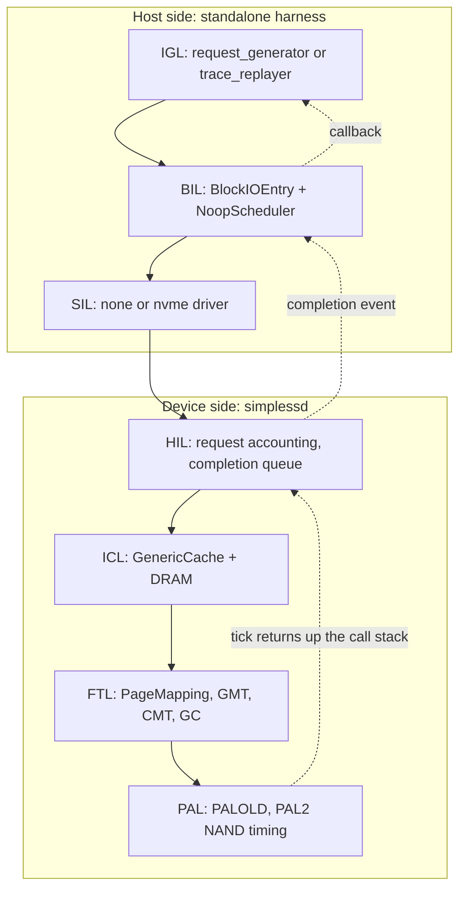

# Simulator Architecture and FTL File Interactions

How the whole SimpleSSD-Standalone simulator fits together, with every non-FTL subsystem reduced to a **contract**, and the FTL directory covered **file by file**.

**Companion series:** [`../page_mapping/README.md`](../page_mapping/README.md) annotates `page_mapping.{hh,cc}` line by line. This series covers everything *around* it.

**Theory:** [`../08_CMT_Mentor_Census.md`](../08_CMT_Mentor_Census.md) for CMT/DFTL background.

---

## What this series answers

1. Which file owns simulated time, and why the FTL receives a `uint64_t &tick` instead of an event.
2. Who constructs `PageMapping`, and when.
3. What each layer above and below the FTL promises, without reading its code.
4. How the nine files in `simplessd/ftl/` depend on each other.
5. What one host request actually costs, hop by hop.

---

## Reading order

| Order | Chapter | Read it for |
| --- | --- | --- |
| 1 | [01_simulator_model.md](01_simulator_model.md) | Discrete-event basics, the two clocks |
| 2 | [02_boot_and_wiring.md](02_boot_and_wiring.md) | Startup, config, who builds whom |
| 3 | [03_layer_contracts.md](03_layer_contracts.md) | IGL, BIL, SIL, HIL, ICL, DRAM, PAL, CPU as black boxes |
| 4 | [04_ftl_file_map.md](04_ftl_file_map.md) | The FTL directory as a whole |
| 5 | [05_ftl_facade.md](05_ftl_facade.md) | `ftl.hh`, `ftl.cc`, `abstract_ftl.hh` annotated |
| 6 | [06_block_metadata.md](06_block_metadata.md) | `common/block.{hh,cc}` annotated |
| 7 | [07_ftl_config.md](07_ftl_config.md) | Every `[ftl]` config key |
| 8 | [08_traces.md](08_traces.md) | Two full end-to-end request traces |

**Short path before a meeting (20 minutes):** chapter 01, then the summary table in chapter 03, then trace A in chapter 08.

**If you only care about your CMT work:** chapter 04 (where your code sits), then jump to [`../page_mapping/04_cmt_why_and_how.md`](../page_mapping/04_cmt_why_and_how.md) and [`../page_mapping/05_cmt_deep_dive.md`](../page_mapping/05_cmt_deep_dive.md).

---

## The one-page map

**Two clocks.** Everything above `HIL::read` runs on the global event queue owned by `Engine`. Everything from `ICL::read` down is one synchronous C++ call chain threading a `uint64_t &tick` reference. Chapter 01 explains why this matters more than any other single fact about the codebase.

---

## Where the code lives

| Layer | Directory | Lines | Series coverage |
| --- | --- | --- | --- |
| IGL | `SimpleSSD-Standalone/igl/` | ~700 | Contract only (ch. 03) |
| BIL | `SimpleSSD-Standalone/bil/` | 471 | Contract only (ch. 03) |
| SIL | `SimpleSSD-Standalone/sil/` | ~1500 | Contract only (ch. 03) |
| Engine | `SimpleSSD-Standalone/sim/` | 1132 | Chapter 01, 02 |
| HIL | `simplessd/hil/` | 365 + NVMe | Contract only (ch. 03) |
| ICL | `simplessd/icl/` | 1560 | Contract only (ch. 03) |
| **FTL** | **`simplessd/ftl/`** | **2854** | **Chapters 04-07 + the `page_mapping/` series** |
| PAL | `simplessd/pal/` | 1427 + `old/` | Contract only (ch. 03) |
| DRAM | `simplessd/dram/` | 956 | Contract only (ch. 03) |
| sim core | `simplessd/sim/` | ~900 | Chapter 01 |

---

## FTL file inventory

The whole point of chapters 04-07. Nine files, 2854 lines.

| File | Lines | Role | Chapter |
| --- | --- | --- | --- |
| `ftl.hh` | 73 | Facade class + `Parameter` geometry struct | 05 |
| `ftl.cc` | 123 | Builds PAL and `PageMapping`; delegates; aggregates stats | 05 |
| `abstract_ftl.hh` | 64 | Interface every mapping algorithm implements | 05 |
| `page_mapping.hh` | 214 | Page-mapping FTL declarations (GMT, CMT, GC) | [`page_mapping/01-03`](../page_mapping/01_the_big_picture.md) |
| `page_mapping.cc` | 1564 | The actual FTL algorithm | [`page_mapping/01-08`](../page_mapping/README.md) |
| `common/block.hh` | 80 | `Block` metadata class declaration | 06 |
| `common/block.cc` | 367 | Per-block valid/erased bitmaps, write pointer, erase count | 06 |
| `config.hh` | 119 | `[ftl]` key enum, policy enums, defaults documented | 07 |
| `config.cc` | 250 | Parse, validate, and serve `[ftl]` keys | 07 |

---

## Acronyms

| Short | Long | Plain meaning |
| --- | --- | --- |
| IGL | I/O Generation Layer | Decides which requests exist |
| BIL | Block I/O Layer | Wraps them as block I/O, measures latency |
| SIL | Simulator Interface Layer | Converts harness requests into device requests |
| HIL | Host Interface Layer | First layer inside the modelled SSD |
| ICL | Internal Cache Layer | DRAM read cache and write buffer |
| FTL | Flash Translation Layer | Logical to physical mapping, GC, wear |
| PAL | Parallelism Abstraction Layer | NAND geometry and timing |
| GMT | Global Mapping Table | Full `LPN -> physical` map (`table`) |
| CMT | Cached Mapping Table | Size-limited cache over the GMT |
| LCA | Logical Cluster Address | ICL-level page address |
| LPN | Logical Page Number | FTL-level (superpage) address |
| PPN | Physical Page Number | `(blockIndex, pageIndex)` pair |

---

## Source snapshot

Written against the working tree of **2026-08-11**. Line numbers cited in chapters were read from source at that time; if you pull upstream changes, re-check before trusting a citation.
