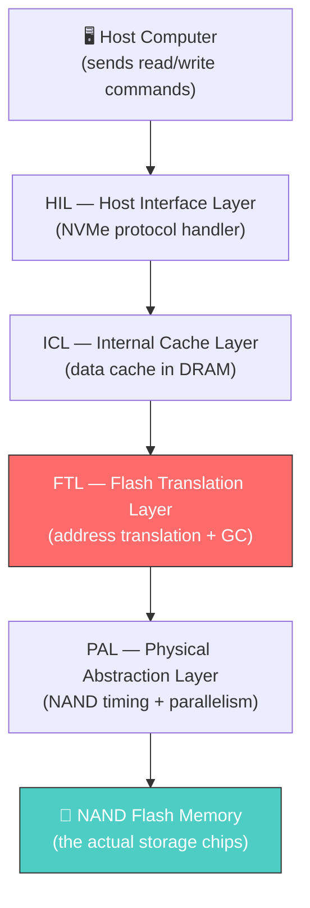
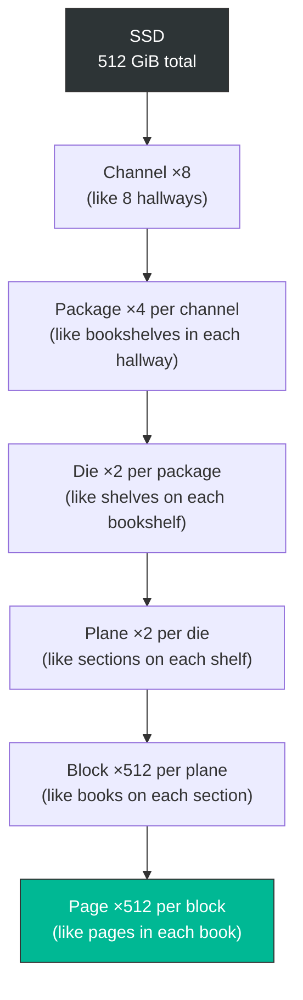
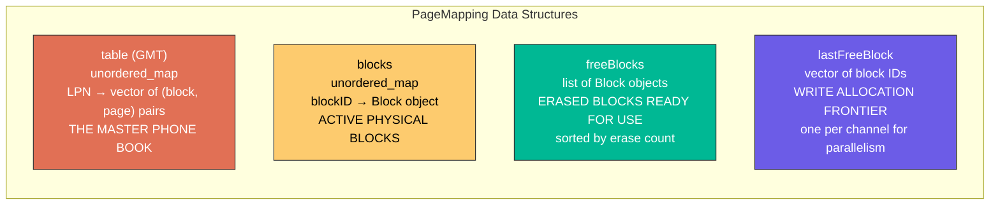
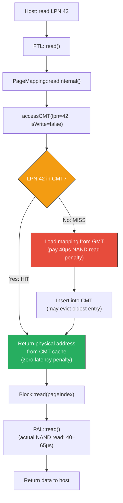
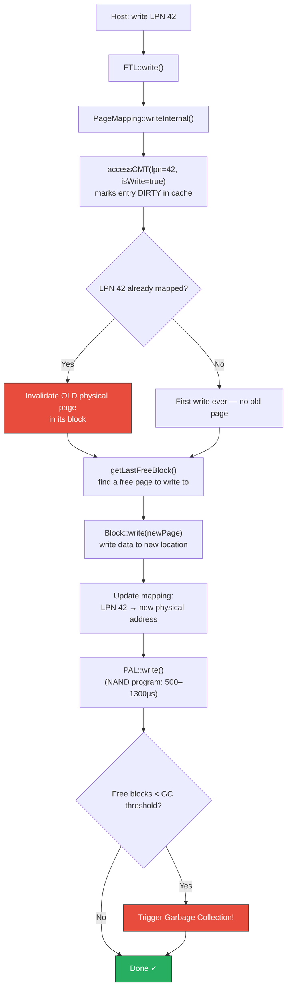
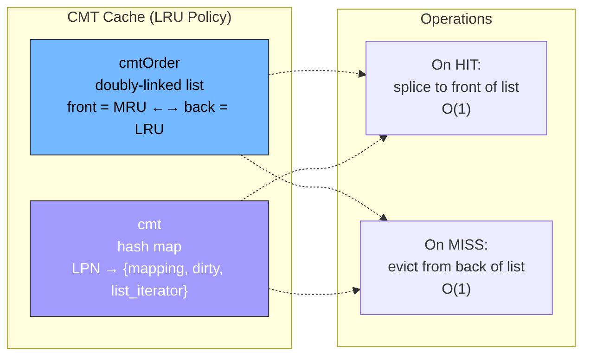
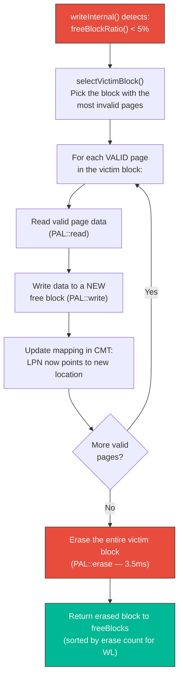
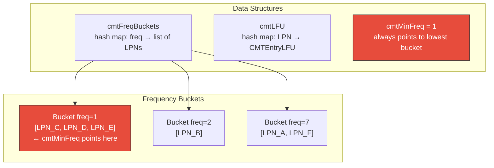
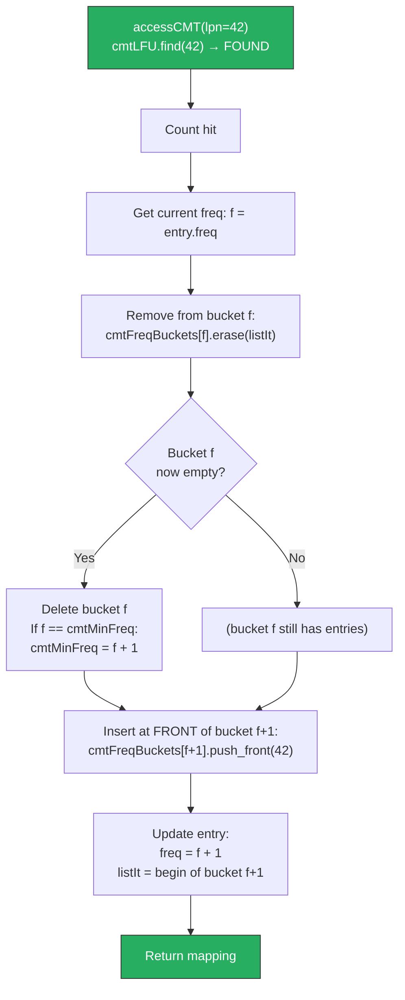
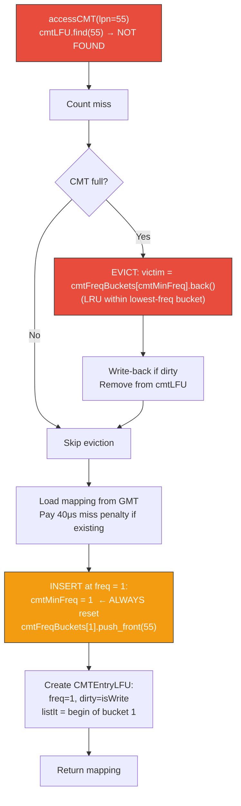

# SimpleSSD FTL Guide — From SSD Architecture to Custom Cache Policies
**SimpleSSD-Standalone 2.0 — Comprehensive Tutorial**
**For:** Second-year CS students working on SSD internals
**Last Updated:** July 31, 2026

---

## Table of Contents

1. [Glossary](#1-glossary)
2. [SSD Architecture Overview](#2-ssd-architecture-overview)
3. [FTL Deep Dive](#3-ftl-deep-dive)
4. [CMT — The Cached Mapping Table](#4-cmt--the-cached-mapping-table)
5. [Garbage Collection](#5-garbage-collection)
6. [LFU Eviction Policy](#6-lfu-eviction-policy)
7. [Project History & Bugs Fixed](#7-project-history--bugs-fixed)
8. [How to Activate LFU](#8-how-to-activate-lfu)

---

## 1. Glossary

Before anything else — here is every acronym you will encounter in SimpleSSD.
Come back to this section whenever you see a term you don't recognize.

| Term | Full Name | What It Is |
|------|-----------|------------|
| **SSD** | Solid State Drive | The storage device being simulated |
| **NAND** | Not-AND (flash memory type) | The physical memory chips inside the SSD |
| **LPN** | Logical Page Number | The address the host computer uses (like a "street address") |
| **PPN** | Physical Page Number | The actual location in NAND where data is stored (like GPS coordinates) |
| **FTL** | Flash Translation Layer | The brain of the SSD — translates LPNs to PPNs |
| **GMT** | Global Mapping Table | The master lookup table: every LPN → PPN mapping. Stored in NAND. |
| **CMT** | Cached Mapping Table | A small, fast cache of the GMT. Stored in DRAM/SRAM. |
| **DFTL** | Demand-based FTL | The algorithm that loads GMT entries into CMT on-demand (like virtual memory page faults) |
| **GC** | Garbage Collection | The process of reclaiming NAND blocks that contain stale/invalid data |
| **WAF** | Write Amplification Factor | Ratio of actual NAND writes to host writes. WAF=1 is perfect; WAF=20 means 20x more writes than needed. |
| **LRU** | Least Recently Used | Eviction policy: throw out the entry that hasn't been touched the longest |
| **LFU** | Least Frequently Used | Eviction policy: throw out the entry that's been touched the fewest times |
| **PAL** | Physical Abstraction Layer | The hardware interface — talks to NAND chips (timing, parallelism) |
| **ICL** | Internal Cache Layer | Data cache (caches actual data blocks, not address translations) |
| **HIL** | Host Interface Layer | The NVMe/SATA interface that receives commands from the host |
| **OP** | Over-Provisioning | Extra physical space reserved for GC to work (typically 7–25%) |
| **MLC** | Multi-Level Cell | NAND type storing 2 bits per cell (used in our config) |
| **WL** | Wear Leveling | Spreading erase operations evenly across all blocks to prevent premature failure |

---

## 2. SSD Architecture Overview

### 2.1 The Big Picture

When the host computer says "read file X" or "write data Y", the request travels through
several layers inside the SSD before anything touches the actual NAND flash memory.



> **You are working in the red box.** The FTL is where address translation, caching (CMT),
> garbage collection, and wear leveling all happen. It's the most complex layer.

### 2.2 Physical NAND Hierarchy

NAND flash memory is organized in a strict hierarchy. Think of it like a library:



**The key sizes from our config (`simplessd/config/sample.cfg`):**

| Level | Count | Size |
|-------|-------|------|
| Page | 1 page | **16 KB** (`PageSize = 16384`) |
| Block | 512 pages | **8 MB** (512 × 16KB) |
| Plane | 512 blocks | **4 GB** |
| Die | 2 planes | **8 GB** |
| Package | 2 dies | **16 GB** |
| Channel | 4 packages | **64 GB** |
| **SSD Total** | 8 channels | **512 GB** physical |

### 2.3 The Three Rules of NAND

These three hardware constraints drive the entire design of the FTL:

1. **You can READ any page** — random access, 40μs per read.
2. **You can only WRITE to an ERASED page** — you cannot overwrite in place.
   If the host wants to update data at LPN 42, the FTL must write it to a *new* physical page
   and mark the old page as invalid. This is called **out-of-place writing**.
3. **You can only ERASE an entire block** — all 512 pages at once, 3.5ms.
   This means if even 1 page in a block is still valid, you can't erase the block.
   You must copy the valid pages somewhere else first. This is **garbage collection**.

---

## 3. FTL Deep Dive

### 3.1 What the FTL Does

The FTL has one primary job: **translate logical addresses (LPNs) into physical addresses (PPNs)**.

The host thinks in logical pages: "read page 42", "write page 1000".
The NAND hardware thinks in physical locations: "block 7, page 3, die 1, channel 2".

The FTL maintains a mapping table that connects these two worlds.

### 3.2 The Files

| File | What It Contains |
|------|-----------------|
| [ftl.hh](file:///home/mohsin/Mohsin/Second%20Year/SIP%202026/SimpleSSD-Standalone/simplessd/ftl/ftl.hh) / [ftl.cc](file:///home/mohsin/Mohsin/Second%20Year/SIP%202026/SimpleSSD-Standalone/simplessd/ftl/ftl.cc) | Top-level wrapper — receives requests from ICL, forwards to PageMapping |
| [page_mapping.hh](file:///home/mohsin/Mohsin/Second%20Year/SIP%202026/SimpleSSD-Standalone/simplessd/ftl/page_mapping.hh) / [page_mapping.cc](file:///home/mohsin/Mohsin/Second%20Year/SIP%202026/SimpleSSD-Standalone/simplessd/ftl/page_mapping.cc) | **The main file** — all mapping logic, CMT, GC, wear leveling |
| [config.hh](file:///home/mohsin/Mohsin/Second%20Year/SIP%202026/SimpleSSD-Standalone/simplessd/ftl/config.hh) / [config.cc](file:///home/mohsin/Mohsin/Second%20Year/SIP%202026/SimpleSSD-Standalone/simplessd/ftl/config.cc) | Configuration parser (CMT size, GC threshold, etc.) |
| [common/block.hh](file:///home/mohsin/Mohsin/Second%20Year/SIP%202026/SimpleSSD-Standalone/simplessd/ftl/common/block.hh) / [block.cc](file:///home/mohsin/Mohsin/Second%20Year/SIP%202026/SimpleSSD-Standalone/simplessd/ftl/common/block.cc) | Physical block abstraction (valid/invalid page tracking, erase count) |
| [abstract_ftl.hh](file:///home/mohsin/Mohsin/Second%20Year/SIP%202026/SimpleSSD-Standalone/simplessd/ftl/abstract_ftl.hh) | Interface class that PageMapping implements |

### 3.3 Key Data Structures

These are the "global variables" that live inside the `PageMapping` class.
Every function in the FTL reads or writes to these:



Think of it this way:
- **`table`** = a phone book. You look up a name (LPN) and get a phone number (physical location).
- **`blocks`** = all the buildings currently in use. Each building (block) has 512 apartments (pages).
- **`freeBlocks`** = empty buildings, ready for new tenants. Sorted by how worn out they are.
- **`lastFreeBlock`** = the building currently accepting new tenants (one per channel for speed).

### 3.4 How a READ Works

When the host says "read LPN 42":



### 3.5 How a WRITE Works

When the host says "write data to LPN 42":



> **Key insight:** Every write creates ONE new valid page and ONE new invalid page.
> The invalid page stays in its old block, wasting space, until GC reclaims it.

### 3.6 The Block Object

Each physical block is represented by a `Block` object (`common/block.cc`).
It tracks:

| Field | What It Tracks |
|-------|---------------|
| `validBits` | Which pages in this block contain live data |
| `erasedBits` | Which pages are erased (available for writing) |
| `pLPNs` | Which LPN is stored in each page slot |
| `eraseCount` | How many times this block has been erased (for wear leveling) |
| `pNextWritePageIndex` | The next free page to write to (sequential within block) |

Important: **writes within a block must be sequential** (page 0, then 1, then 2, ...).
You can't write page 500 before page 499. This is a NAND hardware constraint.

---

## 4. CMT — The Cached Mapping Table

### 4.1 Why the CMT Exists

The GMT (`table`) maps every LPN to its physical address. In a 512 GB SSD with 16 KB pages,
that's ~33 million entries × 8 bytes each = **~256 MB** of mapping data.

That's too much to keep in fast DRAM/SRAM all at once. Real SSD controllers have limited
on-chip memory (typically 2–16 MB for mapping).

The solution: **only cache the hot (recently/frequently used) mappings in fast memory**.
This is exactly what the CMT does — it's a cache, just like your CPU's L1 cache,
but for address translations instead of data.

This approach is called **DFTL** (Demand-based FTL), from the 2009 paper by Gupta et al.

### 4.2 The Cost of a CMT Miss

When the FTL needs a mapping and it's NOT in the CMT:

```
CMT HIT:  0 extra latency — the mapping is right there in SRAM
CMT MISS: +40μs — must read the translation page from NAND flash
          (this is on top of the actual data read/write)

If evicting a DIRTY entry: +500μs — must write the modified mapping
                           back to NAND before evicting it
```

So a CMT miss on a dirty eviction costs **540μs of extra latency** — that's the
difference between a 40μs read and a 580μs read. This is why CMT hit rate matters so much.

### 4.3 CMT Data Structures (LRU — Current Active Policy)



**Two data structures working together:**

1. **`cmtOrder`** — a `std::list<uint64_t>` (doubly-linked list of LPNs)
   - Front = most recently used (MRU)
   - Back = least recently used (LRU) ← this one gets evicted when full
   
2. **`cmt`** — a `std::unordered_map` (hash map)
   - Key: LPN
   - Value: `{CMTEntry, iterator_into_cmtOrder}`
   - The stored iterator is the crucial trick — it lets us do O(1) removal
     from the linked list without scanning.

**Why this is O(1):** When LPN 42 is accessed:
- `cmt.find(42)` → O(1) hash lookup → gets the iterator
- `cmtOrder.splice(begin, cmtOrder, iterator)` → O(1) move to front
- No scanning, no sorting, no searching through the list.

### 4.4 CMT Hit Path (step by step)

```
accessCMT(lpn=42, isWrite=false) called:

  Step 1: cmt.find(42) → FOUND! (it's a HIT)
  Step 2: stat.cmtHits++
  Step 3: cmtOrder.splice(front, cmtOrder, iterator)
          This moves LPN 42 to the front of the list.
          Before: [99, 42, 77, 13]
          After:  [42, 99, 77, 13]
  Step 4: return entry.mapping  (the physical address)
  
  Total extra latency: 0
```

### 4.5 CMT Miss Path (step by step)

```
accessCMT(lpn=55, isWrite=true) called:

  Step 1: cmt.find(55) → NOT FOUND (it's a MISS)
  Step 2: stat.cmtMisses++
  Step 3: Is CMT full? (cmt.size() >= cmtCapacity)
          YES → must evict the LRU entry
  
  Step 4: EVICTION
          evictLpn = cmtOrder.back()  → gets LPN 13 (the oldest)
          Is LPN 13 dirty?
            YES → write back mapping to GMT: table[13] = entry.mapping
                   stat.cmtDirtyEvictions++
                   tick += 500μs  (NAND program penalty)
          cmtOrder.pop_back()
          cmt.erase(13)
  
  Step 5: LOAD FROM GMT
          gmtIt = table.find(55)
          Found → tick += 40μs  (NAND read penalty for translation page)
  
  Step 6: INSERT NEW ENTRY
          cmtOrder.push_front(55)
          cmt[55] = {mapping, dirty=true, iterator=begin}
          
          Before: [42, 99, 77]     (LPN 13 was evicted)
          After:  [55, 42, 99, 77] (LPN 55 inserted at front)
  
  Total extra latency: 40μs (miss) + 500μs (dirty eviction) = 540μs
```

### 4.6 CMT Statistics

These are the counters you see in the simulation output:

| Stat | Meaning |
|------|---------|
| `cmt.hits` | Number of user accesses that found the mapping in CMT |
| `cmt.misses` | Number of user accesses that had to fetch from GMT (expensive) |
| `cmt.hit_rate` | `hits / (hits + misses) × 100%` — higher is better |
| `cmt.evictions` | Total entries thrown out of CMT |
| `cmt.dirty_evictions` | Evictions that required writing data back to NAND |
| `cmt.writebacks` | Same as dirty_evictions (counted separately for clarity) |
| `cmt.gc_hits` | CMT hits triggered by GC (not user requests) |
| `cmt.gc_misses` | CMT misses triggered by GC |
| `cmt.capacity` | Maximum entries the CMT can hold |
| `cmt.occupancy` | How many entries are in the CMT at end of simulation |

---

## 5. Garbage Collection

### 5.1 Why GC Exists

Remember Rule #2: you can't overwrite a NAND page. Every write goes to a NEW page.

This means over time, old pages become "invalid" (stale data). They waste space.
Eventually the SSD runs out of free blocks and MUST reclaim the space.

### 5.2 When GC Triggers

GC is triggered **inside `writeInternal()`** after every write:

```cpp
if (freeBlockRatio() < gcThreshold) {
    // panic mode — we're running out of free blocks!
    selectVictimBlock(blocksToReclaim, tick);
    doGarbageCollection(blocksToReclaim, tick);
}
```

With our config:
```
GCThreshold = 0.05       → fire when < 5% of blocks are free
OverProvisioningRatio = 0.25  → 25% of physical blocks are reserved for GC
```

### 5.3 The GC Process



### 5.4 Why GC Causes Write Amplification

If a victim block has 300 valid pages out of 512:
- GC must **read** 300 pages
- GC must **write** 300 pages to a new block
- GC must **erase** 1 block

That's 300 extra writes that the host never asked for.
This is the primary source of **Write Amplification** (WAF).

### 5.5 GC and the CMT

During GC, the FTL calls `accessCMT(lpn, isWrite=true, isGC=true)`.
The `isGC=true` flag means:
- The access counts toward `stat.cmtGCHits` / `stat.cmtGCMisses` (separate from user stats)
- The CMT entry gets marked dirty (because the physical address changed)
- GC accesses **do** affect LRU ordering — a GC-touched entry moves to the front

### 5.6 Wear Leveling Factor

After GC, the simulator reports `wear_leveling`:

$$\text{WearLeveling} = \frac{\left(\sum \text{eraseCount}_i\right)^2}{N \times \sum \text{eraseCount}_i^2}$$

This is Jain's Fairness Index applied to erase counts:
- **1.0** = perfectly even wear (every block erased the same number of times)
- **0.0** = terrible wear (a few blocks erased heavily, the rest untouched)
- Our runs show ~0.36 because the SSD is "young" with very few GC cycles

---

## 6. LFU Eviction Policy

### 6.1 The Problem with LRU

LRU works great when **recently accessed pages will be accessed again soon** (temporal locality).

But LRU has a weakness called **scan pollution**:

```
Scenario: LPN 1 is accessed 1000 times (it's a hot metadata page).
          Then a sequential scan reads LPN 2 through LPN 5000.
          
Under LRU: The scan pushes LPN 1 to the back of the list.
           LPN 1 gets evicted.
           Next access to LPN 1 = MISS (40μs penalty).
           
The scan "poisoned" the cache — it evicted a genuinely hot page.
```

### 6.2 How LFU Solves This

LFU doesn't care about *when* you were last accessed. It cares about *how many times* total.

```
Same scenario under LFU:
  LPN 1 has freq=1000. The scan pages each have freq=1.
  When the cache is full, LFU evicts the page with freq=1 (scan pages).
  LPN 1 stays in cache with its freq=1000.
  Next access to LPN 1 = HIT (0 latency).
```

### 6.3 The O(1) Frequency-Bucket Algorithm

The naive LFU implementation would scan all entries to find the minimum frequency — that's O(n).
We use the **Shah, Mitra, Matani (2010)** algorithm that makes it O(1):



**Why it's O(1):**
- **Eviction:** Always `cmtFreqBuckets[cmtMinFreq].back()` — no scanning!
- **Promotion:** Remove from `bucket[f]`, insert at front of `bucket[f+1]`
- **cmtMinFreq update:** Can only change by +1 on a hit, or reset to 1 on a miss

### 6.4 LFU Data Structures

```cpp
struct CMTEntryLFU {
    vector<pair<uint32_t, uint32_t>> mapping;  // physical address
    bool     dirty;    // needs write-back on eviction
    uint64_t freq;     // lifetime access count — never resets
    list<uint64_t>::iterator listIt;  // O(1) removal from freq bucket
};

// One list per frequency value
unordered_map<uint64_t, list<uint64_t>> cmtFreqBuckets;

// Main cache store
unordered_map<uint64_t, CMTEntryLFU> cmtLFU;

// Always points to the lowest occupied frequency bucket
uint64_t cmtMinFreq;
```

### 6.5 LFU Hit Path



### 6.6 LFU Miss Path



> **Key insight:** `cmtMinFreq = 1` is reset on EVERY miss. This is because any
> newly inserted entry starts at freq=1, and 1 is the smallest possible frequency.
> So after any insertion, the minimum is guaranteed to be 1.

### 6.7 LRU vs LFU — Side by Side

| Aspect | LRU | LFU |
|--------|-----|-----|
| **Eviction target** | Least recently accessed | Least frequently accessed |
| **Data structure** | 1 doubly-linked list | 1 list per frequency bucket |
| **Extra memory per entry** | 1 iterator (8 bytes) | 1 freq counter + 1 iterator (16 bytes) |
| **Hit complexity** | O(1) — splice to front | O(1) — erase + push_front in new bucket |
| **Eviction complexity** | O(1) — pop back | O(1) — pop back of min-freq bucket |
| **Handles scan pollution?** | ❌ No — scan evicts hot pages | ✅ Yes — scan pages stay at freq=1 |
| **Adapts to phase changes?** | ✅ Fast — old entries naturally age out | ❌ Slow — old hot pages persist ("cache poisoning") |
| **New entry behaviour** | Starts as MRU (most recent) | Starts at freq=1 (coldest possible) |

### 6.8 When LFU Wins

```
CMT capacity: 3 entries
Workload: read LPN 1 ten times, then scan LPN 2 through LPN 100

LRU:  After scan, LPN 1 evicted (it's old). Next read of LPN 1 = MISS.
LFU:  LPN 1 has freq=10. Scan pages have freq=1. LPN 1 stays. NEXT read = HIT.
```

### 6.9 When LFU Loses

```
Phase 1: Read LPN 1 fifty times → freq=50
Phase 2: Never touch LPN 1 again, start reading LPN 2 heavily

LRU:  LPN 1 evicts quickly — hasn't been used recently.
LFU:  LPN 1 has freq=50. It takes 50+ evictions of newer entries
      before LPN 1 is finally the minimum. LPN 1 "squats" in cache.
      This is called "cache poisoning".
```

### 6.10 Open Questions

1. **Does LFU actually help for our workloads?** Pure random IO has uniform access distribution — every LPN accessed equally. LFU and LRU would give identical results. LFU only wins with skewed/hot-spot workloads.

2. **Fill phase poisoning:** The fill phase writes every LPN once, building up freq=1 for all. When the workload starts, those fill-phase entries compete equally with workload entries. Should we reset counters between phases?

3. **Frequency aging:** Counters never decay. A page hot in phase 1 stays "hot" forever in LFU's eyes. Options: saturating counters (cap at 255), periodic halving, or reset on eviction.

4. **GC interaction:** GC calls `accessCMT(isGC=true)`. Should GC accesses increment the frequency counter? If so, pages that get GC'd frequently would artificially inflate their frequency.

---

## 7. Project History & Bugs Fixed

### 7.1 The BIL Log Spam Bug

**Problem:** Every simulation run produced millions of lines of:
```
[BIL] submitIO id=919411 offset=1345153064960 length=4096
[BIL] submitIO id=919412 offset=423466930176 length=4096
```

**Investigation:** Changed every config setting related to logging — `LogFile`, `DebugLogFile`, `ProgressPeriod`. None of them stopped the spam.

**Root Cause:** A `std::cerr` line was hardcoded directly in `bil/entry.cc`. The config system had no control over it.

**Fix:** Deleted the `std::cerr` line from source code and recompiled.

**Lesson:** Not all output is controlled by config files. Sometimes you have to grep the source.

### 7.2 The CMT Capacity Bug

**Problem:** Setting `CMTCapacityBytes = 268435456` (256 MB) resulted in the simulator reporting `cmt.capacity = 245` entries. That's 2 KB, not 256 MB.

**Investigation:** Traced the capacity calculation in `page_mapping.cc` constructor. The formula was dividing by the wrong value — computing something related to total physical pages instead of simple byte-to-entry conversion.

**Root Cause:** The formula `capacity = cmtBytes / totalPhysicalPages` was wrong. Each mapping entry is 8 bytes (4B LPN + 4B PPN), so the formula became `capacity = cmtBytes / 8`.

**Fix:** Changed the capacity calculation to `cmtCapacity = cmtBytes / 8`.

**Impact:** **Every simulation result before this fix was invalid.** The SSD was running with essentially no CMT, producing artificially low hit rates. Results looked plausible but were meaningless.

**Lesson:** Always cross-check derived values in the output (`cmt.capacity`) against what you configured. Silent bugs produce no errors — only wrong numbers.

> [!IMPORTANT]
> This fix was itself incomplete, and was corrected again on 2026-08-06. `bytes / 8` assumes one mapping per CMT entry, but an entry caches a whole superpage — `bitsetSize` mappings, which is 8 on the default config. The formula is now `cmtBytes / (8 * bitsetSize)`. See §7.5.

### 7.5 The CMT Capacity Bug, Round Two

**Problem:** After the §7.2 fix the sweep still behaved oddly: the "2 MB" and "16 MB" points differed far less than the 8x ratio suggested they should.

**Investigation:** Printed `bitsetSize` at startup. It is 8, because `EnableRandomIOTweak = 1` sets `bitsetSize = param.ioUnitInPage` and one superpage spans 8 sub-pages. So one `CMTEntry` holds a `std::vector` of 8 `(block, page)` pairs, i.e. 8 mappings, not 1.

**Root Cause:** `cmtBytes / 8` charges 8 bytes for an entry that actually models 64 bytes of mapping data. Every configured cache size was 8x larger than its label: the "2 MB" sweep point was really a 16 MB cache.

**Fix:** `cmtEntryBytes = 8 * bitsetSize; cmtCapacity = cmtBytes / cmtEntryBytes;` and added `cmt.entry_bytes` and `cmt.capacity_bytes` stats so the true size is recorded in every result file.

**Lesson:** The §7.2 lesson was right but not applied hard enough. Cross-checking `cmt.capacity` against the config would not have caught this, because both the config and the capacity were self-consistent — the error was in what an "entry" *means*. When a derived value depends on a unit, print the unit too.

### 7.6 Warm-Up Contamination of the Hit Rate

**Problem:** Reported hit rates looked implausibly low, e.g. 7.84% on a run where theory predicted about 16.7%.

**Investigation:** `initialize()` prefills the drive by calling `writeInternal()`, which goes through `accessCMT()`. Nothing reset the counters afterwards, so millions of compulsory prefill misses were being counted as part of the measured workload. On `randread_io4G_cmt2MB_d32`: prefill was 0.75 × 1,572,864 = 1,179,648 pages, every one a guaranteed miss. Removing them gives 174,753 / 1,048,576 = 16.67% — exactly `capacity / totalLogicalPages`, the textbook LRU hit rate for uniform random access.

**Root Cause:** Statistics started counting before the experiment did.

**Fix:** `resetCMTStats()` at the end of `initialize()`, zeroing only the CMT counters. The cache *contents* stay warm, which is what a real drive would look like at that point.

**Lesson:** Separate the warm-up phase from the measurement phase explicitly. A benchmark that measures its own setup will quietly report the wrong answer, and the answer will look plausible.

### 7.3 The Sweep Range Calibration

**Problem:** In the parallel sweep, `CMT = 32MB` and `CMT = 128MB` produced identical hit rates (to 6 decimal places).

**Investigation:** Calculated the total working set size:
- The `io_size` parameter in the workload generator determines how many unique LPNs are accessed
- With `io_size = 4GB` and `PageSize = 16KB`, that's ~250K unique LPNs
- 250K × 8 bytes/entry = ~2MB of CMT needed for 100% hit rate
- Both 32MB and 128MB are way above this — both act as "infinite cache"

**Fix:** Recalibrated the sweep range to 512KB – 16MB to properly span the thrashing-to-saturation curve.

**Lesson:** Know your working set size before choosing cache sizes to test. An experiment where half your data points are identical is a wasted experiment.

### 7.4 The GC Trigger Mystery

**Problem:** With `FillRatio = 1.0`, GC never triggered. `gc.count = 0`.

**Investigation:** Traced the math:
- `FillRatio = 1.0` fills 100% of **logical** space
- But `OverProvisioningRatio = 0.25` reserves 25% of **physical** space
- After fill: `65,536 total blocks - 49,152 used = 16,384 free blocks` (25% still free!)
- `GCThreshold = 0.05` means GC fires at `< 3,277 free blocks`
- A 4GB workload only consumes ~2,048 more blocks
- `16,384 - 2,048 = 14,336 free` — nowhere near the threshold

**Fix:** Increased `GCThreshold` to 0.20 and ran a larger workload. GC successfully triggered 124 times.

**Lesson:** "100% full" in logical space ≠ "100% full" in physical space. The OP buffer exists precisely so GC always has room to work.

---

## 8. How to Activate LFU

Set one config key. No source edits, no recompile.

```ini
# simplessd/config/sample.cfg, [ftl] section
CMTPolicy = 0    # LRU (default)
CMTPolicy = 1    # LFU
```

To sweep both policies in one run:

```bash
bash run_sweep_2h.sh -p 0,1
```

The policy appears in every output filename (`randread_LFU_io4G_cmt2MB_d32.txt`) and as the `ftl.page_mapping.cmt.policy` stat inside the file, so a result can never be misattributed.

### How the switch is wired

`accessCMT()` is a thin dispatcher over `accessCMT_LRU()` and `accessCMT_LFU()`. Both policies' data structures are always declared; only the active one is populated.

The important part is that **nothing outside these functions touches the cache containers directly**. Three helpers mediate all other access:

| Helper | Used by |
|---|---|
| `accessCMT()` | `readInternal`, `writeInternal`, `trimInternal`, GC |
| `cmtErase(lpn)` | `trimInternal`, `format` |
| `cmtSize()` | `getStatValues`, warm-up logging |

`flushCMT()` branches on the policy internally and clears both sets of containers.

> [!WARNING]
> **Why this matters — the bug this design prevents.**
> Before 2026-08-06 switching policy meant hand-editing six places, or running `activate_lfu.py` to do it by string replacement. That script was applied *halfway*: `flushCMT()`, `format()` and the occupancy stat were switched to the LFU containers while `accessCMT()` still used the LRU ones.
>
> Because both sets of containers were declared, **it compiled cleanly**. It just silently misbehaved: dirty entries were never flushed at shutdown, formatted LPNs stayed in the cache and returned stale hits, and `cmt.occupancy` always reported 0.
>
> A config key cannot be applied halfway. `activate_lfu.py` and `lfu_code.txt` have been deleted.

### What to Compare After Running Both Policies

Run the same sweep config with LRU, then swap to LFU and rerun. Compare:

| Metric | What It Tells You |
|--------|-------------------|
| `cmt.hit_rate` | Overall cache effectiveness — is LFU better or worse? |
| `cmt.evictions` | Should be similar (same cache size) |
| `cmt.dirty_evictions` | Write pressure from evictions |
| `pal.read.count` | Total NAND reads — fewer = better |
| `pal.program.count` | Total NAND writes — fewer = better |
| Avg latency | End-to-end impact on user-visible performance |

---

*This document supersedes `tutorial/lfu_policy_guide.md`.*
*Source files: `simplessd/ftl/page_mapping.cc` and `page_mapping.hh`*
