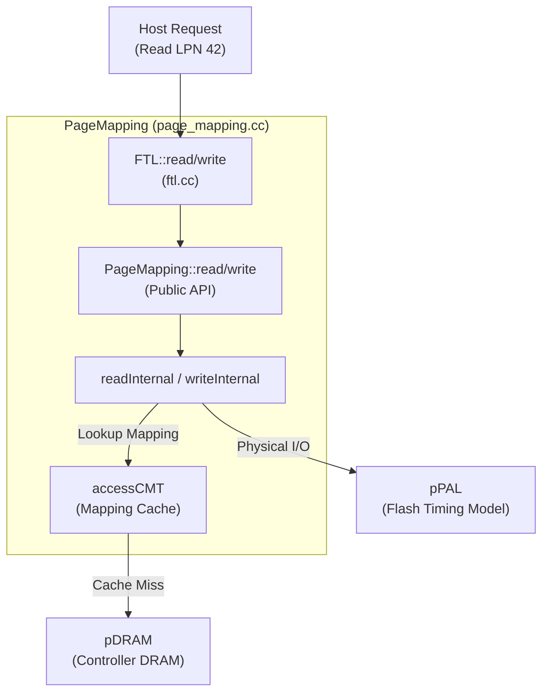

[← README](README.md) | Next: [02 — Boot & Init](02_boot_and_init.md)

# The Big Picture: What Does `PageMapping` Do?

**The one thing to take away:** `PageMapping` is the brain of the simulated SSD — it translates every host read/write into physical flash operations, and every design choice in this file exists because flash can't be overwritten in-place.

## The Problem

Imagine a hard drive: when the host wants to update sector 42, it simply overwrites sector 42. Flash memory cannot do this. You can read and write flash pages, but before you can overwrite a page, you must *erase* the entire block it belongs to. Since blocks are large (often containing hundreds of pages) and erasing them is slow, we can't erase a block every time the host updates a single page.

To solve this, the FTL (Flash Translation Layer) creates an illusion. When the host writes to logical page 42, the FTL writes the data to a *new*, freshly erased physical page, and updates a mapping table to remember where it put the data. The old physical page is marked "invalid". This indirect mapping creates three massive new problems that the FTL must handle:
1. **Garbage Collection:** We eventually run out of free blocks and must reclaim the "invalid" pages.
2. **Wear Leveling:** Flash blocks degrade over time, so we must distribute writes evenly.
3. **The Mapping Table:** We need a massive, fast table to translate Logical Page Numbers (LPNs) to Physical Page Numbers (PPNs). 

`PageMapping` is the component in SimpleSSD that orchestrates all of this.

## The Mental Model

Here is the path a request takes as it flows from the host down to the raw flash. 



> **Term:** `tick` — Simulated time in picoseconds. Notice that `tick` is passed by reference (`uint64_t &tick`) through every function. As functions do work (e.g., table lookups, flash reads), they add latency to `tick`. When the request returns to the host, `tick` holds the time the operation completed.

## A Complete Read, Start to Finish

Let's follow a 4KB read of LPN 42 through the system.

The host says "read LPN 42". The FTL facade (`ftl.cc:68`) simply delegates to `PageMapping::read` (`page_mapping.cc:353`). The `read` function checks the request size, validates the `ioFlag` (which sub-pages are being requested), and hands it off to `readInternal` (`page_mapping.cc:1096`).

```cpp
// page_mapping.cc:1103
auto *mappingData = accessCMT(req.lpn, false, tick, false, false);
```

`readInternal` immediately asks `accessCMT` (`page_mapping.cc:800`): "Where does LPN 42 live physically?" 

- **If it's a CMT hit:** `accessCMT` returns the physical location immediately and increments `cmtHits`.
- **If it's a CMT miss:** `accessCMT` must read the mapping from the Global Mapping Table (GMT) in DRAM. It charges a `cmtMissLatency` (usually 40µs) to `tick`. If the cache is full, it might evict a dirty entry first, adding `cmtWriteBackLatency` (500µs).

Now that `readInternal` has the physical `(blockIndex, pageIndex)`, it builds a physical request and issues it to the flash:

```cpp
// page_mapping.cc:1150
pPAL->read(palRequest, beginAt);
```

The PAL (Physical Abstraction Layer) simulates the NAND timing, adding the actual flash read latency to `tick`. The read is complete.

## A Complete Write, Start to Finish

Writing is far more complex because of out-of-place updates. Let's walk through a 4KB write to LPN 42.

Like reads, the request flows to `PageMapping::write` (`page_mapping.cc:371`), which validates it and calls `writeInternal` (`page_mapping.cc:1162`).

```cpp
// page_mapping.cc:1171
auto &mappingData = *accessCMT(req.lpn, true, tick);
```

`writeInternal` calls `accessCMT` to create or update the mapping. If LPN 42 was written before, it already has a physical location. Because we can't overwrite it, `writeInternal` marks the old physical page as **invalid** in the block's bitmap.

Next, it needs a fresh page. It calls `getLastFreeBlock` (`page_mapping.cc:533`) to find an open block that is actively being written to.

```cpp
// page_mapping.cc:1199
block = blocks.find(getLastFreeBlock(req.ioFlag));
```

It issues the write to the flash via `pPAL->write` (`page_mapping.cc:1260`), and updates the CMT with the new mapping: `mapping = (newBlock, newPage)`.

Finally, because we consumed a free page and generated an invalid page, we check our free space. If `freeBlockRatio() < gcThreshold`, we trigger Garbage Collection on-demand:

```cpp
// page_mapping.cc:1285-1290
selectVictimBlock(list, beginAt);
doGarbageCollection(list, beginAt);
```

> **Why out-of-place writes?** Flash pages can't be overwritten. You must write to a NEW location and invalidate the old one. This is the fundamental reason GC exists.

## The Cast of Characters

To orchestrate this, `PageMapping` manages several data structures:

| Component | Variable Name | Purpose |
| :--- | :--- | :--- |
| **Global Mapping Table** | `table` | The ground truth mapping of every LPN to its PPN. |
| **Cached Mapping Table** | `cmt` / `cmtLFU` | A fast, size-limited cache holding recently accessed mappings. |
| **Block Pool** | `blocks` | Metadata for all physical blocks (tracks valid/invalid pages, erase counts). |
| **Free List** | `freeBlocks` | Erased blocks ready to be written, sorted to aid wear leveling. |
| **Write Pointers** | `lastFreeBlock` | The currently open blocks where incoming writes are placed. |
| **Garbage Collector** | `selectVictimBlock`, `doGarbageCollection` | Reclaims blocks with many invalid pages to replenish `freeBlocks`. |

## Where Everything Lives

If you want to trace the code yourself, here is where to look:

| File | Lines | What's Inside |
| :--- | :--- | :--- |
| `page_mapping.hh` | 214 | Class declarations and data structures. |
| `page_mapping.cc` | 1564 | All the core logic (`read`, `write`, `accessCMT`, `doGarbageCollection`). |
| `ftl.hh` / `ftl.cc` | ~130 | The facade that wraps `PageMapping` and interfaces with the host. |
| `abstract_ftl.hh` | ~130 | The generic interface that all FTL implementations must inherit from. |
| `common/block.hh` / `.cc` | ~130 | Physical block metadata (bitmaps, erase counts). |
| `config.hh` / `config.cc` | - | Configuration parsing for FTL parameters (thresholds, sizes). |

## Key Terms Glossary

- **LPN (Logical Page Number):** The FTL-level block address requested by the host. 
- **PPN (Physical Page Number):** The actual hardware address, stored as a `(blockIndex, pageIndex)` pair.
- **GMT (Global Mapping Table):** The full `LPN → PPN` map stored in controller DRAM.
- **CMT (Cached Mapping Table):** A size-limited SRAM cache over the GMT to speed up lookups.
- **Superpage:** A logical page striped across multiple flash dies to exploit parallel I/O.
- **Sentinel PPN:** A special value `(totalPhysicalBlocks, pagesInBlock)` that means "this LPN has never been written to."
- **`bitsetSize`:** The number of sub-pages per superpage. Equals `ioUnitInPage` if random IO tweaks are on, else 1.
- **`ioUnitInPage`:** The number of parallel sub-page units in one superpage.
- **`pageCountToMaxPerf`:** The number of parallel write streams (channels × dies) available in the SSD architecture.
- **`tick`:** Simulated time in picoseconds, passed by reference through the call stack to accumulate latencies.
- **`ioFlag`:** A bitset indicating exactly which sub-pages are targeted by a request.

---

## Self-Quiz

<details>
<summary>1. What does the FTL translate between?</summary>
It translates host Logical Page Numbers (LPNs) to physical flash memory locations (PPNs).
</details>

<details>
<summary>2. Why can't flash be overwritten in place?</summary>
Flash memory hardware requires an entire block to be erased before any page within it can be rewritten.
</details>

<details>
<summary>3. What is the difference between the GMT and CMT?</summary>
The GMT (Global Mapping Table) is the full, massive mapping table stored in slow DRAM. The CMT (Cached Mapping Table) is a small, fast cache stored in SRAM that holds recently used mappings.
</details>

<details>
<summary>4. What happens on a CMT miss?</summary>
The FTL must fetch the mapping from the GMT in DRAM (adding `cmtMissLatency` to `tick`). If the cache is full, it may also need to evict a dirty entry first (adding `cmtWriteBackLatency`).
</details>

<details>
<summary>5. Why are writes "out-of-place"?</summary>
Because flash cannot be overwritten, a write must go to a freshly erased page. The old data's physical location is marked "invalid" instead of being overwritten.
</details>

<details>
<summary>6. What triggers garbage collection?</summary>
Garbage collection is triggered when the ratio of free blocks drops below a configured threshold (`gcThreshold`).
</details>

<details>
<summary>7. What is a sentinel PPN and when do you see one?</summary>
It's a special `(block, page)` value representing an unmapped LPN that the host has never written to.
</details>

<details>
<summary>8. Which file contains the mapping algorithm vs the facade?</summary>
The algorithm is in `page_mapping.cc`, while the facade that connects it to the host is in `ftl.cc`.
</details>

<details>
<summary>9. What does `tick` represent and how does it flow?</summary>
`tick` represents the simulated time in picoseconds. It is passed by reference through every function, accumulating latency as work is performed.
</details>

<details>
<summary>10. What is `pageCountToMaxPerf` and why does it matter?</summary>
It represents the number of parallel write streams (channels × dies) in the SSD. Grouping writes into this many streams maximizes the parallel performance of the hardware.
</details>
