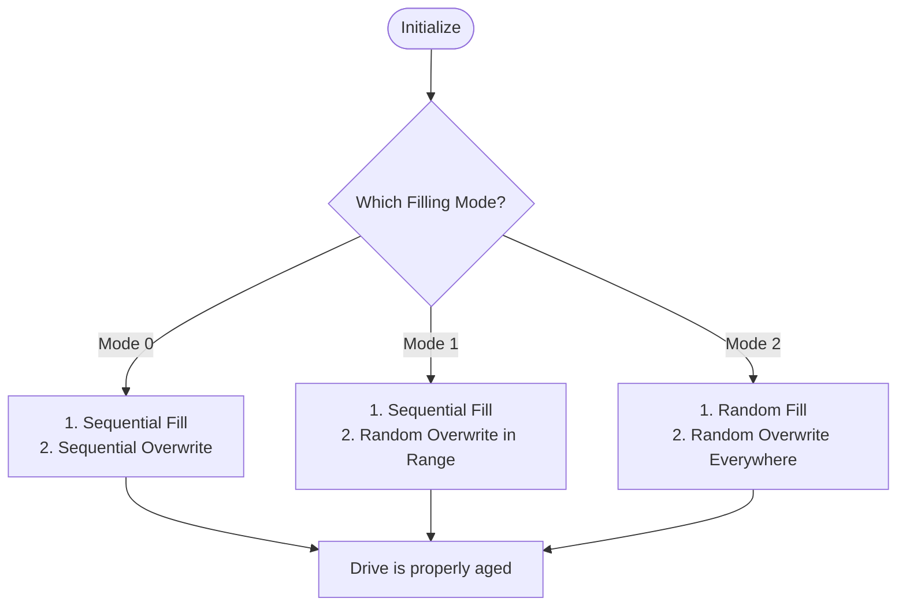

[← README](README.md) | Prev: [01 — Big Picture](01_the_big_picture.md) | Next: [03 — GMT](03_gmt_and_address_space.md)

# Boot & Initialization: How Does the FTL Start Up?

**The one thing to take away:** The constructor sizes every data structure from PAL geometry (physical flash parameters), and `initialize()` pre-fills the drive to simulate a realistic starting state — because benchmarking an empty SSD would give misleading results.

## The Problem

When you take a brand new SSD out of the box, it is completely empty. Every physical page is free, there is no fragmentation, and the FTL has to do exactly zero Garbage Collection (GC) to write new data. If we were to benchmark our FTL simulator starting from this state, the results would look incredible, but they would be entirely fake.

Real SSDs in the wild are partially full. They have fragmented data, invalid pages scattered across blocks, and must constantly clean up old blocks (GC) to make room for new writes. To get realistic performance numbers from our simulation, we have to start the drive in a realistic state. The initialization phase is responsible for creating this "used" state before the real benchmark even begins.

## Constructor Walkthrough

The constructor of our `PageMapping` class is responsible for allocating memory and setting up the initial state of the drive. It uses the physical parameters provided by the **PAL** to size all data structures.

> **Term:** **PAL** (Physical Abstraction Layer). The component of SimpleSSD that models the raw NAND flash chips, including timing, geometry (pages per block), and parallel channels.

First, we allocate the main data structures and initialize the physical blocks.

```cpp
  blocks.reserve(param.totalPhysicalBlocks);
  table.reserve(param.totalLogicalBlocks * param.pagesInBlock);

  for (uint32_t i = 0; i < param.totalPhysicalBlocks; i++) {
    freeBlocks.emplace_back(Block(i, param.pagesInBlock, param.ioUnitInPage));
  }
  nFreeBlocks = param.totalPhysicalBlocks;
```

> **Why this way?** We track `nFreeBlocks` as an explicit integer rather than just calling `freeBlocks.size()`. In older C++ standards (before C++11), `std::list::size()` was allowed to be an $O(N)$ operation. Tracking it manually ensures it is always $O(1)$.

Next, we pre-allocate a few blocks to enable parallel writes right out of the gate. `pageCountToMaxPerf` tells us how many parallel write streams the underlying flash supports.

```cpp
  // Allocate free blocks
  for (uint32_t i = 0; i < param.pageCountToMaxPerf; i++) {
    lastFreeBlock.at(i) = getFreeBlock(i);
  }
```

Then we size the **CMT** (Cached Mapping Table). The CMT is a limited-capacity cache that holds recently accessed address mappings. The size of an entry depends on whether the Random IO Tweak is enabled, which changes the tracking granularity.

```cpp
  bRandomTweak = conf.readBoolean(CONFIG_FTL, FTL_USE_RANDOM_IO_TWEAK);
  bitsetSize = bRandomTweak ? param.ioUnitInPage : 1;
  cmtEntryBytes = 8 * bitsetSize;

  float cmtRatio = conf.readFloat(CONFIG_FTL, FTL_CMT_CAPACITY_RATIO);
  if (cmtRatio > 0.0f) {
    cmtCapacity = (uint64_t)((float)status.totalLogicalPages * cmtRatio);
  }
  else {
    uint64_t cmtBytes = conf.readUint(CONFIG_FTL, FTL_CMT_CAPACITY_BYTES);
    cmtCapacity = cmtBytes / cmtEntryBytes;
  }
  if (cmtCapacity < 16) cmtCapacity = 16;
```

> **Why this way?** We size the CMT based on a strict byte budget rather than a simple entry count. A real SSD controller has a fixed amount of SRAM (e.g., 2 MB). Sizing by bytes ensures that if we change the mapping granularity (which changes how many bytes an entry takes), the cache capacity scales realistically.

## The Three Filling Modes

To simulate a "used" drive, the `initialize()` function pre-fills the drive. There are three filling modes, controlling how data is written and invalidated.



Before filling, the code ensures we don't accidentally fill up the drive so much that we trigger Garbage Collection during the setup phase, which would slow down initialization unnecessarily.

```cpp
  maxPagesBeforeGC =
      param.pagesInBlock *
      (param.totalPhysicalBlocks *
           (1 - conf.readFloat(CONFIG_FTL, FTL_GC_THRESHOLD_RATIO)) -
       param.pageCountToMaxPerf);

  if (nPagesToWarmup + nPagesToInvalidate > maxPagesBeforeGC) {
    warn("ftl: Too high filling ratio. Adjusting invalidPageRatio.");
    nPagesToInvalidate = maxPagesBeforeGC - nPagesToWarmup;
  }
```

> **Why fill the drive?** Benchmarking an empty SSD gives unrealistically high performance — no GC, no fragmentation, infinite free blocks. By filling the drive and creating invalid pages before the simulation starts, we force the FTL to do realistic work immediately.

## CMT Warm-up and `resetCMTStats()`

Filling the drive requires writing millions of pages. Every one of those writes must update the CMT, causing millions of "compulsory misses" as the cache is populated for the first time. If we left these misses in our statistics, they would ruin the accuracy of the hit rate we report at the end of the simulation.

```cpp
  // Warm-up drove millions of writes through the CMT...
  // Zero the CMT counters here.  Cache *contents* stay warm...
  resetCMTStats();
```

> **Why not clear the cache too?** A real drive that was just powered on and filled with data would have a warm cache containing the most recently written mappings. Clearing the cache would simulate a drive that was just power-cycled, which is a different scenario than a continuously running, heavily used drive.

## Destructor: `flushCMT`

When the simulation ends, the `PageMapping` destructor is called. Its only job is to run `flushCMT()`.

```cpp
void PageMapping::flushCMT() {
  if (cmtPolicy == CMT_POLICY_LFU) {
    for (auto &entry : cmtLFU) {
      if (entry.second.dirty) {
        table[entry.first] = entry.second.mapping;
      }
    }
  }
  // ... and similarly for LRU
  cmt.clear();
}
```

> **Why no latency?** Normally, evicting a dirty entry from the CMT takes time because it must be written to flash. However, `flushCMT()` charges no latency. The simulation is already over (no `tick` to advance). This flush is purely to make the underlying GMT structurally coherent, so that if the simulator dumps the final drive state for debugging, it is accurate.

## Helper Functions

The FTL uses a few small helper functions to manage its state gracefully.

- **`repairLFUMinFreq`**: When an entry is evicted from the LFU cache, its frequency bucket might become empty. This function scans the buckets to find the new minimum frequency.
- **`cmtErase`**: Removes an LPN from the cache without writing it back. Used when a mapping is destroyed (e.g., via TRIM or FORMAT). Writing it back would resurrect a deleted mapping!
- **`getLiveMapping`**: A read-only peek at the authoritative mapping for an LPN. If it's dirty in the CMT, it returns the CMT version; otherwise, the GMT version. It generates no stats, charges no latency, and doesn't mutate the cache.
- **`cmtSize`**: Returns the current occupancy of the active cache.
- **`resetCMTStats`**: Zeros out the hit/miss counters, but leaves the actual cached mappings intact.

## Invariants

When the constructor and `initialize()` finish, the following invariants must hold true:
1. `freeBlocks.size() == nFreeBlocks` exactly.
2. `cmtCapacity` is strictly $\ge 16$.
3. The number of valid plus invalid pages is strictly $\le$ `maxPagesBeforeGC`.
4. The CMT stats (hits, misses, evictions) are all exactly `0`, but `cmtSize()` may be $> 0$.
5. The `lastFreeBlock` array has exactly `pageCountToMaxPerf` blocks allocated and ready for parallel writes.

## Source Reference

| Concept | File | Lines |
| :--- | :--- | :--- |
| Constructor / Allocation | [page_mapping.cc](../../SimpleSSD-Standalone/simplessd/ftl/page_mapping.cc) | 34-95 |
| Destructor (`flushCMT`) | [page_mapping.cc](../../SimpleSSD-Standalone/simplessd/ftl/page_mapping.cc) | 97-127 |
| Cache Helpers | [page_mapping.cc](../../SimpleSSD-Standalone/simplessd/ftl/page_mapping.cc) | 129-221 |
| `initialize()` (Filling) | [page_mapping.cc](../../SimpleSSD-Standalone/simplessd/ftl/page_mapping.cc) | 223-351 |

## Self-Quiz

<details>
<summary><b>1. How is `cmtCapacity` computed (two paths)?</b></summary>
If `CMTCapacityRatio > 0`, it is a percentage of total logical pages. Otherwise, it is calculated as `CMTCapacityBytes / cmtEntryBytes`. In both cases, it is floored to a minimum of 16 entries.
</details>

<details>
<summary><b>2. Why does the constructor pre-allocate `pageCountToMaxPerf` blocks?</b></summary>
To allow the SSD to immediately start writing to multiple parallel channels (streams) without having to pause and allocate blocks first.
</details>

<details>
<summary><b>3. What's the difference between filling modes 0, 1, and 2?</b></summary>
Mode 0 is sequential fill then sequential overwrite. Mode 1 is sequential fill then random overwrite within that range. Mode 2 is random fill then random overwrite across the entire logical address space.
</details>

<details>
<summary><b>4. Why does `resetCMTStats` not clear the cache contents?</b></summary>
Because it is simulating a drive that has been pre-conditioned and running. A running drive has a warm cache. Clearing it would simulate a cold boot, giving an artificial cache-miss penalty at the start of the benchmark.
</details>

<details>
<summary><b>5. Why does `cmtErase` NOT write back dirty entries?</b></summary>
It is used during TRIM or FORMAT when the underlying data is being destroyed. Writing back the dirty entry to the GMT would save the mapping to flash, resurrecting data that the OS specifically asked to delete.
</details>

<details>
<summary><b>6. When should you use `getLiveMapping` vs `accessCMT`?</b></summary>
Use `getLiveMapping` when you just need to safely peek at the true mapping (e.g., during TRIM) without mutating the cache, causing an eviction, or charging simulation time. Use `accessCMT` for normal read/write operations that represent actual drive work.
</details>

<details>
<summary><b>7. What does `flushCMT` do and when is it called?</b></summary>
It pushes all dirty cached mappings back into the main table (GMT). It is called in the destructor to ensure the final state of the simulator's memory perfectly matches what would be on the flash chips.
</details>

<details>
<summary><b>8. What is `maxPagesBeforeGC` and why is it needed?</b></summary>
It is the maximum number of pages we can write before the SSD is forced to run Garbage Collection. It acts as a ceiling during initialization to ensure we don't accidentally trigger GC while just trying to set up the starting state.
</details>

<details>
<summary><b>9. Why is `bitsetSize` different when random IO tweak is on vs off?</b></summary>
The random IO tweak allows tracking mappings at a sub-page (sector) level. If it's on, a CMT entry must track multiple sub-mappings, increasing the byte size of the entry. If off, it only tracks one mapping per page.
</details>

<details>
<summary><b>10. What invariants hold after the constructor completes?</b></summary>
All physical blocks are in `freeBlocks`, `nFreeBlocks` matches the actual count, the CMT capacity is sized correctly (and $\ge 16$), and the `lastFreeBlock` array is populated with ready-to-use blocks.
</details>
