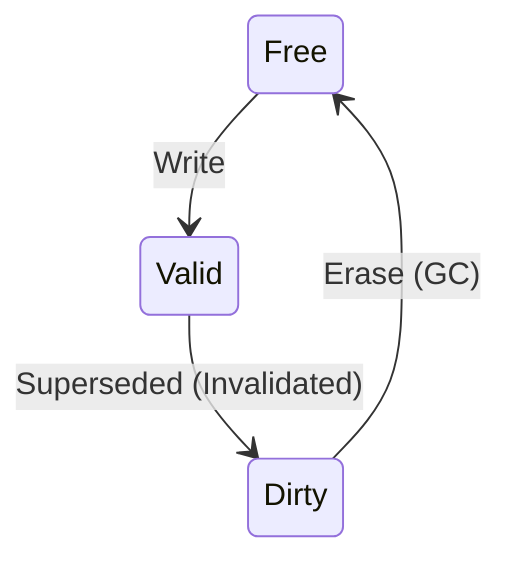

[← README](README.md) | Prev: [02 — Boot & Init](02_boot_and_init.md) | Next: [04 — CMT Why](04_cmt_why_and_how.md)

# The Global Mapping Table & Address Space

The one thing to take away: The GMT (`table`) is a hash map that holds the ground truth for every logical page's physical location. A "sentinel" PPN means "never written" — and accidentally invalidating a sentinel would crash the simulator.

## The Problem

How do you track where each logical page lives on flash? In an SSD, pages move constantly due to out-of-place writes (since flash cannot be overwritten in place). Pages get trimmed, new pages appear, and garbage collection relocates data. You need a dynamic lookup table to constantly map what the host thinks is the address (Logical Page Number) to where the data actually resides on the flash media (Physical Page Number). This mapping must be highly efficient, as the Flash Translation Layer (FTL) performs millions of lookups during operation.

## Address Translation Pipeline

The address translation pipeline dictates how a byte request from the host becomes a physical flash location.


When a request arrives, the Internal Cache Layer (ICL) converts the raw host byte offset into a Logical Cache Address (LCA). Then, the `FTL::Request` constructor converts the LCA into an LPN and a bitset (`ioFlag`). Finally, the Page Mapping layer resolves the LPN to a Physical Page Number (PPN) using the Global Mapping Table (GMT).

The exact conversion formulas are:
- `lpn = lca / ioUnitInPage`
- `ioFlag bit = lca % ioUnitInPage`

These calculations happen precisely in the `FTL::Request` constructor (see `util/def.cc:74-80`).

## The GMT Data Structure

The Global Mapping Table (`table`) is defined as `unordered_map<uint64_t, vector<pair<uint32_t, uint32_t>>>`.

The key is the LPN (a `uint64_t`), and the value is a vector of `(blockIndex, pageIndex)` pairs, one for each sub-page. The size of this vector is `bitsetSize`, which equals `ioUnitInPage` (with the random tweak enabled, else 1).

> **Why a vector of pairs?**
> Each LPN maps to `bitsetSize` sub-pages. With `EnableRandomIOTweak=1` and `ioUnitInPage=8`, a single superpage has 8 independently addressable sub-pages. Each can live in a different physical location across the flash media.

> **Why `unordered_map` (hash map)?**
> O(1) average lookup time. The FTL does millions of lookups per second. A sorted map (O(log N)) would be too slow.

## The Sentinel Value

When a new GMT entry is emplaced (during the first write to an LPN), all sub-pages start as sentinels. The sentinel value used is `(param.totalPhysicalBlocks, param.pagesInBlock)`. Sub-pages get real PPNs as they are subsequently written to.

A valid PPN check is as simple as:
```cpp
if (mapping.first < param.totalPhysicalBlocks) {
    // Valid physical page
}
```

Functions that check for sentinels include `readInternal`, `trimInternal`, `format`, and `writeInternal`.

> **Why not use (0,0)?**
> Block 0, page 0 is a perfectly valid physical location on the flash die! The sentinel must be an impossible, out-of-bounds value to safely indicate "not mapped".

## Block Metadata

> **Term:** **Three-state page model**
> Physical flash pages exist in one of three states: Free, Valid, or Dirty/Invalid.



The `Block` class tracks page states using two bitmaps: `validBits` and `erasedBits`. The state is a 2-bit encoding:
- **Free (erased, not written)**: valid=0, erased=1
- **Valid (written, data is current)**: valid=1, erased=0
- **Dirty (data superseded)**: valid=0, erased=0

> **Why two bitmaps instead of a 3-state enum?**
> Bitwise operations on bitmaps are extremely fast. `~(valid | erased)` gives you all dirty pages in one operation, which is heavily used during garbage collection.

Other critical block metadata includes:
- `getNextWritePageIndex()`: Provides the next available page to write. This enforces the sequential programming constraint (NAND pages must be written in order within a block).
- `eraseCount`: Tracks cumulative erase cycles for wear leveling.
- `lastAccessed`: Timestamp used for Cost-Benefit Garbage Collection policies.
- `pLPNs`: Reverse mapping array (`pLPNs[pageIndex]` or `ppLPNs`) that stores which LPN lives at each physical page. This is essential for GC to know what logical pages to relocate when erasing a block.

## Free Block Pool

The system maintains available blocks using `freeBlocks` and `lastFreeBlock`.

The `freeBlocks` pool is a doubly-linked list of erased blocks, deliberately sorted by `eraseCount` in ascending order to naturally enforce wear leveling (blocks with fewer erases get picked first). An explicit `nFreeBlocks` counter is used to avoid the O(N) cost of `list::size()`.

The `lastFreeBlock` array is a vector of size `pageCountToMaxPerf` containing the block indices of currently open write blocks. Each write stream maps to a different die/channel combination.

> **Why multiple open blocks?**
> To stripe writes across flash channels/dies for maximum bandwidth. Opening one block per parallel unit allows concurrent writes.

## The Superpage Concept

> **Term:** **Superpage**
> A logical construct that groups physical pages across multiple dies to be programmed in parallel.

The value `pageCountToMaxPerf` defines the total number of parallel units (total superblocks / blocks-per-superblock). A write to one LPN programs sub-pages across multiple dies simultaneously. The `lastFreeBlockIndex` rotates round-robin across streams to distribute the workload, and `lastFreeBlockIOMap` tracks which sub-pages are used in the current superpage allocation.

## Invariants

1. A PPN must be either a valid block/page or strictly equal to the sentinel value.
2. A block's pages must be written sequentially; `getNextWritePageIndex()` must never go backward.
3. A physical page cannot be overwritten; it must transition from Free -> Valid -> Dirty, and back to Free only via an erase.
4. The `freeBlocks` list must always remain sorted by `eraseCount` ascending.

## Source Reference

| Concept | File | Lines |
|---|---|---|
| FTL::Request Constructor | `util/def.cc` | 74-80 |
| GMT `table` Declaration | `simplessd/ftl/page_mapping.hh` | 44-45 |
| Sentinel Value Checks | `simplessd/ftl/page_mapping.cc` | 1109, 1176, 1312 |
| Block Bitmaps | `simplessd/ftl/common/block.hh` | 40-41, 45-46 |
| Reverse Mapping | `simplessd/ftl/common/block.hh` | 42, 47 |

## Self-Quiz

<details><summary>1. What type is <code>table</code> and what does one value represent?</summary>

It is an `unordered_map<uint64_t, vector<pair<uint32_t, uint32_t>>>`. One value represents the physical locations of all sub-pages for a given LPN.
</details>

<details><summary>2. What is the sentinel PPN and why can't (0,0) be used?</summary>

The sentinel is `(param.totalPhysicalBlocks, param.pagesInBlock)`. `(0,0)` cannot be used because Block 0, Page 0 is a valid physical location on the flash die.
</details>

<details><summary>3. How many elements does a GMT value vector have?</summary>

It has `bitsetSize` elements, which equals `ioUnitInPage` (when `EnableRandomIOTweak` is 1).
</details>

<details><summary>4. What are the three states of a physical page?</summary>

Free (erased), Valid (written), and Dirty (invalid/superseded).
</details>

<details><summary>5. Why are two bitmaps used instead of a 3-state enum?</summary>

Bitwise operations on bitmaps are highly optimized and fast. You can find all dirty pages in a block instantly using `~(valid | erased)`.
</details>

<details><summary>6. What does <code>getNextWritePageIndex()</code> return and what constraint does it enforce?</summary>

It returns the next available unwritten page in a block, enforcing the sequential programming constraint of NAND flash.
</details>

<details><summary>7. Why is <code>freeBlocks</code> sorted by erase count?</summary>

To enforce wear leveling; blocks with the lowest erase counts are chosen first.
</details>

<details><summary>8. What is <code>pageCountToMaxPerf</code> and what does it control?</summary>

It represents the number of parallel units (dies/channels) and controls how many blocks are kept open simultaneously to maximize write bandwidth.
</details>

<details><summary>9. Where is the reverse mapping (physical page → LPN) stored?</summary>

In the `pLPNs` or `ppLPNs` array within the `Block` class metadata.
</details>

<details><summary>10. How does the address translation pipeline convert a byte offset to a PPN?</summary>

Host byte offset -> LCA (via ICL) -> LPN and `ioFlag` bitset (via `FTL::Request`) -> PPN (via PageMapping GMT lookup).
</details>
