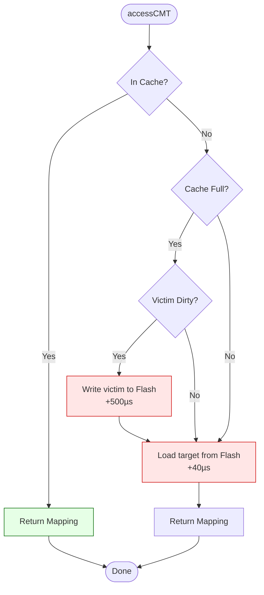
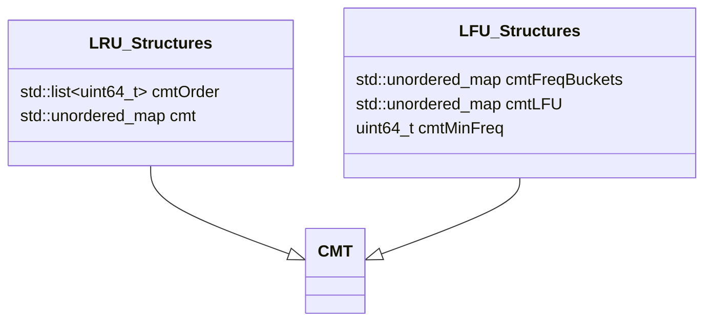

[← README](README.md) | Prev: [03 — GMT](03_gmt_and_address_space.md) | Next: [05 — CMT Deep Dive](05_cmt_deep_dive.md)

# The CMT: Why Cache the Mapping Table?

**The one thing to take away:** A 1TB SSD's full mapping table is ~1GB — far too large for controller SRAM. The CMT is a small, fast cache that holds only the hot working set. Every cache miss costs an extra NAND flash read (the "DFTL double-read penalty"), which is why CMT hit rate directly determines SSD performance.

## The Problem

To understand why the **Cached Mapping Table (CMT)** exists, we have to do some basic math.

In our simulated SSD, the total number of logical pages is `totalLogicalPages`. Each mapping entry in the **Global Mapping Table (GMT)** takes up `8 × bitsetSize` bytes. 

If we calculate the total GMT size:
`Total GMT size = totalLogicalPages × 8 × bitsetSize bytes`

For a 1TB SSD with 4KB pages, this mapping table is roughly 1GB. However, SSD controllers are embedded systems. Their fast, on-die SRAM might only be 2MB to 32MB. You cannot possibly fit a 1GB table into 2MB of SRAM. You can only cache a fraction of it: `cmtCapacity` entries. Therefore, you NEED a demand-based cache that keeps the hottest (most frequently or recently used) mappings in fast memory while leaving the rest on slow NAND flash.

## DFTL Background

The concept of a cached mapping table was popularized by the **Demand-Based Flash Translation Layer (DFTL)** paper (Gupta et al., ASPLOS '09). 

In the early days of SSDs, engineers faced a dilemma:
- **Full page-level mapping** gives the best performance (complete flexibility in placing data) but requires too much SRAM.
- **Block-level mapping** uses much less SRAM (one entry per block instead of per page) but causes massive write amplification because small writes force entire blocks to be moved.

DFTL offered a compromise: keep a full page-level GMT, but store it **on the flash itself**. Then, use a small SRAM cache (the CMT) to hold the hottest entries. 
- On a **CMT hit**, the controller translates the address instantly.
- On a **CMT miss**, the controller must read the relevant "translation page" from the flash before reading the actual user data. This is known as the **double-read penalty**.
- On a **dirty eviction**, when a modified CMT entry is pushed out to make room, the controller must program the updated translation page back to flash.

## The Cost of a Miss

Let's visualize the critical path of accessing a mapping entry.



> **Why 40µs for miss?** That's one MLC LSB page read — the physical cost of reading a translation page from NAND flash.

> **Why 500µs for write-back?** That's one MLC LSB program — the physical cost of programming a modified translation page back to NAND flash.

**The Latency Math:**
A single NAND read for user data takes about 40µs. But what happens on a CMT miss where the victim is dirty?
1. Write back the dirty victim translation page (+500µs)
2. Read the new translation page (+40µs)
3. Read the actual user data (+40µs)

Total time: 580µs! A miss with a dirty eviction can increase the latency of a single read by **over 13x**. This is why maximizing the CMT hit rate is the primary goal of any DFTL-based FTL.

## CMT Configuration

The size and behavior of the CMT are highly configurable. Every key corresponds to a physical design parameter:

- `CMTPolicy` (0=LRU, 1=LFU): Selects the replacement algorithm.
- `CMTCapacityRatio`: If > 0, sets capacity as a fraction of total pages (`capacity = ratio × totalLogicalPages`).
- `CMTCapacityBytes`: If ratio is 0, sets capacity based on SRAM size (`capacity = bytes / (8 × bitsetSize)`).
- `CMTMissLatency`: Picoseconds added on a miss (default 40000000 ps = 40µs).
- `CMTWriteBackLatency`: Picoseconds added on a dirty eviction (default 500000000 ps = 500µs).

*Example:* With 1,000,000 logical pages and `CMTCapacityRatio=0.01`, you get a `cmtCapacity` of 10,000 entries.

## The API Contract

Every time the FTL needs to translate an address, it calls `accessCMT`:

```cpp
std::vector<std::pair<uint32_t, uint32_t>> *accessCMT(
    uint64_t lpn, bool isWrite, uint64_t &tick, bool isGC, bool allocate)
```

- `lpn`: The Logical Page Number being requested.
- `isWrite`: If true, marks the entry as dirty upon hit or insertion (meaning it must be written back on eviction).
- `tick`: A reference to simulated time. The 40µs or 500µs penalties are added directly to this variable.
- `isGC`: Routes statistics to Garbage Collection counters instead of user counters.
- `allocate`: If false and the LPN is not in the cache, the function returns `nullptr` without fetching it from flash and polluting the cache.
- **Returns:** A pointer to the mapping vector, or `nullptr`.

The `accessCMT` function is just a thin dispatcher. It checks `cmtPolicy` and delegates to either `accessCMT_LRU` or `accessCMT_LFU`.

## Data Structures Overview

SimpleSSD-Standalone implements two highly optimized cache replacement policies.



### LRU (Least Recently Used)
- `cmtOrder`: A doubly-linked list of LPNs. The front is the Most Recently Used (MRU); the back is the victim.
- `cmt`: A hash map mapping LPN to `{CMTEntry, list iterator}`.

> **Why store iterators inside entries?** For O(1) promotion. Without storing the iterator, finding an entry in the linked list to move it to the front would require O(N) traversal. With the iterator, `std::list::splice` can move it instantly.

### LFU (Least Frequently Used)
- `cmtFreqBuckets`: A hash map of `frequency → list of LPNs`. (Front of the list breaks ties by MRU).
- `cmtLFU`: A hash map of `LPN → CMTEntryLFU {mapping, dirty, freq, listIterator}`.
- `cmtMinFreq`: Tracks the minimum occupied frequency bucket.

> **Why frequency buckets?** This is the O(1) LFU implementation from Shah et al. (2010). A naive LFU requires a min-heap, which makes evictions cost O(log N). Frequency buckets ensure both hits and evictions remain O(1) time complexity.

## Statistics & Counters

The CMT tracks several counters to evaluate performance. Crucially, user I/O is separated from internal Garbage Collection I/O.

- `cmtHits` / `cmtMisses`: Track how often user I/O finds its mappings in the cache.
- `cmtEvictions`: Total number of entries pushed out of the cache.
- `cmtDirtyEvictions` / `cmtWritebacks`: Evictions that required a flash write-back (currently, these are always equal).
- `cmtGCHits` / `cmtGCMisses`: CMT accesses made by the Garbage Collector.

To calculate the user hit rate:
`User Hit Rate = cmtHits / (cmtHits + cmtMisses)`

> **Why separate GC counters?** GC reads and moves many mappings to relocate valid pages. If we included these in the user hit rate, a workload that triggers heavy GC might look like it has better performance (more "hits"), even though GC is pure overhead. By separating them, the user hit rate strictly reflects the efficiency of the application's access pattern.

## Source Reference

| Concept | File | Lines |
|---------|------|-------|
| CMT Declarations & Data Structures | [page_mapping.hh](../../SimpleSSD-Standalone/simplessd/ftl/page_mapping.hh) | 57-157 |
| CMT Sizing & Constructor | [page_mapping.cc](../../SimpleSSD-Standalone/simplessd/ftl/page_mapping.cc) | 34-95 |
| `accessCMT` Dispatcher | [page_mapping.cc](../../SimpleSSD-Standalone/simplessd/ftl/page_mapping.cc) | 799-807 |

## Self-Quiz

<details>
<summary>1. Why can't the full GMT fit in controller SRAM?</summary>
The full GMT for a large SSD (e.g., 1TB) requires hundreds of megabytes or even gigabytes of space, while embedded SSD controllers typically only have 2-32MB of fast SRAM available.
</details>

<details>
<summary>2. What is the "DFTL double-read penalty"?</summary>
When a mapping is not in the CMT (a miss), the controller must first read the translation page from NAND flash before it can read the actual user data. This requires two flash reads instead of one.
</details>

<details>
<summary>3. What happens when a dirty CMT entry is evicted?</summary>
The modified mapping must be saved permanently, so the controller must program (write) the updated translation page back to the NAND flash.
</details>

<details>
<summary>4. How much extra latency does a CMT miss + dirty eviction add?</summary>
It adds 540µs: 500µs to program the dirty victim back to flash, and 40µs to read the new translation page from flash.
</details>

<details>
<summary>5. What does <code>allocate=false</code> do and when is it used?</summary>
If <code>allocate=false</code> and the requested LPN is not in the cache, <code>accessCMT</code> returns <code>nullptr</code> immediately without fetching it from flash. This prevents operations like Trim on unmapped addresses from polluting the cache.
</details>

<details>
<summary>6. Why are GC hits/misses counted separately from user hits/misses?</summary>
GC accesses many mappings just to relocate data. Including these internal operations in the user hit rate would distort the metrics, making a workload seem more cache-friendly than it actually is.
</details>

<details>
<summary>7. What data structure gives O(1) LRU promotion?</summary>
A doubly-linked list (`std::list`) combined with storing the list iterator directly inside the hash map's cache entry.
</details>

<details>
<summary>8. What data structure gives O(1) LFU eviction?</summary>
Frequency buckets (a hash map mapping frequency counts to doubly-linked lists of LPNs), combined with a pointer/variable (`cmtMinFreq`) tracking the lowest occupied frequency.
</details>

<details>
<summary>9. What is <code>cmtMinFreq</code> and why is it needed?</summary>
It tracks the smallest frequency bucket that contains at least one entry. It allows the LFU algorithm to instantly find a victim for eviction in O(1) time without searching through all frequencies.
</details>

<details>
<summary>10. If <code>CMTCapacityRatio=0.02</code> and <code>totalLogicalPages=500000</code>, what is <code>cmtCapacity</code>?</summary>
The cache capacity would be 10,000 entries (500,000 × 0.02).
</details>
