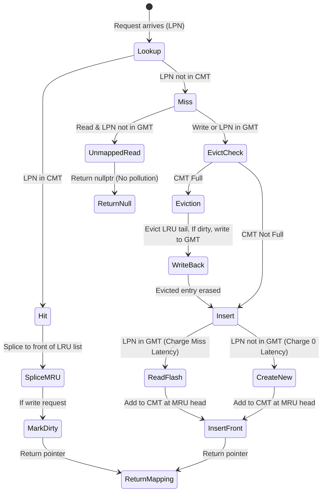
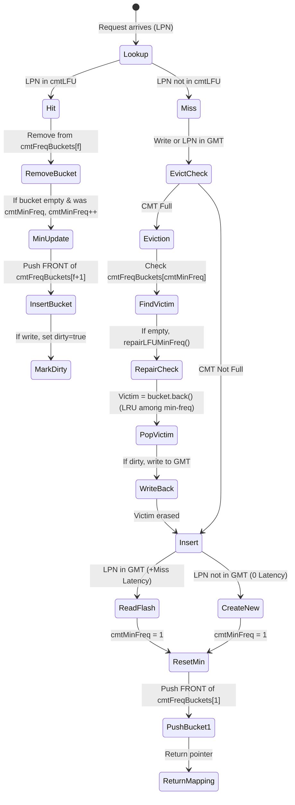

[← README](README.md) | Prev: [04 — CMT Why](04_cmt_why_and_how.md) | Next: [06 — I/O Paths](06_io_paths.md)

# The CMT Deep Dive: LRU & LFU Policies

**The one thing to take away:** Both policies achieve O(1) lookup, insertion, and eviction — but they make fundamentally different assumptions about workload behavior. LRU bets on temporal locality; LFU bets on frequency stability. Understanding the step-by-step mechanics and edge cases is essential for CMT research.

## The Problem

A Cached Mapping Table (CMT) is fundamentally a capacity-constrained cache for translation entries. Since the CMT is vastly smaller than the Global Mapping Table (GMT), it must constantly make decisions about which mappings to keep in SRAM and which to evict back to NAND flash. 

If the CMT evicts the wrong mappings, it incurs high "miss penalties" (reading translation pages from NAND) and "dirty write-back penalties" (programming translation pages to NAND). To minimize this overhead, we need an eviction policy that correctly predicts which mappings will be needed again soon, while performing these cache operations with minimal CPU overhead.

## LRU: The Algorithm

> **Term:** **LRU (Least Recently Used)** — An eviction policy that assumes pages accessed recently will be accessed again soon. When the cache is full, it evicts the page that has been unaccessed for the longest time.

### Conceptual Flow

### Hit Path
On a cache hit, the LPN is already in the `cmt` hash map. We count the hit, move the entry to the MRU (Most Recently Used) end of the tracking list, mark it dirty if it's a write, and return the pointer.

> **Why this way?** Why splice to front on every hit (including reads)? Without read promotion, LRU degrades to "least recently WRITTEN." A frequently read metadata page that is rarely modified would be unfairly evicted over a freshly written, but rarely accessed, data page.

### Miss Path (Eviction)
When an LPN is absent, we must fetch it. If the CMT is at `cmtCapacity`, we pop the back of `cmtOrder` (the LRU tail). If that victim is dirty, we write it back to `table` (the GMT) and charge `cmtWriteBackLatency`. 

> **Why this way?** Why re-find `gmtIt` after eviction write-back? The write-back operation does `table[evictLpn] = mapping`. If this inserts a new element into `unordered_map`, it may trigger a rehash, which invalidates the previously obtained `gmtIt` iterator. Re-finding the iterator guarantees C++ memory safety.

### Miss Path (Insertion)
If the LPN is in the GMT, we charge `cmtMissLatency` (simulating a flash read). 
If the LPN is brand-new (not even in GMT), we create a new GMT entry with sentinel unmapped PPNs. We charge *no* miss latency here because there is nothing stored on flash yet.
Finally, we push the new LPN to the front of `cmtOrder` and insert it into `cmt`.

### Unmapped Read
If we receive a read for an LPN that isn't in the CMT *and* isn't in the GMT (`allocate=false`), we immediately return `nullptr`. We do not create a dummy mapping in the CMT. This prevents malicious or accidental reads to unmapped space from polluting the CMT with useless entries.

### Worked Trace: LRU (Capacity = 3)

| Step | Operation | Cache State [MRU→LRU] | Stats Change | Latency Added |
|------|-----------|-----------------------|--------------|---------------|
| 1 | **W A** | `[A]` | `cmtMisses++` | 0 (New LPN) |
| 2 | **W B** | `[B, A]` | `cmtMisses++` | 0 (New LPN) |
| 3 | **W C** | `[C, B, A]` | `cmtMisses++` | 0 (New LPN) |
| 4 | **R A** | `[A, C, B]` | `cmtHits++` | 0 (Hit) |
| 5 | **W D** | `[D, A, C]` | `Miss++`, `Evict++`, `DirtyEvict++`, `WB++` | `+cmtWriteBackLatency` (B evicted) |
| 6 | **R C** | `[C, D, A]` | `cmtHits++` | 0 (Hit) |
| 7 | **R B** | `[B, C, D]` | `Miss++`, `Evict++`, `DirtyEvict++`, `WB++` | `+cmtWriteBackLatency` (A) `+cmtMissLatency` (B) |
| 8 | **R E** (unmapped) | `[B, C, D]` | `cmtMisses++` | 0 (No allocation) |

## LFU: The Algorithm

> **Term:** **LFU (Least Frequently Used)** — An eviction policy that assumes pages accessed most often over their lifetime will be accessed again. It evicts the page with the lowest overall access count.

LFU is typically O(N) or O(log N) to find the minimum frequency. SimpleSSD uses an O(1) frequency bucket design (Shah et al. 2010) to match LRU's performance.

### Conceptual Flow

### Hit Path
On a hit, we find the entry's current frequency `f`. We remove it from `cmtFreqBuckets[f]`. If that leaves bucket `f` empty, and `f` happens to be the global `cmtMinFreq`, we increment `cmtMinFreq = f + 1`. We then insert the entry at the *front* of `cmtFreqBuckets[f + 1]`.

> **Why this way?** Why insert promoted entries at the FRONT of the new bucket? When choosing a victim, LFU picks the item at the *back* of the minimum frequency bucket. By pushing to the front on access, the back of the list becomes the "Least Recently Used" item *within* that frequency. This provides a robust LRU tie-breaker for items with identical frequencies.

### Miss Path and Insertion
When the cache is full, we go straight to `cmtFreqBuckets[cmtMinFreq]` and evict the item at the `.back()`. The dirty write-back logic is identical to LRU. When we insert the new entry, we set its frequency to 1 and push it to the front of `cmtFreqBuckets[1]`.

> **Why this way?** Why set `cmtMinFreq = 1` on every insertion? A newly fetched entry inherently has a frequency of 1. Since frequency counts cannot be 0, an insertion guarantees that the global minimum frequency across all cached entries is exactly 1. This simple O(1) assignment is the secret to making LFU as fast as LRU.

### Worked Trace: LFU (Capacity = 3)

| Step | Operation | Cache State [Bucket State] | MinFreq | Latency Added |
|------|-----------|----------------------------|---------|---------------|
| 1 | **W A** | `b[1]=[A]` | 1 | 0 (New) |
| 2 | **W B** | `b[1]=[B, A]` | 1 | 0 (New) |
| 3 | **W C** | `b[1]=[C, B, A]` | 1 | 0 (New) |
| 4 | **R A** | `b[2]=[A]`, `b[1]=[C, B]` | 1 | 0 (Hit) |
| 5 | **W D** | `b[2]=[A]`, `b[1]=[D, C]` (B evicted) | 1 | `+cmtWriteBackLatency` |
| 6 | **R C** | `b[2]=[C, A]`, `b[1]=[D]` | 1 | 0 (Hit) |
| 7 | **R B** | `b[2]=[C, A]`, `b[1]=[B]` (D evicted) | 1 | `+missLat` + `+wbLat` |

## Side-by-Side Comparison

| Feature | LRU | LFU |
|---------|-----|-----|
| **Promotion Strategy** | Splice to front of global list | Move to front of `freq + 1` bucket |
| **Eviction Choice** | Tail of global recency list | Back of `cmtMinFreq` bucket |
| **Workload Assumption**| Temporal Locality (recent = future) | Frequency Stability (often = future) |
| **Scan Resistance** | None (scans flush out hot entries) | Strong (scan entries stay at freq 1) |
| **Cache Poisoning** | Immune (adapts fast to phase changes) | Vulnerable (once-hot items linger) |
| **O(1) Mechanism** | STL `std::list::splice` | Dynamic Bucket Array + `cmtMinFreq` |

## Critical Edge Cases

Every caching algorithm has edge cases that break naive implementations. Here are the pitfalls handled in SimpleSSD:

1. **Iterator Invalidation after Rehash**: 
   *What if we didn't re-find `gmtIt`?* When writing back a dirty victim, `table[evictLpn] = mapping` is executed. This can cause the `std::unordered_map` to rehash its buckets, silently invalidating the `gmtIt` iterator pointing to the missing LPN. We would segfault upon inserting it.
2. **`repairLFUMinFreq()`**:
   *What if `cmtMinFreq` drifts?* If `cmtFreqBuckets[cmtMinFreq]` somehow becomes empty without `cmtMinFreq` incrementing (e.g., manual invalidation or bugs), the eviction path would crash trying to read `.back()`. The repair function defensively scans buckets to find the true minimum.
3. **Reads Not Splicing**:
   *What if reads didn't move items to MRU?* LRU would degenerate into "Least Recently Written". Frequently read metadata mappings would be flushed by one-time sequential writes, destroying performance.
4. **Unmapped Reads (`allocate=false`)**:
   *What if unmapped reads triggered evictions?* Reading unallocated LBA space (common in file system initialization) would force actual hot mappings out of the CMT to store empty, dummy mappings, causing catastrophic "cache pollution". Furthermore, charging Miss Latency for these would be inaccurate since no translation page exists on NAND.
5. **GC Accessing CMT**:
   *What if GC bypassed the CMT?* Garbage Collection moves data, requiring mapping updates. Setting `isGC=true` routes stats to `cmtGCHits`/`cmtGCMisses`, but GC *must* update the live cache to avoid data corruption. GC reads can and will cause evictions and write-backs.
6. **`flushCMT()` No Latency**:
   *Why no latency on shutdown flush?* `flushCMT()` is called in the destructor to ensure final statistics and GMT states are correct. Because the simulation is ending, there is no `tick` to advance.

## Latency Cheat Sheet

| Scenario | Added Latency | Reason |
|----------|---------------|--------|
| Hit (Read) | 0 | Found in SRAM CMT |
| Hit (Write) | 0 | Found in SRAM, marked dirty |
| Miss (Existing LPN) | `cmtMissLatency` | Fetch translation page from NAND |
| Miss (Brand New LPN) | 0 | No translation page exists on NAND yet |
| Miss (Unmapped Read) | 0 | Returns `nullptr`, skips lookup |
| Clean Eviction | 0 | Overwrite SRAM entry |
| Dirty Eviction | `cmtWriteBackLatency` | Program translation page to NAND |
| Miss + Dirty Eviction | `cmtMissLat` + `cmtWriteBackLat` | Program victim, then read new page |

## Call-Site Matrix

Where does `accessCMT` get called from?

| Function | `isWrite` | `isGC` | `allocate` | Purpose |
|----------|-----------|--------|------------|---------|
| `readInternal` | `false` | `false` | `false` | User read. Do not allocate dummy mappings. |
| `writeInternal` | `true` | `false` | `true` | User write. Must create mapping if missing. |
| `doGarbageCollection` | `true` | `true` | `true` | GC mapping update. Tracked in GC stats. |

## Complexity Table

| Operation | LRU Complexity | LFU Complexity | Notes |
|-----------|----------------|----------------|-------|
| Lookup Hit | O(1) | O(1) | HashMap lookup + List Splice / Bucket Move |
| Evict | O(1) | O(1) | Pop back of list / Pop back of `minFreq` bucket |
| Insert | O(1) | O(1) | Push front of list / Push front of Bucket 1 |
| Write-back | O(1) | O(1) | Overwrite in `unordered_map` GMT |

## Invariants

If you modify the CMT, you must preserve these invariants:
1. `cmt.size()` / `cmtLFU.size()` must NEVER exceed `cmtCapacity`.
2. Every item in `cmtOrder` MUST have a corresponding key in `cmt`.
3. Every item in `cmtFreqBuckets` MUST have a corresponding key in `cmtLFU`.
4. The sum of items across all `cmtFreqBuckets` MUST equal `cmtLFU.size()`.
5. `cmtMinFreq` MUST be exactly `1` immediately after any cache miss insertion.
6. A dirty entry MUST be written to `table` (GMT) before its CMT iterator is erased.
7. Any write to `table` during a miss MUST be followed by re-finding iterators.
8. Unmapped reads (`allocate=false` missing from GMT) MUST NOT insert into the CMT.
9. An LFU hit that empties the `cmtMinFreq` bucket MUST increment `cmtMinFreq`.
10. `tick` MUST be incremented accurately according to miss and write-back penalties.

## Source Reference

| Concept | File | Lines |
|---------|------|-------|
| LRU Hit Path | `ftl/page_mapping.cc` | 821-841 |
| LRU Eviction | `ftl/page_mapping.cc` | 862-892 |
| LRU Insertion | `ftl/page_mapping.cc` | 894-913 |
| LFU Hit Path | `ftl/page_mapping.cc` | 959-991 |
| LFU Eviction | `ftl/page_mapping.cc` | 1006-1058 |
| LFU Insertion | `ftl/page_mapping.cc` | 1076-1090 |
| Read Call Site | `ftl/page_mapping.cc` | 1101-1104 |

## Self-Quiz

1. What happens on an LRU read hit? Does the entry become dirty?

The entry's iterator is spliced to the front of <code>cmtOrder</code> (O(1) MRU promotion). The entry does <i>not</i> become dirty unless <code>isWrite</code> is true.

2. When does <code>accessCMT</code> return nullptr?

When <code>allocate=false</code> (like a user read) AND the LPN does not exist in the GMT.

3. Why is <code>gmtIt</code> re-assigned after a dirty eviction?

Because writing the dirty mapping back to the GMT (<code>table[evictLpn] = mapping</code>) might cause the <code>unordered_map</code> to rehash, invalidating the existing <code>gmtIt</code> iterator.

4. For a brand-new LPN, which latencies apply?

Zero latency. A brand-new LPN has no existing mapping page on NAND flash to read, so <code>cmtMissLatency</code> is bypassed.

5. How does <code>isGC</code> affect the algorithm vs statistics?

It changes nothing about the cache algorithm (lookups, evictions, hits), but it increments <code>cmtGCHits</code> / <code>cmtGCMisses</code> instead of the standard user metrics.

6. Where is a new LFU entry inserted and what happens to <code>cmtMinFreq</code>?

It is inserted at the front of <code>cmtFreqBuckets[1]</code>, and <code>cmtMinFreq</code> is unconditionally reset to 1.

7. On an LFU hit that empties the min-freq bucket, how does <code>cmtMinFreq</code> change?

It increments by exactly 1 (<code>cmtMinFreq = oldFreq + 1</code>).

8. Why does LFU insert at the FRONT of the new bucket?

Because LFU tie-breaks by LRU. By pushing to the front, the item at the <code>.back()</code> of a frequency bucket is guaranteed to be the Least Recently Used item with that frequency.

9. Under what workload would LFU outperform LRU?

Workloads with frequent, predictable hot spots mixed with massive sequential scans. The scans flush LRU, but in LFU they stay at frequency 1 and get evicted instantly, protecting the hot spots.

10. What is "cache poisoning" and which policy is vulnerable to it?

Cache poisoning is when once-hot items build up massive frequency counts but are no longer needed, clogging the cache. LFU is highly vulnerable to this; LRU is immune.

