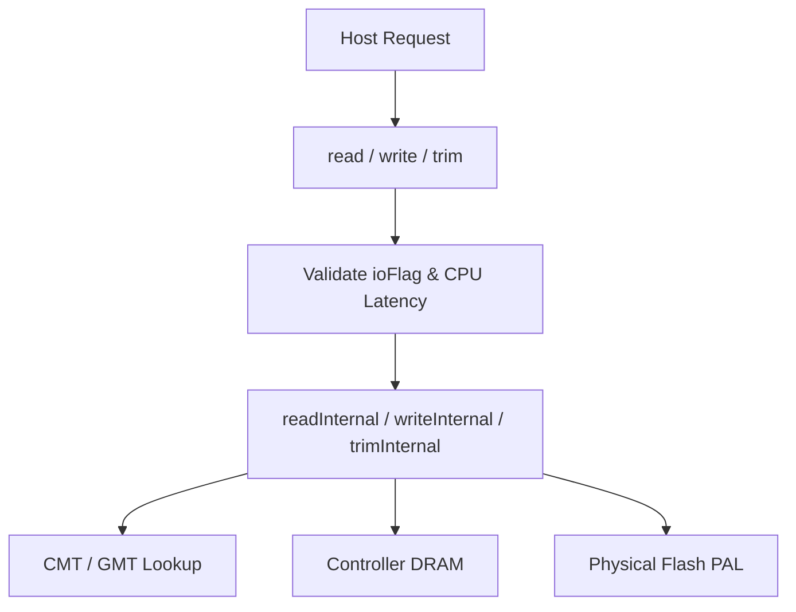

[← README](README.md) | Prev: [05 — CMT Deep Dive](05_cmt_deep_dive.md) | Next: [07 — GC](07_garbage_collection.md)

# Reading, Writing, and Trimming: The I/O Paths

**The one thing to take away:** Public methods (`read`, `write`, `trim`, `format`) are thin wrappers that add CPU latency. The real work happens in `readInternal`, `writeInternal`, `trimInternal`, and `eraseInternal` — and understanding the tick budget of each operation is essential for interpreting simulation results.

## The Problem

Why does the FTL separate public and internal functions? The public API handles the facade: request validation, FTL-level CPU latency calculation, logging, and statistics. The internal functions handle the physical mechanics: managing mappings, orchestrating DRAM and PAL accesses, managing block states, and enforcing Flash constraints. Separating them keeps the state machine and timing models clean.

## The Public API



The public API forms the entry point for the controller. 

> **Term:** FTL (Flash Translation Layer) — the firmware layer that maps logical addresses to physical flash memory.
> **Term:** CMT (Cached Mapping Table) — the fast, on-chip SRAM cache for address translations.
> **Term:** GMT (Global Mapping Table) — the complete mapping table stored in DRAM.
> **Term:** PAL (Physical Abstraction Layer) — the interface for issuing actual physical commands to flash chips.

- **`read`**: Validates the `ioFlag` and calls `readInternal`, adding the FTL CPU latency.
- **`write`**: Validates the `ioFlag` and calls `writeInternal`, adding the FTL CPU latency.
- **`trim`**: Calls `trimInternal` directly, adding the FTL CPU latency.
- **`format`**: Iterates over the entire GMT range, invalidates mapped pages, erases entries from the CMT (`cmtErase`), and runs `doGarbageCollection` to free physical blocks.
- **`getStatus`**: Counts the total mapped pages by iterating over the GMT and returns a status struct pointer.

```cpp
uint64_t PageMapping::read(uint64_t tick, uint64_t lpn, std::bitset<64> subPages, SubPage ioFlag) {
  // Validate request...
  tick = readInternal(tick, lpn, subPages, ioFlag);
  tick += pConfig->Hardware.CPU.Latency.FTL; // CPU Latency added
  return tick;
}
```

## `readInternal` Walkthrough

When a read request arrives, the internal flow orchestrates cache and media access:

1. **`accessCMT(lpn, isWrite=false, allocate=false)`**: Look up the mapping in the CMT.
2. **Empty Check**: If no mapping exists or no sub-pages are valid, return immediately (unmapped read).
3. **`pDRAM->read`**: Charge a DRAM translation read delay to look up the mapping physically.
4. **Sub-page Iteration**: For each requested valid sub-page, we look up the physical `Block` metadata, mark the block as read (`Block::read`), and issue a read command to the flash array (`pPAL->read`).
5. **Tick Accumulation**: `tick` is updated to the maximum of all PAL read completion times.

> **Why `allocate=false`?** Reading an unmapped page shouldn't create a GMT entry or pollute the CMT. The page simply doesn't exist.

```cpp
Mapping* mapping = accessCMT(tick, lpn, false, false);
if (mapping == nullptr || mapping->validCount == 0) {
  return tick; // Unmapped read
}
tick = pDRAM->read(tick); // Read translation mapping
// ... Loop over sub-pages and issue PAL reads ...
tick = pPAL->read(tick, ppn);
```

## `writeInternal` Walkthrough

Writing is the most complex operation because Flash cannot be overwritten in-place.

1. **`accessCMT(lpn, isWrite=true, allocate=true)`**: Looks up the mapping. If this is a new write, it creates an empty mapping in the GMT and brings it into the CMT.
2. **Invalidation**: If the LPN had a previous physical location, we must invalidate those old physical pages in their respective `Block` bitmaps.
3. **`getLastFreeBlock`**: We allocate a brand-new physical page from an open active block.
4. **`pDRAM->read` / `write`**: We read the old mapping and write the new mapping in the controller's DRAM.
5. **Read-Before-Write**: If this is a partial page write and `randomTweak` is disabled, we must read the existing sub-pages from flash before we can write the new complete page.
6. **Flash Write**: For each sub-page, we find the next free physical index, update the mapping, call `Block::write`, and issue `pPAL->write`.
7. **Garbage Collection Trigger**: Finally, we check `freeBlockRatio()`. If it falls below `gcThreshold`, we trigger `selectVictimBlock` and `doGarbageCollection`.

> **Why out-of-place writes?** Flash pages can't be overwritten in-place. We must write to a new clean page and invalidate the old one. This leads to garbage collection later.

> **Why read-before-write for partial pages?** Without the random tweak, the FTL treats a superpage as one indivisible unit. Writing only some sub-pages requires reading the other existing sub-pages first to preserve their data during the new page write.

## `trimInternal` Walkthrough

The trim operation tells the SSD that data is no longer needed by the OS.

1. **`getLiveMapping`**: We peek at the current mapping without modifying cache MRU state.
2. If unmapped, we just return.
3. **Invalidation**: We invalidate the physical pages in their parent `Block` structures.
4. **`cmtErase`**: Drops the mapping from the CMT immediately without writing it back.
5. **`table.erase`**: Removes the entry from the global GMT.

> **Why `getLiveMapping` instead of `accessCMT`?** Destroying a mapping shouldn't pollute the cache or cause useless evictions. `getLiveMapping` is a read-only peek that avoids modifying cache access statistics.

## `eraseInternal` Walkthrough

Erasing physical blocks is what reclaims space for new writes.

1. We assert that the block's `validCount` is exactly 0.
2. We call `Block::erase` to reset its internal bitmaps and increment its `eraseCount`.
3. We issue `pPAL->erase` to the physical media.
4. We re-insert the block into the `freeBlocks` list in ascending erase-count order to ensure wear leveling.
5. **Bad Block Check**: If `eraseCount` exceeds the bad block threshold, the block is discarded instead of being re-inserted.

## `accessCMT` vs `getLiveMapping`

| Feature | `accessCMT` | `getLiveMapping` |
| :--- | :--- | :--- |
| **Use Cases** | Normal data path (`read`, `write`, GC) | Destroy paths (`trim`, `format`) |
| **Cache Mutation** | Updates MRU list | None |
| **Eviction** | May evict dirty entries | Never evicts |
| **Latencies** | CMT Miss, CMT Writeback | Zero latency |
| **Allocation** | Can allocate new GMT entries | Read-only peek |

## Tick Budget

Understanding the timing of a single mapped 4KB read is critical for simulation analysis. The final tick time is the sum of:
1. `CPU::FTL` (facade overhead in `read()`)
2. CMT lookup latency (0 if hit, + `cmtMissLatency` if missed)
3. CMT eviction latency (+ `cmtWriteBackLatency` if a dirty entry was evicted to make room)
4. DRAM translation read delay (`pDRAM->read` in `readInternal`)
5. NAND page read delay (`pPAL->read`)
6. `CPU::FTL__PAGE_MAPPING::READ_INTERNAL` (FTL internal state update)

## PAL/DRAM Interaction Summary

| Operation | Controller DRAM Activity | Physical Media (PAL) Activity |
| :--- | :--- | :--- |
| **`readInternal`** | `pDRAM->read` | `pPAL->read` |
| **`writeInternal`** | `pDRAM->read`, `pDRAM->write` | `pPAL->read` (partial only), `pPAL->write` |
| **`trimInternal`** | `pDRAM->read` (peek) | None |
| **`eraseInternal`** | None | `pPAL->erase` |

## Invariants

1. **Never read unmapped pages**: If `accessCMT` returns null during a read, the request immediately terminates.
2. **Never overwrite in-place**: `writeInternal` must always allocate a new physical page and invalidate the old one.
3. **Trim does not cache**: `trimInternal` must use `getLiveMapping` to avoid polluting the CMT.
4. **Erase only empty blocks**: `eraseInternal` will trigger an assertion failure if the target block has a non-zero valid page count.

## Source Reference

| Concept | File | Line Numbers |
| :--- | :--- | :--- |
| **Public API** | `page_mapping.cc` | 353-479 |
| **`readInternal`** | `page_mapping.cc` | 1096-1160 |
| **`writeInternal`** | `page_mapping.cc` | 1162-1299 |
| **`trimInternal`** | `page_mapping.cc` | 1301-1353 |
| **`eraseInternal`** | `page_mapping.cc` | 1355-1405 |

## Self-Quiz

<details>
<summary>1. Why do we charge CPU latency in the public methods?</summary>
The public methods represent the FTL facade processing the incoming request from the host. This accounts for the firmware parsing the command.
</details>

<details>
<summary>2. Why does <code>readInternal</code> pass <code>allocate=false</code> to <code>accessCMT</code>?</summary>
Reading an LBA that has never been written means the data does not exist. We shouldn't create a dummy mapping in memory just to read it.
</details>

<details>
<summary>3. What triggers garbage collection in <code>writeInternal</code>?</summary>
At the end of a write, if the ratio of free blocks to total blocks (<code>freeBlockRatio()</code>) drops below the <code>gcThreshold</code>, garbage collection is triggered.
</details>

<details>
<summary>4. Why does a partial page write sometimes cause a Flash read?</summary>
Flash must be written in complete pages. If the random tweak is off, the FTL must read the existing sub-pages to preserve them alongside the new sub-pages being written.
</details>

<details>
<summary>5. How does <code>writeInternal</code> handle old data?</summary>
It finds the previous physical page in the block's bitmap and invalidates it, changing its state to dead.
</details>

<details>
<summary>6. Why does <code>trimInternal</code> use <code>getLiveMapping</code>?</summary>
Trim destroys data. Using <code>accessCMT</code> would bring the mapping into the cache or update its MRU status, which wastes cache space for data that is about to be deleted.
</details>

<details>
<summary>7. What happens in <code>trimInternal</code> after the block mappings are invalidated?</summary>
The mapping is erased from the CMT (<code>cmtErase</code>) without writeback, and then removed from the global GMT.
</details>

<details>
<summary>8. How does <code>eraseInternal</code> implement wear leveling?</summary>
When a block is erased, it is re-inserted into the <code>freeBlocks</code> list, which is sorted in ascending order of erase counts. This ensures blocks with fewer erases are used first next time.
</details>

<details>
<summary>9. What is the tick budget for a cache hit read?</summary>
FTL CPU overhead + DRAM translation read + NAND physical read + FTL read internal state overhead. (CMT miss and eviction latencies are 0).
</details>

<details>
<summary>10. What happens if a block reaches its erase threshold in <code>eraseInternal</code>?</summary>
It is considered a bad block and is not re-inserted into the <code>freeBlocks</code> pool.
</details>
