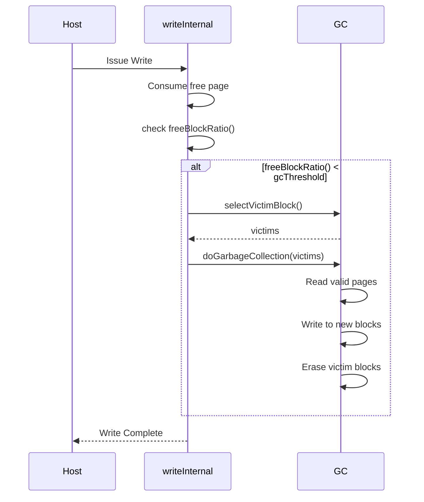
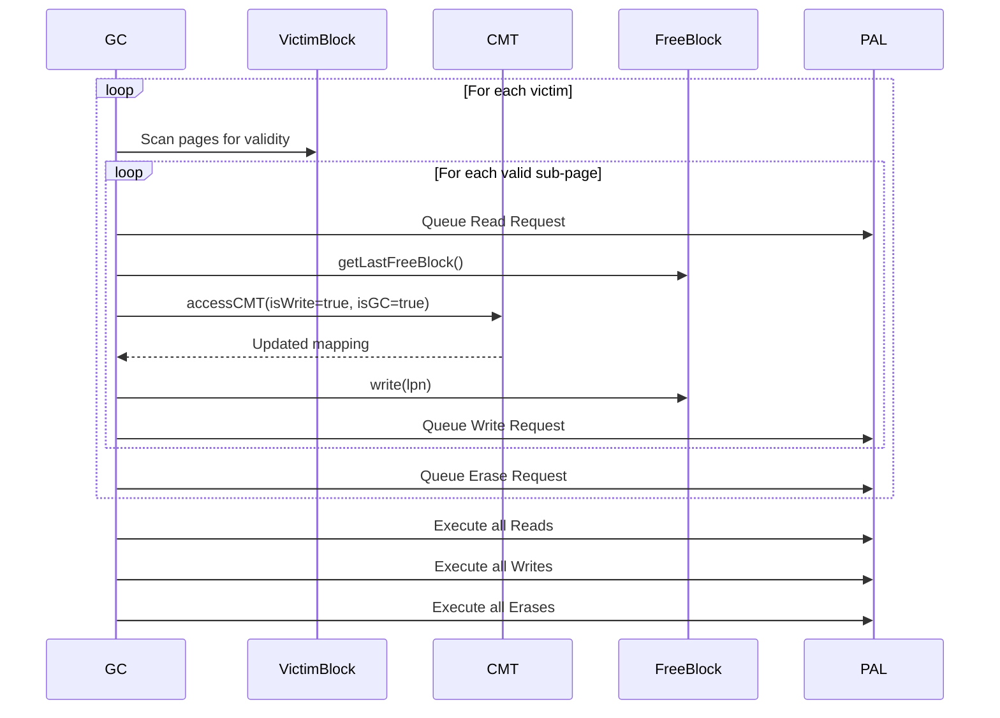

[← README](README.md) | Prev: [06 — I/O Paths](06_io_paths.md) | Next: [08 — Stats](08_wear_and_stats.md)

# Garbage Collection: Reclaiming Flash Blocks

**The one thing to take away:** GC is triggered on-demand when free blocks drop below a threshold. It selects victim blocks, migrates their valid pages to fresh blocks, and erases the victims. The key design tension: GC costs write amplification (extra writes) but is necessary to create free space.

## 1. The Problem

NAND flash memory has a fundamental physical limitation: you can't overwrite a page in place. Once written, a page must be erased before it can be written again. However, erases can only happen at the **block** level (a group of many pages). 

When a Logical Page Number (LPN) is overwritten by the host, the FTL writes the new data to a fresh physical page and simply marks the old physical page as "invalid". Over time, flash blocks become filled with a mix of valid and invalid pages. If we just erased blocks randomly, we would delete valid data! 

**Garbage Collection (GC)** is the process that solves this. It selects blocks that are mostly filled with invalid data (victims), reads the surviving valid pages out, writes them to a new free block, and then erases the entire victim block, returning it to the free pool.

## 2. When GC Triggers

GC in SimpleSSD-Standalone's Page Mapping is typically triggered synchronously during the write path when the supply of free blocks runs low.



It can also be triggered explicitly by a `format` command, which allows targeted GC on specific blocks.

## 3. How Many Blocks to Reclaim

When GC triggers, it needs to decide how many blocks to recycle. SimpleSSD provides two modes, controlled by `FTL_GC_MODE`:

1. **Mode 0 (Fixed):** Reclaims a fixed number of blocks, determined by `FTL_GC_RECLAIM_BLOCK` (default is usually 1).
2. **Mode 1 (Threshold):** Dynamically calculates how many blocks to reclaim based on a threshold formula:
   `nBlocks = (totalPhysicalBlocks × reclaimThreshold) - nFreeBlocks`

Additionally, the FTL employs a proactive measure called `bReclaimMore`:

```cpp
if (bReclaimMore) {
  nBlocks += param.pageCountToMaxPerf;
  bReclaimMore = false;
}
```

> **Why `bReclaimMore`?**
> In the FTL, write streams span multiple blocks in parallel (`pageCountToMaxPerf`). When an active allocation block fills up (its write pointer reaches the end), the FTL must draw a new block from the `freeBlocks` pool. Because this extra consumption just happened, GC proactively reclaims extra blocks to prevent the free pool from unexpectedly dropping to zero.

## 4. Victim Selection Policies

Selecting the right victim blocks is the most crucial decision in GC. A good policy minimizes the number of valid pages that must be copied (which causes **Write Amplification**). 

The FTL calculates a `weight` for each block and picks the blocks with the lowest weight. Only **sealed** blocks (where `getNextWritePageIndex() == pagesInBlock`) are considered.

> **Why skip non-sealed blocks?**
> Open (unsealed) blocks still have empty pages waiting to be written. Erasing them would throw away those perfectly good, unwritten pages.

### Greedy Policy (`POLICY_GREEDY`)
* **Weight:** `validPageCount`
* **Concept:** Pick the block with the absolute fewest valid pages.
* **Tradeoff:** Minimizes immediate write amplification, but ignores block age. Hot data blocks (frequently overwritten) are constantly picked, while cold blocks (static data) sit untouched forever, hoarding space.

### Cost-Benefit Policy (`POLICY_COST_BENEFIT`)
* **Weight:** `(validRatio) / ((1 - validRatio) × age)` 
  *(where age = currentTick - lastAccessedTime)*
* **Concept:** Balances the cost of copying valid pages against the time the block has been sitting cold.
* **Tradeoff:** Excellent for mixing hot and cold data. It avoids picking recently-written blocks, giving their data time to become invalid. However, it requires tracking accurate timestamps and complex floating-point division.

### Random Policy (`POLICY_RANDOM`)
* **Weight:** Random selection among `nBlocks` candidates.
* **Concept:** A baseline comparison policy. Randomly picks a handful of blocks and chooses the best among them.
* **Tradeoff:** Very low CPU overhead (O(1) per block), but can make terrible choices leading to high write amplification.

### D-Choice Policy (`POLICY_DCHOICE`)
* **Weight:** Random selection among `d × nBlocks` candidates.
* **Concept:** Randomly samples a larger pool (`d` times the number of needed blocks) and picks the one with the lowest valid count. 
* **Tradeoff:** Offers a bounded middle ground between Greedy (which requires sorting all blocks, O(N log N)) and Random. Performance depends heavily on tuning the `d` parameter.

## 5. `doGarbageCollection` Step-by-Step

Once victims are selected, `doGarbageCollection` actually moves the data and erases the blocks.



### The Batched I/O Pattern

If you look closely at lines 769-794, you'll see a distinct pattern:

1. It queues all reads, writes, and erases into separate `std::vector<PAL::Request>`.
2. It executes a loop to fire off **all reads**.
3. It executes a loop to fire off **all writes** (starting at `readFinishedAt`).
4. It executes a loop to fire off **all erases** (also starting at `readFinishedAt`).

> **Why batch PAL requests?**
> The underlying flash simulation layer (PAL2) has a known limitation/bug where aggressively interleaving reads, writes, and erases on the same flash chips can cause reentrancy issues (infinite loops or segmentation faults). Batching the requests prevents this crash.

### CMT Coherence

When GC moves a valid page to a new block, the Logical-to-Physical mapping changes. Notice this line:
`auto &gcMappingData = *accessCMT(lpns.at(idx), true, tick, true);`

> **Why does GC go through `accessCMT`?**
> The CMT (Cached Mapping Table) is a fast SRAM cache for the mapping table. If the mapping for the relocated page happens to be currently cached in the CMT, we must update it there! Bypassing the CMT and writing directly to DRAM would leave stale data in the cache, breaking system coherence.

## 6. GC ↔ CMT Interaction

Because GC uses `accessCMT` to update mappings, GC operations directly impact the state and performance of the CMT cache:

* **Dirtying:** GC passes `isWrite=true`, which marks the CMT entry as dirty. It will eventually need to be written back to DRAM.
* **Eviction:** If the CMT is full, a GC access can trigger the eviction of a different entry to make room.
* **Latencies:** If the entry isn't in the cache, GC pays the `cmtMissLatency`. If an eviction is dirty, it pays the `cmtWriteBackLatency`.
* **Stats Tracking:** The stats engine carefully separates host traffic from GC traffic, routing these cache accesses to `cmtGCHits` and `cmtGCMisses`.
* **Cache Promotion:** In algorithms like LFU (Least Frequently Used), a GC hit counts as an access, increasing the frequency weight of the entry just like a user hit would.

## 7. Free Block Allocation

When GC needs a destination block to write valid pages into, it calls `getLastFreeBlock()`, which in turn calls `getFreeBlock()`.

`getFreeBlock(idx)` doesn't just grab a random block. It specifically looks for a block that satisfies:
`blockIndex % param.pageCountToMaxPerf == idx`

> **Term:** Stream Alignment
> SSDs achieve maximum throughput by striping writes across multiple parallel channels and dies. `pageCountToMaxPerf` defines how many parallel streams exist. By enforcing this modulo math, the FTL ensures that the active open blocks are perfectly distributed across all parallel flash hardware, preventing bottlenecking on a single chip.

If no perfectly aligned block is available, it gracefully falls back to taking the first available block in the `freeBlocks` pool. `getLastFreeBlock` manages the rotation of the write pointer across these parallel streams.

## 8. Config Keys

| Key | Default | Description |
| :--- | :--- | :--- |
| `FTL_GC_MODE` | 0 | 0 = Fixed count, 1 = Threshold-based count |
| `FTL_GC_EVICT_POLICY` | 0 | 0=Greedy, 1=Cost-Benefit, 2=Random, 3=D-Choice |
| `FTL_GC_RECLAIM_BLOCK` | 1 | Number of blocks to reclaim in Mode 0 |
| `FTL_GC_RECLAIM_THRESHOLD`| 0.05 | Target free block ratio for Mode 1 |
| `FTL_GC_D_CHOICE_PARAM` | 2 | Multiplier 'd' for D-Choice policy |

## 9. Invariants

1. **Sealed Blocks Only:** Only blocks where `getNextWritePageIndex() == pagesInBlock` can be selected as GC victims.
2. **CMT Coherence:** Any mapping updated by GC must be updated via the CMT to prevent stale cached mappings.
3. **No In-Place Overwrites:** GC writes relocated pages to fresh blocks; it never attempts to overwrite the victim block before erasing it.
4. **Batched Execution:** PAL requests for a GC operation must be executed in order: all reads, then all writes and erases, to avoid PAL reentrancy bugs.

## 10. Source Reference

| Concept | File | Lines |
| :--- | :--- | :--- |
| GC Mode / Policy Configs | [page_mapping.cc](../../SimpleSSD-Standalone/simplessd/ftl/page_mapping.cc) | 607-611 |
| `selectVictimBlock` | [page_mapping.cc](../../SimpleSSD-Standalone/simplessd/ftl/page_mapping.cc) | 605-675 |
| Policy Weights | [page_mapping.cc](../../SimpleSSD-Standalone/simplessd/ftl/page_mapping.cc) | 566-603 |
| `doGarbageCollection` | [page_mapping.cc](../../SimpleSSD-Standalone/simplessd/ftl/page_mapping.cc) | 677-797 |
| Batched PAL Execution | [page_mapping.cc](../../SimpleSSD-Standalone/simplessd/ftl/page_mapping.cc) | 769-794 |
| `getFreeBlock` | [page_mapping.cc](../../SimpleSSD-Standalone/simplessd/ftl/page_mapping.cc) | 489-531 |

## 11. Self-Quiz

<details>
<summary>1. Why can't we just erase invalid pages individually?</summary>
Flash memory physically requires erasing at the block granularity, which contains many pages.
</details>

<details>
<summary>2. What is Write Amplification?</summary>
The phenomenon where a single host write causes multiple physical flash writes, because GC must copy valid pages from victim blocks to new blocks.
</details>

<details>
<summary>3. Why does the Greedy policy tend to cause high Write Amplification in the long run?</summary>
It ignores block age, so it repeatedly picks "hot" blocks that will soon be invalidated anyway, while ignoring "cold" blocks that permanently hoard space.
</details>

<details>
<summary>4. What determines if a block is "sealed"?</summary>
A block is sealed when its write pointer reaches the end (`getNextWritePageIndex() == pagesInBlock`).
</details>

<details>
<summary>5. Why does GC ignore unsealed blocks?</summary>
Unsealed blocks still have empty, unwritten pages. Erasing them would waste that usable space.
</details>

<details>
<summary>6. What triggers the `bReclaimMore` flag?</summary>
It triggers when an active allocation block fills up, meaning a new free block was just consumed to rotate the write pointer.
</details>

<details>
<summary>7. Why does `doGarbageCollection` batch all PAL reads before PAL writes?</summary>
To avoid a known simulation bug (reentrancy) in the PAL2 layer that causes crashes when reads/writes are interleaved.
</details>

<details>
<summary>8. Why must GC pass `isGC=true` to `accessCMT`?</summary>
To ensure GC accesses are tracked correctly in the statistics (e.g., `cmtGCHits` vs user hits) and to update the cached mapping if it happens to be present in the SRAM.
</details>

<details>
<summary>9. What is "stream alignment" in `getFreeBlock`?</summary>
Selecting a free block whose index modulo `pageCountToMaxPerf` matches the required slot, ensuring writes are distributed across parallel flash dies.
</details>

<details>
<summary>10. What is the mathematical weight formula for the Cost-Benefit policy?</summary>
`weight = (validRatio) / ((1 - validRatio) × age)`
</details>
