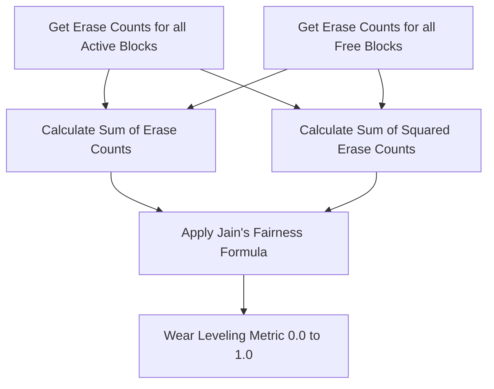

[← README](README.md) | Prev: [07 — GC](07_garbage_collection.md) | Next: [09 — Conclusion](09_conclusion.md)

# Chapter 8: Wear Leveling & Statistics: Measuring What the FTL Does

**The one thing to take away:** The simulator exports 18 statistics that let you evaluate FTL performance. Understanding what each metric measures — and its quirks — is essential for writing correct experiment analysis.

## The Problem

When running FTL experiments, simply observing that an I/O workload finishes is not enough. To evaluate and compare FTL designs, you need granular metrics. Does **LRU** perform better than **LFU** for a specific workload? How much overhead is **Garbage Collection (GC)** introducing? Are some blocks being heavily worn out while others sit completely idle? 

To answer these questions, the simulator tracks 18 specific metrics, ranging from cache hit rates to wear leveling fairness. Understanding exactly how these metrics are calculated—and the specific edge cases in their formulas—is critical for drawing accurate conclusions about your experiments.

## The Wear Leveling Formula

One of the most important responsibilities of an FTL is ensuring that Flash blocks wear out evenly. If some blocks are erased thousands of times while others are barely touched, the drive will fail prematurely. 

The simulator uses **Jain's fairness index** to quantify wear distribution. 



The mathematical formula used is:
$$W = \frac{(\sum E_i)^2}{N \times \sum E_i^2}$$

Where:
* $E_i$ is the erase count of block $i$.
* $N$ is the total number of blocks.

A value of **1.0** means perfect wear leveling (all blocks have the exact same erase count). A value of **0.5** means highly skewed wear. A value approaching $1/N$ means only a single block is absorbing all the wear.

Here is how it's implemented:

```cpp
float PageMapping::calculateWearLeveling() {
  uint64_t totalEraseCnt = 0;
  uint64_t sumOfSquaredEraseCnt = 0;
  uint64_t numOfBlocks = param.totalLogicalBlocks;
  uint64_t eraseCnt;

  for (auto &iter : blocks) {
    eraseCnt = iter.second.getEraseCount();
    totalEraseCnt += eraseCnt;
    sumOfSquaredEraseCnt += eraseCnt * eraseCnt;
  }

  // freeBlocks is sorted
  // Calculate from backward, stop when eraseCnt is zero
  for (auto riter = freeBlocks.rbegin(); riter != freeBlocks.rend(); riter++) {
    eraseCnt = riter->getEraseCount();
    if (eraseCnt == 0) break;
    totalEraseCnt += eraseCnt;
    sumOfSquaredEraseCnt += eraseCnt * eraseCnt;
  }

  if (sumOfSquaredEraseCnt == 0) return -1;  // no meaning of wear-leveling

  return (float)totalEraseCnt * totalEraseCnt /
         (numOfBlocks * sumOfSquaredEraseCnt);
}
```

> **Why Jain's fairness index?** 
> It's a standard metric from networking (Jain et al., 1984) adapted for wear leveling. It produces values bounded between 0 and 1, is scale-independent, and is widely understood in the research community.

> **Why `totalLogicalBlocks` in the denominator instead of `totalPhysicalBlocks`?** 
> This is a documented quirk in the code. The denominator should arguably count all blocks (including over-provisioned ones), but the code uses `totalLogicalBlocks`. This slightly inflates the final metric. Keep this in mind when comparing absolute fairness values against other simulators.

## Calculating Total Pages

To understand the current capacity utilization and GC pressure, the FTL can calculate the total number of valid and invalid (dirty) pages. 

```cpp
void PageMapping::calculateTotalPages(uint64_t &valid, uint64_t &invalid) {
  valid = 0;
  invalid = 0;

  for (auto &iter : blocks) {
    valid += iter.second.getValidPageCount();
    invalid += iter.second.getDirtyPageCount();
  }
}
```

This function simply iterates through all active blocks (in the `blocks` map). For each block, it fetches the valid page count and the dirty page count. The dirty page count represents pages that have been invalidated by subsequent overwrites to the same logical address.

## The Complete Stats Catalog

Here is the complete catalog of the 18 core stats tracked by the simulator:

| Category | Statistic Name | Description |
| :--- | :--- | :--- |
| **GC** | `gc_count` | Total number of GC invocations. |
| **GC** | `reclaimed_blocks` | Total blocks erased by GC. |
| **GC** | `valid_superpages_copied` | Superpage-level copies during GC. |
| **GC** | `valid_pages_copied` | Sub-page-level copies during GC. |
| **Utilization** | `valid_pages` | Currently valid pages across all blocks. |
| **Utilization** | `invalid_pages` | Currently invalid (dirty) pages. |
| **Utilization** | `valid_page_ratio` | valid / total pages. |
| **Wear** | `wear_leveling` | Jain's fairness index (1.0 = perfect). |
| **CMT (User)** | `cmt_hit_count` | User read/write CMT hits. |
| **CMT (User)** | `cmt_miss_count` | User read/write CMT misses. |
| **CMT (User)** | `cmt_hit_rate` | hits / (hits + misses). |
| **CMT (User)** | `cmt_eviction_count` | Total evictions from the mapping cache. |
| **CMT (User)** | `cmt_dirty_eviction_count`| Evictions that required write-back to Flash. |
| **CMT (User)** | `cmt_writeback_count` | Write-back operations (equals dirty evictions). |
| **CMT (GC)** | `cmt_gc_hit_count` | GC-internal CMT hits. |
| **CMT (GC)** | `cmt_gc_miss_count` | GC-internal CMT misses. |
| **CMT (GC)** | `cmt_gc_hit_rate` | gc_hits / (gc_hits + gc_misses). |
| **Capacity** | `cmt_size` | Current entries residing in the cache. |

## CMT Hit Rate Details

The **Cached Mapping Table (CMT)** hit rate is a crucial metric for evaluating mapping cache policies. However, notice how it is calculated:

```cpp
// User-facing hit rate (excludes GC-triggered accesses)
uint64_t totalLookups = stat.cmtHits + stat.cmtMisses;
double hitRate = totalLookups > 0
    ? (double)stat.cmtHits / (double)totalLookups * 100.0
    : 0.0;
```

The user hit rate explicitly excludes `cmtGCHits` and `cmtGCMisses`. 

> **Why exclude GC?** 
> GC accesses a massive number of mappings rapidly during block relocation. Because GC reads sequentially from a victim block, these accesses often have a very high hit rate. Including these in the main hit rate inflates the number and makes heavy-GC workloads look artificially better, masking the true user-facing performance of the cache.

Notice the `totalLookups > 0` check: this prevents division-by-zero errors in edge cases where no cache lookups occurred.

## Reading a Stats File

When a simulation finishes, the stats file will dump these metrics. Here is a brief annotated example of what you might see:

```ini
page_mapping.gc.count = 45                 # GC was triggered 45 times
page_mapping.gc.reclaimed_blocks = 45      # 45 blocks were erased
page_mapping.wear_leveling = 0.89          # Good, but not perfect wear distribution
page_mapping.cmt.hits = 95000              # Cache is performing well
page_mapping.cmt.misses = 5000             # 
page_mapping.cmt.hit_rate = 95.0           # 95% user hit rate
page_mapping.cmt.dirty_evictions = 120     # Few dirty evictions means low write-back overhead
```

**Sanity Checks:**
* If your workload size is smaller than the over-provisioning space, `gc_count` should be 0 (the drive never hit the high watermark).
* If your workload's active working set fits entirely in the CMT, `cmt.hit_rate` should approach 100%.

> **Warning:** By default, stats include the "warm-up" phase of your workload. If you want to measure only the steady-state performance, ensure you call `resetCMTStats()` after warming up the cache!

## Resetting Stats

Speaking of resetting stats, the FTL provides a way to wipe the slate clean:

```cpp
void PageMapping::resetStatValues() {
  memset(&stat, 0, sizeof(stat));
}
```

This completely zeros out all statistical counters, including all GC stats.
* **Contrast with `resetCMTStats()`**: That function *only* clears the mapping cache counters (hits/misses/evictions), leaving GC and wear leveling intact.
* **Contrast with `initialize()`**: Initialization implicitly calls `resetCMTStats()`, but it does *not* call `resetStatValues()`.

## Practical Tips for Research

When running your experiments, keep these heuristics in mind:

1. **"If your CMT hit rate is >0.99, your working set fits entirely in cache — the CMT policy doesn't matter much."** Don't waste time comparing LRU vs LFU on workloads that fit in RAM.
2. **"If your CMT hit rate is <0.50, your cache is too small for the workload — consider increasing CMTCapacityRatio."** The default cache size might be starving your workload.
3. **"Compare `cmt_dirty_eviction_count` between LRU and LFU — fewer dirty evictions = less translation write traffic."** Dirty evictions are expensive because they require writing translation pages back to flash.
4. **"If `gc_count` is high but `valid_pages_copied` is low, GC is efficiently picking victims with few valid pages."** This indicates your greedy victim selection algorithm is working beautifully.

## Source Reference

| Concept | File | Lines |
| :--- | :--- | :--- |
| **Wear Leveling Formula** | `page_mapping.cc` | 1407-1438 |
| **Total Pages Calculation** | `page_mapping.cc` | 1440-1448 |
| **Stats Catalog & Definitions** | `page_mapping.cc` | 1450-1556 |
| **CMT Hit Rate Calculation** | `page_mapping.cc` | 1537-1541 |
| **Resetting Stats** | `page_mapping.cc` | 1558-1560 |

## Self-Quiz

<details>
<summary>1. What does a wear leveling index of 1.0 mean?</summary>
Perfectly even wear; every block has the exact same erase count.
</details>

<details>
<summary>2. Why does Jain's index formula in this codebase slightly inflate the fairness score?</summary>
Because it uses `totalLogicalBlocks` in the denominator instead of `totalPhysicalBlocks`.
</details>

<details>
<summary>3. Why are GC-triggered CMT hits excluded from the main user hit rate?</summary>
Because GC accesses many sequential mappings rapidly. Including them would artificially inflate the hit rate and make heavy-GC workloads look falsely efficient.
</details>

<details>
<summary>4. What is a "dirty eviction" in the context of the CMT?</summary>
An eviction of a cache entry that has been modified, meaning the new mapping must be written back to the Global Mapping Table (GMT) in flash.
</details>

<details>
<summary>5. How does `calculateTotalPages` determine the number of invalid pages in a block?</summary>
It calls `getDirtyPageCount()` on each block, which tracks pages that have been logically overwritten.
</details>

<details>
<summary>6. If `gc_count` is 0 at the end of a simulation, what does that imply about the workload?</summary>
The total volume of writes never exhausted the initial free space pool to trigger the GC high watermark threshold.
</details>

<details>
<summary>7. What is the difference between `resetStatValues()` and `resetCMTStats()`?</summary>
`resetStatValues()` zeros out everything including GC counters. `resetCMTStats()` only resets the cache hit/miss/eviction counters.
</details>

<details>
<summary>8. If your CMT hit rate is 99.5%, should you spend time optimizing your eviction policy (LRU vs LFU)?</summary>
No. A 99.5% hit rate means the working set almost entirely fits in cache, so the eviction policy will have virtually no impact on overall performance.
</details>

<details>
<summary>9. Why do we iterate `freeBlocks` backwards when calculating wear leveling?</summary>
Because `freeBlocks` is sorted by erase count. Iterating backwards ensures we process blocks with higher erase counts first, allowing an early exit if we hit blocks with 0 erase counts.
</details>

<details>
<summary>10. What does a high `gc_count` but a very low `valid_pages_copied` tell you about your GC?</summary>
It means the GC is effectively selecting victim blocks that contain almost entirely invalid pages, resulting in very little copy-overhead.
</details>
