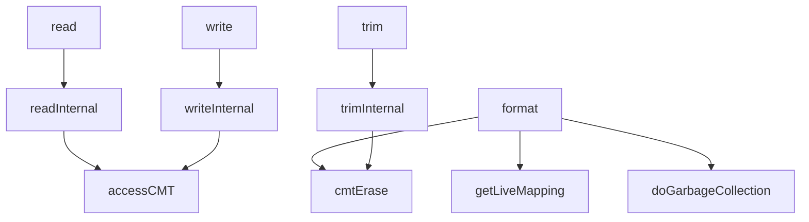

# Chapter 3 — Public I/O: `read`, `write`, `trim`, `format`, `getStatus`

[← Back to `page_mapping` guide](README.md)

**Source:** [`page_mapping.cc`](../../SimpleSSD-Standalone/simplessd/ftl/page_mapping.cc) lines **353–479**

**Prerequisites:** [02_constructor_init.md](02_constructor_init.md), [06_cmt_access.md](06_cmt_access.md) (how mappings are resolved on read/write)

**Related:** Internal paths in [07_internal_io.md](07_internal_io.md); GC from `format` in [05_gc.md](05_gc.md).

---

## Overview

These are the **public API** methods the rest of SimpleSSD calls on the FTL. Each wraps an `*Internal` helper (except `format`, which walks GMT directly), adds debug logging, and applies a **CPU-side FTL latency** via `applyLatency`. They are thin orchestration layers — mapping cache logic is in `accessCMT` ([06_cmt_access.md](06_cmt_access.md)) and destroy helpers from Chapter 2 (`getLiveMapping`, `cmtErase`).

---

## Section A — `read` (lines 353–369)

### Line range

`page_mapping.cc` **353–369**

### Purpose

Handle a host **read** request: if the request targets at least one sub-page (`ioFlag`), delegate to `readInternal` and log duration; otherwise warn. Always add modeled FTL CPU read latency to `tick`.

### Line-by-line

| Line | Code | Meaning |
| --- | --- | --- |
| 353 | `void PageMapping::read(Request &req, uint64_t &tick) {` | Public read entry; `tick` is simulation time in ps (updated in place). |
| 354 | `  uint64_t begin = tick;` | Snapshot start time for debug delta. |
| 355 | *(blank)* | |
| 356 | `  if (req.ioFlag.count() > 0) {` | At least one bit set in sub-page mask — non-empty read. |
| 357 | `    readInternal(req, tick);` | PAL read path + `accessCMT(lpn, isWrite=false)` ([07_internal_io.md](07_internal_io.md)). |
| 358 | *(blank)* | |
| 359–362 | `debugprint(LOG_FTL_PAGE_MAPPING, "READ ...")` | Log LPN, begin tick, end tick, elapsed `tick - begin`. |
| 363 | `  }` | End non-empty branch. |
| 364 | `  else {` | Empty `ioFlag`. |
| 365 | `    warn("FTL got empty request");` | Should not happen from well-formed HIL; no internal call. |
| 366 | `  }` | |
| 367 | *(blank)* | |
| 368 | `  tick += applyLatency(CPU::FTL__PAGE_MAPPING, CPU::READ);` | Add fixed FTL software overhead for read (independent of NAND latency inside `readInternal`). |
| 369 | `}` | |

### Invariants

- `tick` after return ≥ value on entry (NAND + CPU latency).
- Empty requests do not call `readInternal` or touch CMT.
- CMT miss on unmapped LPN: see README open question #1 — miss counted, no GMT allocation ([06_cmt_access.md](06_cmt_access.md)).

### Links

- [06_cmt_access.md](06_cmt_access.md) — `accessCMT` on read path.
- [07_internal_io.md](07_internal_io.md) — `readInternal`.

---

## Section B — `write` (lines 371–387)

### Line range

`page_mapping.cc` **371–387**

### Purpose

Host **write**: same structure as `read`, but calls `writeInternal` and applies write CPU latency.

### Line-by-line

| Line | Code | Meaning |
| --- | --- | --- |
| 371 | `void PageMapping::write(Request &req, uint64_t &tick) {` | Public write entry. |
| 372 | `  uint64_t begin = tick;` | Start timestamp for logging. |
| 373 | *(blank)* | |
| 374 | `  if (req.ioFlag.count() > 0) {` | Non-empty write. |
| 375 | `    writeInternal(req, tick);` | Allocate physical page, update mapping via `accessCMT(isWrite=true)`, program NAND. |
| 376 | *(blank)* | |
| 377–380 | `debugprint(..., "WRITE ...")` | Log LPN and elapsed time. |
| 381 | `  }` | |
| 382 | `  else {` | Empty request. |
| 383 | `    warn("FTL got empty request");` | |
| 384 | `  }` | |
| 385 | *(blank)* | |
| 386 | `  tick += applyLatency(CPU::FTL__PAGE_MAPPING, CPU::WRITE);` | FTL CPU write overhead. |
| 387 | `}` | |

### Invariants

- Writes with valid `ioFlag` always go through `accessCMT` with `allocate=true` inside `writeInternal` — may evict and dirty-write-back ([06_cmt_access.md](06_cmt_access.md)).
- `writeInternal` default third arg `true` marks user I/O; warm-up passes `false` ([02_constructor_init.md](02_constructor_init.md)).

### Links

- [06_cmt_access.md](06_cmt_access.md) — write hits mark entries dirty.
- [04_free_blocks.md](04_free_blocks.md) — `getLastFreeBlock` inside `writeInternal`.

---

## Section C — `trim` (lines 389–400)

### Line range

`page_mapping.cc` **389–400**

### Purpose

**Trim** (deallocate / discard): always calls `trimInternal` — no empty-request guard. Logs and adds trim CPU latency.

### Line-by-line

| Line | Code | Meaning |
| --- | --- | --- |
| 389 | `void PageMapping::trim(Request &req, uint64_t &tick) {` | Public trim entry. |
| 390 | `  uint64_t begin = tick;` | Log start. |
| 391 | *(blank)* | |
| 392 | `  trimInternal(req, tick);` | Invalidate physical pages, erase GMT entry, `cmtErase` ([07_internal_io.md](07_internal_io.md)). |
| 393 | *(blank)* | |
| 394–397 | `debugprint(..., "TRIM ...")` | Log LPN and elapsed time. |
| 398 | *(blank)* | |
| 399 | `  tick += applyLatency(CPU::FTL__PAGE_MAPPING, CPU::TRIM);` | FTL CPU trim overhead. |
| 400 | `}` | |

### Invariants

- Unlike read/write, **no** `ioFlag.count()` check — caller must pass sensible mask in `trimInternal`.
- Trim destroys mapping → uses `cmtErase`, not dirty write-back ([02_constructor_init.md](02_constructor_init.md)).

### Links

- [07_internal_io.md](07_internal_io.md) — `trimInternal`.
- [02_constructor_init.md](02_constructor_init.md) — `cmtErase`.

---

## Section D — `format` (lines 402–460)

### Line range

`page_mapping.cc` **402–460**

### Purpose

**Format** a range of logical pages: for each GMT entry in `[slpn, slpn+nlp)`, invalidate live physical sub-pages, remove CMT/GMT entries, collect affected block indices, run **targeted GC** on those blocks, add format CPU latency.

This is the most complex public method in this chapter — it combines `getLiveMapping`, `cmtErase`, block invalidation, and `doGarbageCollection`.

### Line-by-line — setup and GMT scan (402–449)

| Line | Code | Meaning |
| --- | --- | --- |
| 402 | `void PageMapping::format(LPNRange &range, uint64_t &tick) {` | `range.slpn` = start LPN, `range.nlp` = count of logical pages. |
| 403 | `  PAL::Request req(param.ioUnitInPage);` | PAL request for erase operations during GC. |
| 404 | `  std::vector<uint32_t> list;` | Collect unique physical block indices to GC. |
| 405 | *(blank)* | |
| 406 | `  req.ioFlag.set();` | Full superpage for PAL erase helper. |
| 407 | *(blank)* | |
| 408 | `  for (auto iter = table.begin(); iter != table.end();) {` | Walk **GMT** (not CMT alone). |
| 409 | `    if (iter->first >= range.slpn && iter->first < range.slpn + range.nlp) {` | LPN inside format range. |
| 410–412 | Comment | Must use live mapping: GMT may hold allocate sentinel or stale PPN. |
| 413 | `      auto *mappingList = getLiveMapping(iter->first);` | CMT if resident, else GMT ([02_constructor_init.md](02_constructor_init.md)). |
| 414 | *(blank)* | |
| 415 | `      if (mappingList == nullptr) {` | Edge case: iterator in `table` but no live map? |
| 416 | `        mappingList = &iter->second;` | Fallback to GMT vector from iterator. |
| 417 | `      }` | |
| 418 | *(blank)* | |
| 419 | `      // Do trim` | Comment: invalidate physical pages. |
| 420 | `      for (uint32_t idx = 0; idx < bitsetSize; idx++) {` | Each sub-page in superpage entry. |
| 421 | `        auto &mapping = mappingList->at(idx);` | `pair<uint32_t,uint32_t>` = (blockIndex, pageIndex). |
| 422 | *(blank)* | |
| 423–424 | Comment + `if (mapping.first >= param.totalPhysicalBlocks)` | **Sentinel:** never-allocated sub-page slot. |
| 425 | `          continue;` | Skip — no physical page to invalidate. |
| 426 | `        }` | |
| 427 | *(blank)* | |
| 428 | `        auto block = blocks.find(mapping.first);` | Find in-use block metadata. |
| 429 | *(blank)* | |
| 430 | `        if (block == blocks.end()) {` | Mapping points to non-existent block. |
| 431 | `          panic("Block is not in use");` | Fatal consistency error. |
| 432 | `        }` | |
| 433 | *(blank)* | |
| 434 | `        block->second.invalidate(mapping.second, idx);` | Mark physical page invalid in block metadata. |
| 435 | *(blank)* | |
| 436–437 | Comment + `list.push_back(mapping.first);` | Remember block for GC. |
| 438 | `      }` | End sub-page loop. |
| 439 | *(blank)* | |
| 440–441 | Comment | Destroy mapping — no write-back. |
| 442 | `      cmtErase(iter->first);` | Drop from CMT if present. |
| 443 | *(blank)* | |
| 444 | `      iter = table.erase(iter);` | Remove GMT entry; iterator-safe erase. |
| 445 | `    }` | End in-range branch. |
| 446 | `    else {` | LPN outside format range. |
| 447 | `      iter++;` | Advance without erase. |
| 448 | `    }` | |
| 449 | `  }` | End GMT walk. |

### Line-by-line — GC and latency (451–460)

| Line | Code | Meaning |
| --- | --- | --- |
| 451 | `  // Get blocks to erase` | Comment. |
| 452 | `  std::sort(list.begin(), list.end());` | Sort block indices for `unique`. |
| 453 | `  auto last = std::unique(list.begin(), list.end());` | Collapse duplicates (many LPNs same block). |
| 454 | `  list.erase(last, list.end());` | Trim vector to unique blocks. |
| 455 | *(blank)* | |
| 456 | `  // Do GC only in specified blocks` | Comment: not global GC — only collected victims. |
| 457 | `  doGarbageCollection(list, tick);` | Relocate valid pages, erase blocks ([05_gc.md](05_gc.md)). |
| 458 | *(blank)* | |
| 459 | `  tick += applyLatency(CPU::FTL__PAGE_MAPPING, CPU::FORMAT);` | FTL CPU format overhead. |
| 460 | `}` | |

### Invariants

- After format, no GMT entry exists for LPNs in range; CMT entries for those LPNs removed.
- Physical pages invalidated before GC; GC may call `accessCMT(..., isWrite=true, isGC=true)` ([06_cmt_access.md](06_cmt_access.md)).
- LPNs outside range unchanged.

### Links

- [02_constructor_init.md](02_constructor_init.md) — `getLiveMapping`, `cmtErase`.
- [05_gc.md](05_gc.md) — `doGarbageCollection`.
- [06_cmt_access.md](06_cmt_access.md) — GC mapping updates.

---

## Section E — `getStatus` (lines 462–479)

### Line range

`page_mapping.cc` **462–479**

### Purpose

Fill public `status` snapshot: free block count and count of **mapped** logical pages (GMT entries), either whole-device or per LPN sub-range.

### Line-by-line

| Line | Code | Meaning |
| --- | --- | --- |
| 462 | `Status *PageMapping::getStatus(uint64_t lpnBegin, uint64_t lpnEnd) {` | Query range `[lpnBegin, lpnEnd)` — end is exclusive. |
| 463 | `  status.freePhysicalBlocks = nFreeBlocks;` | Current free block counter. |
| 464 | *(blank)* | |
| 465 | `  if (lpnBegin == 0 && lpnEnd >= status.totalLogicalPages) {` | Full-device query shortcut. |
| 466 | `    status.mappedLogicalPages = table.size();` | GMT size = number of mapped LPNs (O(1)). |
| 467 | `  }` | |
| 468 | `  else {` | Partial range — must scan. |
| 469 | `    status.mappedLogicalPages = 0;` | Initialize counter. |
| 470 | *(blank)* | |
| 471 | `    for (uint64_t lpn = lpnBegin; lpn < lpnEnd; lpn++) {` | Each LPN in range. |
| 472 | `      if (table.count(lpn) > 0) {` | GMT has entry (CMT-only dirty mappings **not** counted if not in GMT). |
| 473 | `        status.mappedLogicalPages++;` | Increment. |
| 474 | `      }` | |
| 475 | `    }` | |
| 476 | `  }` | |
| 477 | *(blank)* | |
| 478 | `  return &status;` | Pointer to member `status` (reused each call). |
| 479 | `}` | |

### Invariants

- `mappedLogicalPages` counts **GMT keys**, not CMT residents — dirty-only-in-CMT LPNs may be undercounted until write-back.
- `freePhysicalBlocks == nFreeBlocks` always consistent with free list ([04_free_blocks.md](04_free_blocks.md)).

### Links

- [04_free_blocks.md](04_free_blocks.md) — `nFreeBlocks` maintenance.

---

## Public I/O flow (summary diagram)

---

## Self-quiz

1. What happens if `read` or `write` receives a request with an empty `ioFlag`?
2. Why does `trim` not check `ioFlag.count()` like read/write?
3. Why does `format` iterate `table` instead of only the CMT?
4. What is the sentinel check `mapping.first >= param.totalPhysicalBlocks`?
5. Why does `format` call `cmtErase` instead of flushing dirty entries?
6. What does `doGarbageCollection(list, tick)` receive after the format loop?
7. Does `getStatus` count mappings that exist only in CMT (dirty, not yet in GMT)?
8. Where is NAND read latency for a CMT miss charged — in `read()` or elsewhere?
9. What three latency types does `applyLatency(CPU::FTL__PAGE_MAPPING, …)` add in this chapter?
10. Why might `getLiveMapping` return nullptr yet `format` still uses `iter->second`?

### Answers

Click to reveal answers

1. **`warn`** is printed; `readInternal`/`writeInternal` are **not** called. CPU FTL latency is still applied to `tick`.

2. **Trim semantics:** Deallocation is defined per `trimInternal` and `ioFlag` mask inside it; empty trim may still be meaningful to the caller. Read/write with zero bits are clearly erroneous.

3. **GMT is authoritative enumeration:** CMT is a subset; format must clear **all** mappings in range, including those only in GMT or with stale GMT + dirty CMT.

4. **Unmapped sub-page:** Slots never written use block index ≥ `totalPhysicalBlocks` as sentinel — skip invalidation.

5. **Mapping destroyed:** Write-back would restore the mapping in GMT after we intend to delete it — same rationale as trim ([02_constructor_init.md](02_constructor_init.md)).

6. A **sorted, unique** list of physical block indices that had valid pages invalidated — targeted GC victims.

7. **No** — `getStatus` uses `table.count(lpn)` only. Dirty CMT-only state is invisible until eviction or `flushCMT`.

8. **Inside `readInternal` → `accessCMT`** ([06_cmt_access.md](06_cmt_access.md)) via `cmtMissLatency` on miss; `read()` adds separate CPU FTL overhead.

9. **READ, WRITE, TRIM, FORMAT** CPU latencies — four ops in this range (read, write, trim, format each call one enum).

10. **`getLiveMapping` returns nullptr** only if LPN absent from CMT **and** GMT — but the loop is on `table`, so `iter->second` should always exist; the nullptr branch is defensive if structures diverge; normally `getLiveMapping` returns GMT pointer for table entries.

