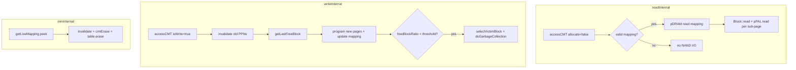

# Chapter 7 — Internal I/O Paths (`readInternal` … `eraseInternal`)

**Source:** [`page_mapping.cc`](../../SimpleSSD-Standalone/simplessd/ftl/page_mapping.cc) lines **1096–1405**

**Series:** [← README](README.md) · [06 CMT access](06_cmt_access.md) · **07 Internal I/O** · [08 Wear & stats](08_wear_stats.md)

**Prerequisites:** [06_cmt_access.md](06_cmt_access.md) (`accessCMT`), [04_free_blocks.md](04_free_blocks.md) (`getLastFreeBlock`), [05_gc.md](05_gc.md) (`selectVictimBlock`, `doGarbageCollection`).

**Theory companion:** [08_CMT_Mentor_Census.md](../08_CMT_Mentor_Census.md) §§17–20 (end-to-end read/write/trim/GC).

---

## Overview

Public FTL entry points (`read`, `write`, `trim`) are thin wrappers that add debug logging and CPU bookkeeping latency. The **real work** happens in four `*Internal` helpers:

| Function | CMT API | PAL / DRAM | GC |
| --- | --- | --- | --- |
| `readInternal` | `accessCMT(..., allocate=false)` | DRAM read + PAL read | No |
| `writeInternal` | `accessCMT(..., isWrite=true)` | DRAM R/W + PAL R/W (optional) | **On-demand** at end |
| `trimInternal` | `getLiveMapping` (peek only) | DRAM read | No |
| `eraseInternal` | None | PAL erase | Indirect (post-GC reclaim) |



---

## `accessCMT` vs `getLiveMapping` — when each path uses which

Both resolve **LPN → vector of (blockIndex, pageIndex)** pairs, but they differ in **side effects**:

| Property | `accessCMT` | `getLiveMapping` |
| --- | --- | --- |
| Mutates CMT | Yes (hit promote, miss fill, eviction) | **No** |
| Charges miss / write-back latency | Yes | **No** |
| Updates hit/miss counters | Yes (`cmtHits` / `cmtMisses` or GC variants) | **No** |
| Marks dirty on write | Yes (`isWrite=true`) | **No** |
| `allocate=false` on miss | Returns `nullptr`, no GMT load | Falls through to GMT or `nullptr` |
| Preferred copy | CMT after lookup | CMT if resident, else GMT |

### Call sites in this chapter

| Function | API | Rationale |
| --- | --- | --- |
| `readInternal` L1103 | `accessCMT(lpn, false, tick, false, false)` | Read must **not** create a mapping for never-written LPNs; miss still counts for stats (see [README open question #1](README.md#1-unmapped-read-increments-cmtmiss-before-nullptr)). |
| `writeInternal` L1171 | `accessCMT(lpn, true, tick)` | Write always needs a mapping entry; `isWrite=true` marks dirty immediately; default `allocate=true`. |
| `trimInternal` L1305 | `getLiveMapping(lpn)` | TRIM **destroys** the mapping. A CMT miss would load the doomed LPN, possibly evicting a useful entry, only to erase it microseconds later. |
| `doGarbageCollection` (ch. 5) L729 | `accessCMT(lpn, true, tick, isGC=true)` | GC relocation updates mappings — same coherence path as user writes; stats go to `cmtGCHits` / `cmtGCMisses`. |
| `format` (ch. 3) L413 | `getLiveMapping` | Same “destroy path” reasoning as TRIM. |

**Invariant (destroy paths):** `trimInternal`, `format`, and any code that erases an LPN from the GMT must use `getLiveMapping` (or GMT iteration) — never `accessCMT` — unless you intentionally want cache pollution and extra miss latency.

---

## §7.1 `readInternal` (lines 1096–1160)

Host read path after `PageMapping::read` validates `req.ioFlag`.

### Annotated block

```cpp
void PageMapping::readInternal(Request &req, uint64_t &tick) {
  PAL::Request palRequest(req);
  uint64_t beginAt;
  uint64_t finishedAt = tick;
  // ...
}
```

| Line(s) | Code | Meaning |
| --- | --- | --- |
| 1096 | `void PageMapping::readInternal(...)` | Internal read; `tick` is simulation time in picoseconds (in/out). |
| 1097 | `PAL::Request palRequest(req)` | Copy host request into PAL-layer struct (LPN, `ioFlag`, etc.). |
| 1098–1099 | `beginAt`, `finishedAt = tick` | Track per-sub-page NAND completion; `finishedAt` is max of all sub-ops. |
| 1101–1103 | `accessCMT(req.lpn, false, tick, false, false)` | **CMT lookup, read-only, user path, no allocate.** Args: `(lpn, isWrite, tick, isGC, allocate)`. |
| 1105–1114 | `hasValidMapping` scan | `mappingData` may be non-null (CMT hit on sentinel entry) but contain no real PPN. Valid iff any `mapping.first < totalPhysicalBlocks`. |
| 1116 | `if (hasValidMapping)` | Unmapped LPN: no DRAM, no PAL, no `READ_INTERNAL` CPU latency — silent no-op. |
| 1117–1122 | `pDRAM->read(mappingData, …)` | Charge DRAM bandwidth/latency to **fetch translation** from controller DRAM. Bytes: `8 * req.ioFlag.count()` (random tweak) or `8` (full superpage). |
| 1124–1155 | sub-page loop | For each targeted sub-page (`req.ioFlag` or all if `!bRandomTweak`): copy PPN into `palRequest`, `Block::read` (metadata), `pPAL->read` (NAND). |
| 1128–1129 | bounds check | Skip slots with sentinel `blockIndex >= totalPhysicalBlocks`. |
| 1133–1139 | `palRequest.ioFlag` | Random tweak: one sub-page per PAL op. Else: full superpage flag. |
| 1141–1145 | `blocks.find` | Block must be in active `blocks` map; else `panic`. |
| 1149–1150 | `block->second.read` + `pPAL->read` | Block object updates internal valid-bitmap; PAL models NAND read time into `beginAt`. |
| 1152 | `finishedAt = MAX(...)` | Parallel sub-pages: wall-clock is longest NAND op. |
| 1157–1158 | `tick = finishedAt` + `READ_INTERNAL` | Advance global time; add FTL CPU cost for internal read handler. |

### Invariants (`readInternal`)

1. **Never allocates on miss:** `allocate=false` ⇒ unmapped read returns `nullptr`, no GMT entry created.
2. **Sentinel convention:** `mapping.first >= param.totalPhysicalBlocks` means “sub-page never written.”
3. **`finishedAt` monotonicity:** Only updated inside `hasValidMapping` branch; unmapped reads leave `tick` unchanged (aside from any CMT miss latency already added inside `accessCMT`).
4. **Block membership:** Every valid PPN must reference a block in `blocks`, not `freeBlocks`.

---

## §7.2 `writeInternal` (lines 1162–1299)

Called from `write()` with `sendToPAL=true`, and from `initialize()` with `sendToPAL=false`.

### Annotated block — mapping invalidate + allocate

| Line(s) | Code | Meaning |
| --- | --- | --- |
| 1162 | `writeInternal(..., bool sendToPAL)` | `sendToPAL=false` skips PAL/DRAM/CPU latency (warm-up); GC during init panics (L1278–1279). |
| 1171 | `*accessCMT(req.lpn, true, tick)` | Write path: allocate on miss, mark dirty on hit/miss insert. |
| 1173–1180 | `hadPreviousMapping` | Detect overwrite vs first write to this LPN. |
| 1182–1196 | invalidate old | For each targeted sub-page with valid old PPN: `Block::invalidate(page, idx)` — old physical page becomes invalid (GC fuel). |
| 1199 | `getLastFreeBlock(req.ioFlag)` | Pick active write pointer block (stripe across `pageCountToMaxPerf` streams). |
| 1201–1203 | `panic("No such block")` | Write pointer must exist in `blocks`. |

### Annotated block — DRAM, read-before-write, program

| Line(s) | Code | Meaning |
| --- | --- | --- |
| 1205–1214 | `pDRAM->read` + `write` | If `sendToPAL`: charge DRAM to read **and** write back mapping vector (translation table traffic). |
| 1216–1219 | `readBeforeWrite` | Only when `!bRandomTweak && !req.ioFlag.all()`: partial superpage write must merge with untouched sub-pages. |
| 1221–1265 | main write loop | Per sub-page: `getNextWritePageIndex`, `Block::write`, optional PAL read of **old** data, update `mapping`, optional PAL program. |
| 1233–1242 | read-before-write PAL read | Reads **old** physical page with `ioFlag` flipped (sub-pages *not* being written). Only if `readBeforeWrite && sendToPAL`. |
| 1244–1246 | `mapping.first/second = …` | Install new PPN in CMT copy (dirty; GMT lags until eviction). |
| 1248–1261 | `pPAL->write` | Program new NAND page when `sendToPAL`. |
| 1267–1271 | CPU latency | `WRITE_INTERNAL` only when `sendToPAL`. |

### Annotated block — on-demand GC trigger

| Line(s) | Code | Meaning |
| --- | --- | --- |
| 1275 | `static gcThreshold = conf.readFloat(..., FTL_GC_THRESHOLD_RATIO)` | Read once per process; compared against **free block ratio**. |
| 1277 | `if (freeBlockRatio() < gcThreshold)` | `freeBlockRatio = nFreeBlocks / totalPhysicalBlocks` (ch. 4). |
| 1278–1280 | init panic | Warm-up must not trigger GC (`sendToPAL=false`). |
| 1282–1290 | `selectVictimBlock` + `doGarbageCollection` | Reclaim `list.size()` blocks; GC uses `accessCMT(..., isGC=true)` internally. |
| 1296–1297 | `stat.gcCount++`, `reclaimedBlocks` | Cumulative GC stats (exported in ch. 8). |

### GC trigger flow (write path only)

```
writeInternal completes page programs
        │
        ▼
freeBlockRatio() < FTL_GC_THRESHOLD_RATIO ?
        │
   NO ──┴── YES (and sendToPAL)
              │
              ▼
        selectVictimBlock(list, tick)
              │
              ▼
        doGarbageCollection(list, tick)
              │
              ▼
        stat.gcCount++, stat.reclaimedBlocks += list.size()
```

**Note:** `readInternal` and `trimInternal` never invoke GC. Only `writeInternal` (and explicit `format` / GC chapter paths) reclaim blocks.

### Invariants (`writeInternal`)

1. **Out-of-place write:** New data always goes to `getLastFreeBlock`; old valid pages invalidated, never overwritten in place.
2. **CMT dirty:** Every successful write marks the CMT entry dirty (`accessCMT` with `isWrite=true`).
3. **Mapping authority:** After loop, CMT `mappingData` holds the new PPNs; GMT may be stale until dirty eviction.
4. **Init safety:** `initialize()` relies on `maxPagesBeforeGC` (ch. 2) so `freeBlockRatio()` stays above threshold when `sendToPAL=false`.
5. **Partial write:** Read-before-write only applies when random-I/O tweak is **off** and `ioFlag` is a proper subset of sub-pages.

---

## §7.3 `trimInternal` (lines 1301–1353)

Discards mapping for one LPN (host TRIM / deallocate).

### Annotated block

| Line(s) | Code | Meaning |
| --- | --- | --- |
| 1301–1305 | `getLiveMapping(req.lpn)` | **Peek** CMT-then-GMT; no cache fill, no stats. Comments L1302–1304 explain why not `accessCMT`. |
| 1307–1317 | `hasMappingData` | Scan all `bitsetSize` sub-pages (partial superpage trim when `bRandomTweak`). |
| 1319–1325 | `pDRAM->read` | Charge DRAM for reading mapping vector before invalidation (if any valid mapping). |
| 1328–1344 | invalidate loop | Skip sentinels (`mapping.first >= totalPhysicalBlocks`); `Block::invalidate` per sub-page. |
| 1346–1349 | `cmtErase` + `table.erase` | Remove from CMT (no write-back) and GMT. TRIM destroys the translation. |
| 1351 | `TRIM_INTERNAL` CPU latency | Added only when mapping existed. |

### `trimInternal` vs `readInternal` mapping lookup

| Scenario | `readInternal` | `trimInternal` |
| --- | --- | --- |
| LPN only in GMT, not CMT | `accessCMT` miss → load into CMT (+ miss latency) | `getLiveMapping` → GMT pointer, **no CMT insert** |
| LPN dirty in CMT | `accessCMT` hit → CMT copy | `getLiveMapping` → **CMT copy** (authoritative) |
| Never-written LPN | `accessCMT` miss, `allocate=false` → `nullptr` | `getLiveMapping` → `nullptr` → no-op |

### Invariants (`trimInternal`)

1. **No CMT pollution:** Never calls `accessCMT`.
2. **No write-back on erase:** `cmtErase` drops resident entry without flushing dirty data back to GMT (mapping is destroyed).
3. **Sentinel skip:** Invalidating `mapping.first == totalPhysicalBlocks` would lookup a non-existent block and `panic`.
4. **Idempotent trim:** Trimming an unmapped LPN is a silent no-op (no tick advance for TRIM_INTERNAL).

---

## §7.4 `eraseInternal` (lines 1355–1405)

PAL-level block erase after GC has relocated all valid pages.

### Annotated block

| Line(s) | Code | Meaning |
| --- | --- | --- |
| 1355–1358 | `FTL_BAD_BLOCK_THRESHOLD` | Blocks erased more than this threshold are retired (not returned to `freeBlocks`). |
| 1358–1363 | `blocks.find` | Victim must still be in active set. |
| 1365–1367 | `getValidPageCount() != 0` | GC must have evacuated all valid pages first. |
| 1370 | `block->second.erase()` | Increment erase count, reset block metadata. |
| 1372 | `pPAL->erase(req, tick)` | NAND erase latency. |
| 1375–1399 | reinsert or retire | If `erasedCount < threshold`: insert into `freeBlocks` sorted by erase count (low-wear blocks at front for allocation). |
| 1401–1402 | `blocks.erase` | Victim leaves active block table. |
| 1404 | `ERASE_INTERNAL` CPU latency | FTL handler cost. |

### `freeBlocks` reinsertion (wear-aware ordering)

`freeBlocks` stays sorted by **ascending erase count**. The reverse scan (L1379–1394) finds the insertion point so blocks with similar wear cluster together — allocation via `getFreeBlock` still respects `blockIdx % pageCountToMaxPerf` striping.

### Invariants (`eraseInternal`)

1. **Zero valid pages:** `getValidPageCount() == 0` before erase.
2. **`nFreeBlocks`:** Incremented only when block re-enters `freeBlocks` (not retired as bad).
3. **Erase count monotonic:** `Block::erase()` never decreases erase count.

---

## PAL / DRAM interaction summary

| Step | DRAM (`pDRAM`) | PAL (`pPAL`) |
| --- | --- | --- |
| Read translation | `read(mappingData, 8 or 8×count, tick)` | — |
| Read data | — | `read(palRequest, tick)` per sub-page |
| Write translation | `read` + `write` on `&mappingData` | — |
| Partial write merge | — | `read` old page with flipped `ioFlag` |
| Program data | — | `write(palRequest, tick)` |
| Trim translation | `read(mappingData, …)` | — |
| Erase block | — | `erase(req, tick)` |

DRAM traffic here models **controller DRAM** for mapping metadata, separate from NAND data path latency in PAL.

---

## Cross-chapter tick budget (one mapped read)

| Phase | Where charged |
| --- | --- |
| CMT hit/miss | `accessCMT` (ch. 6): 0 on hit; miss +40 µs; dirty eviction +500 µs |
| Translation DRAM | `pDRAM->read` in `readInternal` |
| NAND data | `pPAL->read` |
| FTL CPU | `applyLatency(READ_INTERNAL)` in `readInternal`; outer `READ` in `PageMapping::read` |

---

## Self-quiz (10 questions)

### Questions

1. Why does `readInternal` pass `allocate=false` to `accessCMT`?
2. What happens to `tick` when you read an LPN that was never written?
3. Why does `trimInternal` use `getLiveMapping` instead of `accessCMT`?
4. When does `writeInternal` set `readBeforeWrite = true`?
5. What PAL operation reads **old** data during a write, and why?
6. Under what condition does `writeInternal` panic during GC?
7. How is `hasValidMapping` different from a non-null `mappingData` pointer?
8. After `trimInternal`, what happens to the LPN in CMT and GMT?
9. When is a block **not** returned to `freeBlocks` after `eraseInternal`?
10. Does `readInternal` ever trigger garbage collection?

### Answers

1. So a read to a never-written LPN does not create a GMT/CMT entry; the FTL treats it as unmapped with no NAND access.
2. CMT may still charge **miss latency** inside `accessCMT` (counter increments), but `readInternal` does not advance `tick` for DRAM/PAL/CPU read path because `hasValidMapping` is false.
3. TRIM deletes the mapping; loading it into CMT on a miss would waste cache space, risk evicting useful entries, and add pointless miss latency.
4. When `!bRandomTweak && !req.ioFlag.all()` — partial superpage write without per-sub-page random I/O mode.
5. `pPAL->read` with `palRequest.ioFlag = req.ioFlag.flip()` — to merge new sub-page data with previously stored sub-pages in the same superpage.
6. When `freeBlockRatio() < gcThreshold` and `sendToPAL == false` (initialization path).
7. `mappingData != nullptr` can be a CMT entry full of sentinel PPNs; `hasValidMapping` requires at least one real `(block, page)` pair.
8. `cmtErase(req.lpn)` removes it from CMT without write-back; `table.erase(req.lpn)` removes GMT entry.
9. When `block->second.getEraseCount() >= FTL_BAD_BLOCK_THRESHOLD` after erase — block is retired.
10. No. GC is only triggered at the end of `writeInternal` when free block ratio drops below threshold.

---

[← Back to README](README.md) · [Next: Wear & stats →](08_wear_stats.md)
