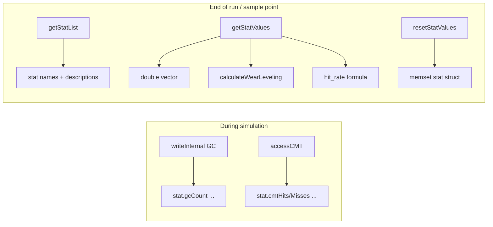

# Chapter 8 — Wear Leveling & Statistics Export

**Source:** [`page_mapping.cc`](../../SimpleSSD-Standalone/simplessd/ftl/page_mapping.cc) lines **1407–1564**

**Series:** [← README](README.md) · [07 Internal I/O](07_internal_io.md) · **08 Wear & stats**

**Prerequisites:** [07_internal_io.md](07_internal_io.md) (GC counters), [06_cmt_access.md](06_cmt_access.md) (CMT counters), [02_constructor_init.md](02_constructor_init.md) (`resetCMTStats` after warm-up).

**Theory companion:** [08_CMT_Mentor_Census.md](../08_CMT_Mentor_Census.md) §26 (statistics), §29 (experiments).

---

## Overview

The tail of `page_mapping.cc` provides:

1. **Wear metric** — `calculateWearLeveling()` (SIGMETRICS 2013 formula).
2. **Debug accounting** — `calculateTotalPages()` (valid vs invalid page counts).
3. **Simulator stat export** — `getStatList` / `getStatValues` / `resetStatValues` (SimpleSSD `Stats` framework).



**Critical:** `getStatList` and `getStatValues` must stay **in the same order** — the framework pairs them by index.

---

## §8.1 `calculateWearLeveling` (lines 1407–1438)

Implements the wear-leveling factor from:

> Li, Yongkun, Patrick PC Lee, and John Lui. *"Stochastic modeling of large-scale solid-state storage systems."* ACM SIGMETRICS (2013).

### Annotated block

```cpp
float PageMapping::calculateWearLeveling() {
  uint64_t totalEraseCnt = 0;
  uint64_t sumOfSquaredEraseCnt = 0;
  uint64_t numOfBlocks = param.totalLogicalBlocks;
  // ...
}
```

| Line(s) | Code | Meaning |
| --- | --- | --- |
| 1407 | function signature | Returns `float`; called from `getStatValues`, not cached in `stat`. |
| 1408–1410 | accumulators | `totalEraseCnt` = Σ eᵢ; `sumOfSquaredEraseCnt` = Σ eᵢ²; `numOfBlocks` = **logical** block count from PAL geometry. |
| 1413–1417 | loop `blocks` | Sum erase counts for **currently active** (in-use) blocks. |
| 1414 | `getEraseCount()` | Per-block erase counter maintained by `Block::erase()`. |
| 1419–1430 | loop `freeBlocks` reverse | `freeBlocks` sorted by erase count ascending. Walk from **highest** wear backward; **stop** when `eraseCnt == 0` (never-erased free blocks skipped). |
| 1432–1434 | `sumOfSquaredEraseCnt == 0` | No block ever erased → return **-1** (“undefined / no wear yet”). |
| 1436–1437 | return formula | See below. |

### Formula

Let N = `param.totalLogicalBlocks`, eᵢ = erase count of block i (active + counted free blocks).

$$\text{wear\_leveling} = \frac{\left(\sum_i e_i\right)^2}{N \cdot \sum_i e_i^2}$$

**Interpretation:**

| Value | Meaning |
| --- | --- |
| **1.0** | Perfect wear distribution (all blocks same erase count). |
| **→ 1/N** | One block does all erases (worst case for this metric). |
| **-1** | No erases recorded yet (`sumOfSquaredEraseCnt == 0`). |

**Note:** Denominator uses `totalLogicalBlocks`, not `totalPhysicalBlocks`. Active + scanned-free blocks may be fewer than N; blocks with eᵢ = 0 at the low end of `freeBlocks` are excluded by the early `break`.

### Invariants

1. Result ∈ (0, 1] when defined, or exactly **-1** when undefined.
2. Uniform erase counts ⇒ return **1.0** (within floating-point tolerance).
3. Only blocks with `eraseCnt > 0` in the free-list tail contribute from `freeBlocks`.

---

## §8.2 `calculateTotalPages` (lines 1440–1448)

Debug helper used in `initialize()` to verify warm-up fill ratios.

| Line(s) | Code | Meaning |
| --- | --- | --- |
| 1440 | `calculateTotalPages(valid, invalid)` | Output parameters; not exported as simulator stats. |
| 1441–1442 | `valid = invalid = 0` | Reset accumulators. |
| 1444–1447 | loop `blocks` | For each **active** block: `valid += getValidPageCount()`, `invalid += getDirtyPageCount()`. |

### Semantics

| Output | Source | Meaning |
| --- | --- | --- |
| `valid` | `Block::getValidPageCount()` | Physical pages currently reachable by some LPN mapping. |
| `invalid` | `Block::getDirtyPageCount()` | Invalid / stale pages awaiting GC reclamation. |

**Not included:** Pages in `freeBlocks` (already erased or never written). This function does **not** walk the GMT or CMT.

---

## §8.3 `getStatList` (lines 1450–1528)

Registers human-readable stat names for the SimpleSSD stats dump. `prefix` is typically `"ftl."` from the parent module.

### Complete stat catalogue

| # | Stat name (`prefix + …`) | Description (from code) | Value source in `getStatValues` |
| --- | --- | --- | --- |
| 1 | `page_mapping.gc.count` | Total GC count | `stat.gcCount` |
| 2 | `page_mapping.gc.reclaimed_blocks` | Total reclaimed blocks in GC | `stat.reclaimedBlocks` |
| 3 | `page_mapping.gc.superpage_copies` | Total copied valid superpages during GC | `stat.validSuperPageCopies` |
| 4 | `page_mapping.gc.page_copies` | Total copied valid pages during GC | `stat.validPageCopies` |
| 5 | `page_mapping.wear_leveling` | Wear-leveling factor | `calculateWearLeveling()` |
| 6 | `page_mapping.cmt.policy` | Active CMT replacement policy (0 = LRU, 1 = LFU) | `(double)cmtPolicy` |
| 7 | `page_mapping.cmt.hits` | User mapping cache hits (CMT, excludes warm-up) | `stat.cmtHits` |
| 8 | `page_mapping.cmt.misses` | User mapping cache misses (CMT, excludes warm-up) | `stat.cmtMisses` |
| 9 | `page_mapping.cmt.hit_rate` | User mapping cache hit rate % (CMT, excludes GC and warm-up) | **computed** — see §8.4 |
| 10 | `page_mapping.cmt.evictions` | Total CMT evictions (excludes warm-up) | `stat.cmtEvictions` |
| 11 | `page_mapping.cmt.dirty_evictions` | CMT dirty evictions (required write-back to GMT) | `stat.cmtDirtyEvictions` |
| 12 | `page_mapping.cmt.writebacks` | Total GMT write-back operations | `stat.cmtWritebacks` |
| 13 | `page_mapping.cmt.gc_hits` | GC-triggered mapping cache hits (CMT) | `stat.cmtGCHits` |
| 14 | `page_mapping.cmt.gc_misses` | GC-triggered mapping cache misses (CMT) | `stat.cmtGCMisses` |
| 15 | `page_mapping.cmt.capacity` | CMT capacity (max entries in cache) | `cmtCapacity` |
| 16 | `page_mapping.cmt.entry_bytes` | Mapping bytes held per CMT entry (8 B per sub-page mapping) | `cmtEntryBytes` |
| 17 | `page_mapping.cmt.capacity_bytes` | Effective CMT size in bytes (capacity × entry_bytes) | `cmtCapacity * cmtEntryBytes` |
| 18 | `page_mapping.cmt.occupancy` | CMT occupancy at end of simulation (entries used) | `cmtSize()` |

### Line-by-line table (`getStatList`)

| Line(s) | Code | Meaning |
| --- | --- | --- |
| 1450 | `getStatList(list, prefix)` | Append to caller's `std::vector<Stats>`. |
| 1451 | `Stats temp` | Reused row template. |
| 1453–1455 | `gc.count` | Incremented in `writeInternal` after each on-demand GC (ch. 7). |
| 1457–1459 | `gc.reclaimed_blocks` | `+= list.size()` per GC invocation. |
| 1461–1463 | `gc.superpage_copies` | Updated inside `doGarbageCollection` (ch. 5). |
| 1465–1467 | `gc.page_copies` | Sub-page copy counter during GC. |
| 1469–1475 | `wear_leveling` | Paper citation in comment; value computed at export time. |
| 1477–1479 | `cmt.policy` | `0` = LRU (`CMT_POLICY_LRU`), `1` = LFU. |
| 1481–1483 | `cmt.hits` | User `accessCMT` hits (`isGC=false`). |
| 1485–1487 | `cmt.misses` | User misses. **Includes** unmapped-read misses (README #1). |
| 1489–1491 | `cmt.hit_rate` | **Derived** in `getStatValues`; not stored in `stat`. |
| 1493–1495 | `cmt.evictions` | Every LRU/LFU victim eviction. |
| 1497–1499 | `cmt.dirty_evictions` | Evictions where `dirty == true`. |
| 1501–1503 | `cmt.writebacks` | Incremented with dirty eviction (currently equal — README #2). |
| 1505–1507 | `cmt.gc_hits` | `accessCMT(..., isGC=true)` hits. |
| 1509–1511 | `cmt.gc_misses` | GC path misses. |
| 1513–1515 | `cmt.capacity` | Max entries from config (ch. 2). |
| 1517–1519 | `cmt.entry_bytes` | `8 * bitsetSize` bytes per entry. |
| 1521–1523 | `cmt.capacity_bytes` | Total DRAM budget for CMT if full. |
| 1525–1527 | `cmt.occupancy` | Live entry count at sample time. |

---

## §8.4 `getStatValues` (lines 1530–1556)

Pushes one `double` per `getStatList` row, **same order**.

### Annotated block

| Line(s) | Code | Formula / value |
| --- | --- | --- |
| 1531 | `stat.gcCount` | Raw counter |
| 1532 | `stat.reclaimedBlocks` | Raw counter |
| 1533 | `stat.validSuperPageCopies` | Raw counter |
| 1534 | `stat.validPageCopies` | Raw counter |
| 1535 | `calculateWearLeveling()` | §8.1 formula or **-1** |
| 1537–1541 | hit rate block | See **CMT hit_rate** below |
| 1543 | `(double)cmtPolicy` | 0 or 1 |
| 1544–1551 | CMT counters | Direct cast from `stat.*` |
| 1552–1554 | capacity fields | `cmtCapacity`, `cmtEntryBytes`, product |
| 1555 | `(double)cmtSize()` | `cmt.size()` or `cmtLFU.size()` |

### CMT `hit_rate` — exact formula

From lines 1537–1541:

```cpp
uint64_t totalLookups = stat.cmtHits + stat.cmtMisses;
double hitRate = totalLookups > 0
    ? (double)stat.cmtHits / (double)totalLookups * 100.0
    : 0.0;
```

$$\text{hit\_rate} = \begin{cases}
100 \times \dfrac{\text{cmtHits}}{\text{cmtHits} + \text{cmtMisses}} & \text{if } \text{cmtHits} + \text{cmtMisses} > 0 \\[8pt]
0 & \text{otherwise}
\end{cases}$$

| Property | Detail |
| --- | --- |
| **Numerator** | `stat.cmtHits` only (user path). |
| **Denominator** | `cmtHits + cmtMisses` only — **GC lookups excluded**. |
| **Units** | Percent (0–100), not ratio (0–1). |
| **Warm-up** | Counters zeroed by `resetCMTStats()` at end of `initialize()` — warm-up misses do **not** appear. |
| **Not used** | `cmtGCHits`, `cmtGCMisses`, `cmtEvictions`, `cmtWritebacks`. |

**Example:** `cmtHits = 900`, `cmtMisses = 100` ⇒ `hit_rate = 90.0` (percent).

**GC hit rate (not exported):** If you needed it for analysis:

$$\text{gc\_hit\_rate} = 100 \times \frac{\text{cmtGCHits}}{\text{cmtGCHits} + \text{cmtGCMisses}} \quad (\text{0 if denominator } 0)$$

### Derived formulae for config stats

| Stat | Formula |
| --- | --- |
| `cmt.entry_bytes` | `8 × bitsetSize` (typically `8 × 8 = 64`) |
| `cmt.capacity` | `⌊CMTCapacityBytes / cmtEntryBytes⌋` or `⌊totalLogicalPages × CMTCapacityRatio⌋`, min 16 |
| `cmt.capacity_bytes` | `cmt.capacity × cmt.entry_bytes` |
| `cmt.occupancy` | `|cmt|` (LRU) or `|cmtLFU|` (LFU) at export instant |

### Where counters increment (quick reference)

| Counter | Incremented in |
| --- | --- |
| `gcCount`, `reclaimedBlocks` | `writeInternal` (ch. 7) |
| `validSuperPageCopies`, `validPageCopies` | `doGarbageCollection` (ch. 5) |
| `cmtHits`, `cmtMisses` | `accessCMT_LRU` / `accessCMT_LFU`, `isGC=false` |
| `cmtGCHits`, `cmtGCMisses` | same, `isGC=true` |
| `cmtEvictions`, `cmtDirtyEvictions`, `cmtWritebacks` | CMT eviction on capacity miss |

---

## §8.5 `resetStatValues` (lines 1558–1560)

| Line(s) | Code | Meaning |
| --- | --- | --- |
| 1558 | `resetStatValues()` | Simulator hook to clear accumulated stats between experiments. |
| 1559 | `memset(&stat, 0, sizeof(stat))` | Zeros **entire** anonymous `stat` struct including GC and CMT counters. |

### What `resetStatValues` does **not** reset

| Field | Still holds previous value after reset |
| --- | --- |
| `cmtCapacity`, `cmtEntryBytes`, `cmtPolicy` | Config — not in `stat` |
| CMT contents (`cmt`, `cmtLFU`, `table`) | Cache state unchanged |
| `calculateWearLeveling()` inputs | Block erase counts live in `Block` objects |

**Contrast:** `resetCMTStats()` (ch. 2) zeros **only** CMT counters after warm-up, preserving `gcCount` etc. `resetStatValues()` clears everything in `stat`.

---

## Reading a stats file

Typical row pairing:

```
ftl.page_mapping.cmt.hits          1234567
ftl.page_mapping.cmt.misses         123456
ftl.page_mapping.cmt.hit_rate          90.9
```

Verify: `hits / (hits + misses) × 100 ≈ hit_rate` (floating-point rounding).

Sanity checks:

1. `dirty_evictions == writebacks` in current code (README #2).
2. `occupancy ≤ capacity` always.
3. `wear_leveling == -1` only before any erase.
4. `gc.count` matches number of on-demand GC events in debug log.

---

## Invariants (chapter-wide)

1. **`getStatList` / `getStatValues` length match:** Always 18 entries each.
2. **Hit rate scope:** User lookups only; GC isolated in `gc_hits` / `gc_misses`.
3. **Wear factor:** Computed live from block erase counts, not stored incrementally.
4. **`resetStatValues`:** Does not reset wear inputs (erase counts) or CMT occupancy.
5. **Warm-up separation:** Only `resetCMTStats()` during `initialize()`; full `resetStatValues()` is a separate experiment boundary.

---

## Self-quiz (10 questions)

### Questions

1. What is the closed-form formula for `page_mapping.wear_leveling`?
2. When does `calculateWearLeveling` return `-1`?
3. What is the exact formula for `page_mapping.cmt.hit_rate`?
4. Are `cmtGCHits` included in the hit rate denominator? Why or why not?
5. How many stats does `getStatList` register, and why must order matter?
6. What is the difference between `resetStatValues()` and `resetCMTStats()`?
7. Which function computes `valid` and `invalid` page counts, and is it exported?
8. What does `page_mapping.cmt.capacity_bytes` represent?
9. Where is `stat.gcCount` incremented?
10. If all blocks have erase count 42, what wear-leveling value do you expect?

### Answers

1. \(\displaystyle \text{WL} = \frac{(\sum_i e_i)^2}{N \cdot \sum_i e_i^2}\) where N = `totalLogicalBlocks` and eᵢ are per-block erase counts (active blocks + tail of `freeBlocks` with eᵢ > 0).
2. When `sumOfSquaredEraseCnt == 0` — no block has been erased yet.
3. If `cmtHits + cmtMisses > 0`: `100 × cmtHits / (cmtHits + cmtMisses)`; else `0`.
4. **No.** Hit rate is explicitly “user mapping cache” only; GC uses separate `cmt.gc_hits` / `cmt.gc_misses` counters (see `getStatList` description strings).
5. **18** stats; SimpleSSD pairs names and values by vector index — reordering without updating both functions breaks the dump.
6. `resetStatValues()` zeroes the entire `stat` struct (GC + CMT). `resetCMTStats()` zeroes only CMT counters after warm-up, leaving GC stats and cache contents intact.
7. `calculateTotalPages(valid, invalid)` — sums per active block; **not** exported via `getStatList`.
8. Maximum CMT DRAM footprint if every slot were filled: `cmtCapacity × cmtEntryBytes`.
9. In `writeInternal`, after `doGarbageCollection` completes when `freeBlockRatio() < gcThreshold`.
10. **1.0** — equal erase counts give \((N \cdot 42)^2 / (N \cdot N \cdot 42^2) = 1\).

---

[← Back to README](README.md) · [← Internal I/O](07_internal_io.md)
